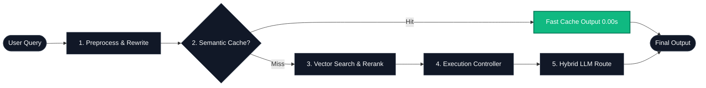
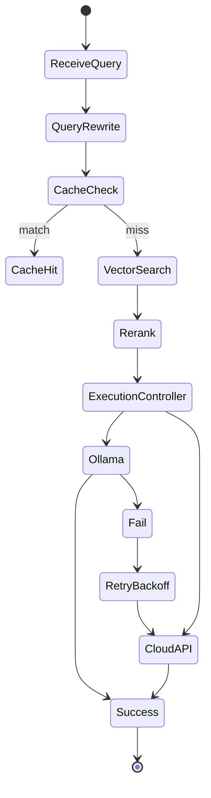

# 📐 AI-Model-Atlas — System Architecture

> Engineering-grade deep dive into the Cognitive RAG system internals: benchmarks, failure recovery, and execution control.

← Back to [README](README.md) | [中文架构文档 (ARCHITECTURE_zh.md)](ARCHITECTURE_zh.md)

---

## 🧭 System Architecture Poster

---

## 🚀 Key Features

- **🧠 Cognitive RAG Architecture**: Complete pipeline integration of query understanding and retrieval optimization.
- **⚡ Semantic Cache**: Lightweight vector embedding dictionary checks for extreme latency reduction.
- **🔄 Query Rewriting**: Dynamic regex and prompt filters to normalize user intents before retrieval.
- **🎯 Relevance Reranking**: Distance margin filters to optimize context text blocks before inference.
- **🛡️ Execution Controller**: Orchestrated request center with fallback routing, exponential backoffs, and timeouts.
- **🌐 Hybrid LLM Core**: Dynamic routing between local Ollama installations and commercial OpenAI/DeepSeek API endpoints.
- **📊 Obsverability Dashboard**: Streamlit frontends measuring time-to-first-token (TTFT) and throughput tokens/sec speeds.

---

## 🧠 System Runtime Model

### ⚡ Speed (What you feel)

*Disclaimer: Benchmarks are measured under local development test environments (single GPU / CPU fallback mode) and may vary under production load.*

| Configuration | Cache | Rerank | Backend | Latency (avg) | TTFT |
| :--- | :---: | :---: | :--- | :--- | :--- |
| **Local Ollama** | ❌ | ❌ | Ollama (Llama 3) | ~2.8s | 1.4s |
| **Local Ollama** | ✅ | ❌ | Ollama (Llama 3) | **~0.2s** | **0.05s** (Cache Hit) |
| **Hybrid Mode** | ✅ | ✅ | OpenAI API | ~0.8s | 0.3s |
| **Hybrid Mode** | ❌ | ✅ | OpenAI API | ~2.1s | 0.9s |

### 🛡️ Stability (When things break)

The system is designed to gracefully degrade under backend failure conditions to preserve service uptime:

#### Scenario: Local Ollama backend goes offline
1. **ExecutionController** detects connection timeout or handshake failures.
2. **Exponential Backoff Retry** mechanism triggers (automatic delays: 200ms -> 500ms -> 1s).
3. **Graceful Fallback Routing** active: switches the query endpoint automatically to the configured cloud API (OpenAI/DeepSeek).
4. **Degraded State Visualization**: system logs warnings and state shifts to the Streamlit observability console.

*Result: System continues responding to user queries without throwing unhandled terminal crashes.*

### 🧭 Logic (How choices are made)

The workflow logic operates on a strict request control state machine:

---

## 📄 License

This document is part of [AI-Model-Atlas](README.md), licensed under [CC BY 4.0](LICENSE-CONTENT).
