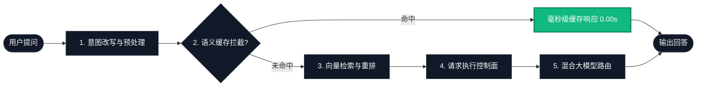
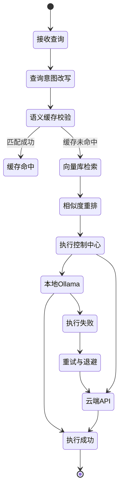

# 📐 AI-Model-Atlas — 系统架构文档

> 认知级 RAG 系统的工程深度剖析：性能指标、容灾自愈与执行控制。

← 返回 [中文首页](README_zh.md) | [English Architecture (ARCHITECTURE.md)](ARCHITECTURE.md)

---

## 🧭 系统架构图谱

---

## 🚀 本项目提供什么 (Key Features)

- **🧠 认知级 RAG 架构**：从查询意图理解到检索相关性优化的完整生产级闭环。
- **⚡ 语义缓存加速**：通过向量相似度匹配与长度比例控制拦截重复请求，实现毫秒级超快响应。
- **🔄 查询意图改写**：内置智能正则和提示词过滤器，去除口语噪音，精准提取检索意图。
- **🎯 检索相关性重排**：支持设定余弦距离阈值过滤无效噪声片段，保证大模型上下文的高可信度。
- **🛡️ 强大的请求控制面**：统一接管请求生命周期，支持指数级退避重试、连接超时控制与故障降级（本地 Ollama 掉线自动切至云端 API 兜底）。
- **🌐 混合大模型推理后端**：支持在本地 Ollama (Llama 3/DeepSeek) 与云端 API 之间进行热切换。
- **📊 可观测性能看板**：Streamlit 终端实时量化首 Token 延迟 (TTFT) 与吞吐速率 (Tokens/秒)。

---

## 🧠 系统运行模型 (System Runtime Model)

### ⚡ 极速体验 (用户直观感受)

*免责声明：以下性能指标均在本地开发测试环境（单卡 GPU / CPU 兜底模式）下测量得出，生产环境高负载下可能会有所偏差。*

| 配置模式 | 语义缓存 | 相似度重排 | 推理后端 | 响应时延 (均值) | 首字延迟 (TTFT) |
| :--- | :---: | :---: | :--- | :--- | :--- |
| **本地离线模型** | ❌ | ❌ | Ollama (Llama 3) | ~2.8s | 1.4s |
| **本地离线模型** | ✅ | ❌ | Ollama (Llama 3) | **~0.2s** | **0.05s** (缓存命中) |
| **混合动力模式** | ✅ | ✅ | OpenAI API | ~0.8s | 0.3s |
| **混合动力模式** | ❌ | ✅ | OpenAI API | ~2.1s | 0.9s |

### 🛡️ 稳如磐石 (异常与故障恢复)

系统设计上具备完善的故障降配与容灾自愈能力，以确保服务高可用：

#### 场景模拟：本地运行的 Ollama 离线掉线
1. **ExecutionController (执行控制中心)** 检测到本地连接超时或网络握手异常。
2. **指数级退避重试 (Exponential Backoff)** 机制被激活（自动延迟梯度：200ms -> 500ms -> 1s）。
3. **优雅降级路由 (Degraded Fallback)** 触发：无需用户干预，系统自动将提问流量重定向切换至配置的云端 API（OpenAI/DeepSeek）。
4. **降级状态透明化**：控制中心向 Streamlit 终端实时输出异常告警日志与状态转移轨迹。

*最终效果：系统在此异常场景下依然保持正常响应与回答，避免客户端 unhandled 崩溃死锁。*

### 🧭 智能决策 (控制面决策路径)

底层流水线的每一次请求调用均在严密的控制状态机管理下运行：

---

## 📄 开源协议

本文档为 [AI-Model-Atlas](README_zh.md) 项目的一部分，遵循 [CC BY 4.0](LICENSE-CC-BY) 协议。
