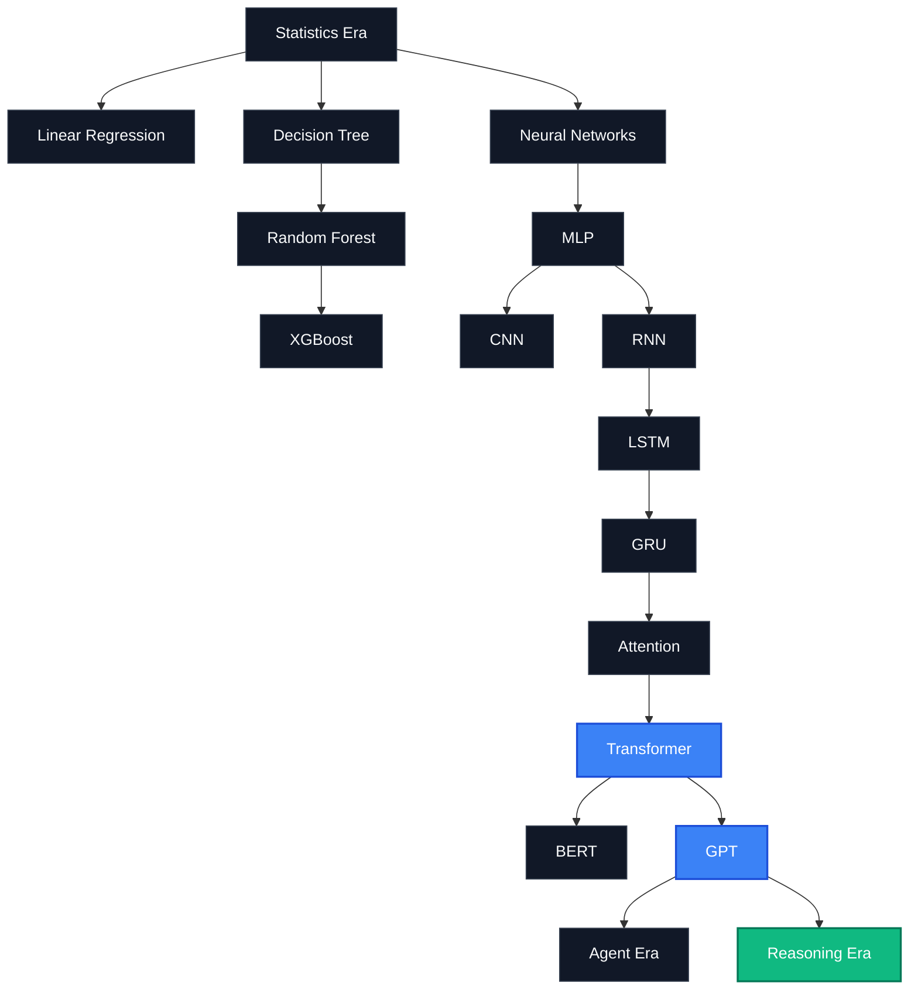

# 🧬 AI-Model-Atlas — Deep Dives (极客深潜专题)

> **A 13-chapter epic technical documentary tracing the mathematical and architectural evolution of AI: from classical machine learning to reasoning models.**

← Back to [README](README.md) | [中文版 (DEEP_DIVES_zh.md)](DEEP_DIVES_zh.md)

---

## 🗺️ The AI Deep Dive Map



---

## Part I: The Birth of Modern Models

### 01. Why Does AI Become Smart? 
> **From rules-based systems to GPT: A 70-year evolution of computational intelligence.**

In the early days of computer science, building artificial intelligence meant writing rules. If a doctor diagnosed a disease, developers wrote thousands of `if-then` statements to map symptoms to diagnoses. These were **Expert Systems**—fragile, unable to learn, and bound to fail the moment they encountered a situation their creators hadn't anticipated.

The paradigm shift occurred when we stopped writing rules and started feeding computers data, asking them to find the rules themselves.

#### 1. Classical Machine Learning (ML) — The Advanced Abacus
* **Random Forest**: Instead of a single decision tree (which is prone to memorizing data rather than understanding it), Random Forest trains a crowd of diverse decision trees and lets them vote. It remains the undisputed king for structured tabular data (like predicting housing prices or credit card fraud).
* **XGBoost (Extreme Gradient Boosting)**: A highly optimized decision-tree boosting system that builds trees sequentially, with each new tree correcting the mistakes of the previous one.

#### 2. The Deep Learning (DL) Awakening — Neural Networks
* **MLP (Multilayer Perceptron)**: The grandfather of deep learning. It simulates a simplified human brain with layers of interconnected "neurons" that pass input values forward through mathematical weight transforms.
* **CNN (Convolutional Neural Network)**: By sliding tiny mathematical filters (kernels) across images, CNNs mimicked the visual cortex, revolutionizing computer vision by detecting edges, shapes, and complex objects.

---

### 02. Why Does Transformer Rule the World?
> **How Attention ended the sequential bottleneck of RNNs and ushered in the LLM revolution.**

Before 2017, natural language processing was dominated by **Recurrent Neural Networks (RNNs)** and **Long Short-Term Memory (LSTM)** networks. They read text the way humans do: word-by-word, sequentially from left to right.

```text
Sequential Reading (RNN/LSTM):
"The" ──► "quick" ──► "brown" ──► "fox" ──► "jumps" ...
```

#### The Sequential Bottleneck
Because RNNs had to process word $t$ before they could look at word $t+1$, they had two fatal flaws:
1. **Forgetfulness**: By the time an RNN read page 10 of a document, it had mathematically forgotten the details from page 1.
2. **Hardware Lock**: GPUs (which excel at doing thousands of mathematical operations at the exact same time) sat mostly idle because the network had to wait for the previous word to finish processing.

#### The Transformer Breakthrough (Attention Is All You Need)
In 2017, Google researchers proposed the **Transformer** architecture. Its core innovation was **Self-Attention**: instead of reading word-by-word, the Transformer reads the entire text block simultaneously.

```text
Parallel Attention (Transformer):
[ "The", "quick", "brown", "fox", "jumps" ] ──► Processed all at once!
```

Every word looks at every other word in the sentence at the exact same time, calculating a mathematical relationship score.
* **Why it changed history**: 
  1. It resolved the forgetfulness problem because long-distance relationships were computed in a single step.
  2. It allowed massive GPU parallelization. Training speeds skyrocketed, allowing models to be fed the entire public internet.
* **The Split Brain**:
  * **BERT (Encoder-only)**: Excels at understanding context by looking both left and right simultaneously. Perfect for classification and extraction.
  * **GPT (Decoder-only)**: Excels at "text auto-complete" by predicting the next most likely word. This became the foundation for modern conversational generative AI.

---

## Part II: The Core Principles of RAG

### 03. What is Embedding under the Hood?
> **From raw words to coordinate spaces: The visual geometry of vector representation.**

A computer cannot read a word; it only understands numbers. The naive solution is **One-Hot Encoding** (giving every word in the dictionary its own index: `apple = [1, 0, 0]`, `banana = [0, 1, 0]`). But this method fails to represent relationships—mathematically, `apple` is just as different from `banana` as it is from `nuclear reactor`.

An **Embedding** represents text as coordinates in a dense, high-dimensional space (often 768 or 1536 dimensions).

```text
Text Input          Embedding Model          High-Dimensional Vector
"King"     ──►    [ 1536-dim network ]   ──►    [ 0.25, -0.47, 0.89, ... ]
"Queen"    ──►    [ 1536-dim network ]   ──►    [ 0.23, -0.45, 0.91, ... ]
"Apple"    ──►    [ 1536-dim network ]   ──►    [ -0.88, 0.12, -0.34, ... ]
```

#### The Magic of Vector Arithmetic
Because these coordinates represent semantic meaning, words with similar concepts sit close to each other in this virtual space. This leads to the famous spatial relationship equation:

$$\overrightarrow{\text{King}} - \overrightarrow{\text{Man}} + \overrightarrow{\text{Woman}} \approx \overrightarrow{\text{Queen}}$$

Embeddings turn language into geometry, allowing us to compute the "meaning distance" between any two sentences.

---

### 04. How Do Vector Databases Retrieve Meaning?
> **Moving beyond string matches: Nearest neighbor algorithms and the mechanics of HNSW.**

A traditional SQL database searches for exact string matches (`WHERE description = 'iPhone'`). If a user searches for `"Apple smartphone"`, the query returns empty because the characters do not match.

A **Vector Database** solves this by storing the Embedding coordinates of text blocks and searching for the mathematically closest vectors.

#### 1. Calculating Distance
* **Cosine Similarity**: Measures the angle between two vectors. If they point in the same direction, the score is close to $1.0$, regardless of sentence length.
* **Euclidean Distance**: Measures the straight-line distance between two points in space.

#### 2. Scaling the Search (Approximate Nearest Neighbors - ANN)
If your database has 10 million documents, calculating the cosine similarity for all of them for every search query is too slow. Vector databases use **HNSW (Hierarchical Navigable Small World)** graphs.

```text
HNSW Multi-Layer Highway Graph:
Layer 2 (Express) ──►  [Point A] ──────────────────────────► [Point F]
Layer 1 (Local)   ──►  [Point A] ──► [Point C] ────────────► [Point F]
Layer 0 (All)     ──►  [Point A] ──► [Point B] ──► [Point C] ──► [Point F]
```

HNSW builds a multi-layered network of vectors, similar to an express highway system. The search starts at the top layer (skipping far-away clusters quickly) and drops down to lower layers for high-precision local routing. This reduces search time from $O(N)$ to $O(\log N)$.

---

### 05. Why is RAG so Effective?
> **Open-book vs. closed-book exams: Bridging the gap between static knowledge and dynamic lookup.**

Without RAG, large language models operate in **Closed-Book Mode**. All their knowledge is permanently baked into their parameters during training.

```text
Closed-Book Model (Static Params):
User Query ──► [ LLM (Frozen parameters) ] ──► Response (May hallucinate if outdated)
```

#### The Limits of Parameters
1. **Outdated**: A model trained in 2024 does not know what happened in 2025.
2. **Blind Spot**: A model has never seen your company's private internal wiki or invoice PDFs.
3. **Expensive**: Retraining a model to teach it new information costs millions of dollars in compute.

#### The RAG Solution (Open-Book Mode)
**Retrieval-Augmented Generation (RAG)** turns the process into an **Open-Book Exam**.

```text
Open-Book Model (RAG Workflow):
User Query ──► [ Retrieve relevant text from DB ] ──► [ Paste into Prompt ] ──► [ LLM reads & writes answer ]
```

RAG keeps the model frozen and updates the database instead. When a user asks a question, the system retrieves the most relevant paragraphs from the database, pastes them into the prompt template as reference context, and asks the model to read them and write an answer. This guarantees fresh information, zero retraining costs, and highly auditable citations.

---

### 06. Why Do Large Models Hallucinate?
> **Understanding the probabilistic nature of language generation and why RAG acts as an anchor.**

Large language models do not possess an internal database of facts. At their core, they are **probabilistic text completion engines**. 

```text
Text Completion Probability:
"The sky is..." ──► blue (94%) | cloudy (4%) | green (0.1%)
```

#### The Root Cause of Hallucination
When an LLM generates text, it calculates the probability distribution of the next token based on all previous tokens. It has no mechanism to verify if the statement is true; it only knows if the sentence *sounds* linguistically correct and natural based on its training distribution. 

If the model lacks information on a topic, it will still pick the most plausible-sounding next words, creating a highly convincing lie. This is **Hallucination**.

#### How RAG Prevents Hallucination
RAG acts as a physical anchor for the model. By injecting verified, factual source texts directly into the prompt context, we shift the model's task from **generation from memory** to **reading comprehension**. The model is constrained to use only the provided context, reducing hallucination rates to near zero for structured retrieval pipelines.

---

### 07. Context Windows and the Needle in a Haystack Test
> **Why 1M tokens does not equal 100% understanding: Lost in the Middle and attention degradation.**

Model providers frequently boast about large **Context Windows** (e.g., Gemini's 2 Million tokens, which fits about 15 novels in a single prompt). However, a larger container does not guarantee perfect recall.

#### 1. Lost in the Middle
Research shows that LLMs suffer from a U-shaped attention curve. They recall information placed at the absolute beginning or the end of a long prompt with high accuracy, but frequently overlook details buried in the middle.

```text
U-Shaped Recall Curve:
100% |  \                               /
     |   \                             /
     |    \                           /
 0%  |     ───────────────────────────
     Beginning        Middle         End
                  (The Blind Spot)
```

#### 2. The Needle in a Haystack (NIAH) Test
To measure this phenomenon, researchers run a stress test:
1. They take a massive text block (the "haystack", e.g., 500,000 words of public financial documents).
2. They insert a single, unrelated sentence in the middle (the "needle", e.g., *"The secret ingredient in the cake is blue bananas"*).
3. They prompt the model: *"What is the secret ingredient in the cake?"*
4. They repeat this across various text lengths and needle positions to plot a recall accuracy heatmap.

A model boasting a 1M context window might score 100% accuracy when the needle is at the 10% mark, but drop to 40% recall when the needle is placed at the 50% mark. Understanding this limitation is why engineers still use RAG to select only the top 3 relevant paragraphs rather than dumping entire books into the prompt.

---

## Part III: The Agentic Era

### 08. Model Context Protocol (MCP) — The USB-C of AI
> **Solving the N x M integration problem: How a unified protocol standardizes AI tools.**

As AI models began calling external tools (reading Notion, querying databases, searching GitHub), engineers faced a scaling nightmare: the **$N \times M$ integration problem**.

```text
Without MCP (Proprietary Integrations):
Claude  ──►  Notion Driver  |  GPT  ──►  Notion Driver  |  Llama  ──►  Notion Driver
Claude  ──►  GitHub Driver  |  GPT  ──►  GitHub Driver  |  Llama  ──►  GitHub Driver
```

If you had $N$ models and $M$ tools, developers had to write custom API connectors for every single pair.

#### The USB-C of AI
The **Model Context Protocol (MCP)**, introduced by Anthropic, acts as a universal adapter. It defines a standard communication protocol between models (clients) and data sources (servers).

```text
With MCP (Universal Standard):
Claude ──┐             ┌──► GitHub Server
GPT    ──┼─► [ MCP ] ──┼──► Notion Server
Llama  ──┘             └──► Local Filesystem
```

Now, developers only write one MCP connector for their tool, and any MCP-compliant model can immediately query, write, and interact with it. It standardizes how AI reads contexts, executes actions, and prompts local environments.

---

### 09. Why an Agent is More Than a Prompt
> **The cybernetic feedback loop: Orchestrating memory, tools, planning, and execution.**

A standard LLM call is a **linear pipeline**: input goes in, output comes out, and the process stops. A simple system prompt (e.g., *"You are a helpful assistant"*) does not make it an Agent.

An **Autonomous Agent** is a dynamic feedback loop that wraps around an LLM to coordinate five components:

```text
                  ┌────────────────────────┐
                  ▼                        │
User Goal ──► [ Planning ] ──► [ Execution / Tools ] ──► [ Environment ]
                  ▲                        │
                  └─────── [ Memory ] ◄────┘
```

#### The Five Pillars of Agentic Architecture
1. **The Brain (LLM)**: Provides core logic, text comprehension, and decision making.
2. **Planning (Self-Reflection)**: The agent breaks down a complex goal (*"Book a flight and hotel for my trip"*) into discrete sub-tasks, evaluates its own intermediate results, and corrects course if a tool fails.
3. **Memory**:
   * *Short-Term Memory*: Tracks the current execution steps.
   * *Long-Term Memory*: Retains information across sessions (storing user preferences in a vector database).
4. **Tools**: External APIs (web search, databases, terminal access) that allow the agent to affect the real world.
5. **Execution**: Running loop controllers (like LangGraph) that keep the agent active until the goal is verified as completed.

---

## Part IV: Next-Generation Models

### 10. Why MoE Makes Scale Affordable
> **Understanding Mixture of Experts: How sparse routing enables giant models at tiny costs.**

Traditionally, when a model like GPT-4 runs inference, every single parameter in the neural network is activated to predict the next word. This is a **Dense Model**. Scaling dense models requires massive compute power, driving up API costs.

**Mixture of Experts (MoE)** converts the network into a **Sparse Model**.

```text
MoE Sparse Routing:
Input Prompt ──► [ Router Network ] ──► Expert 2 (Translation) ──┐
                                    ──► Expert 8 (Coding)      ──┼──► Output
                                    ──► [ Experts 1,3,4... Idle ]┘
```

#### How MoE Works
Instead of one massive neural network, the model is split into multiple smaller sub-networks called **Experts** (e.g., 64 distinct experts, each specializing in coding, math, translation, or creative writing).
1. **The Router**: A lightweight network reads the incoming prompt and determines which experts are best suited to handle it.
2. **Sparse Activation**: The router only activates a small subset (e.g., 2 out of 64 experts) for that specific token.
3. **The Savings**: You get the intelligence of a massive, multi-hundred-billion parameter model, but only pay the compute cost of running a tiny fraction of it. This sparse routing architecture is the core technology behind DeepSeek's high-efficiency pricing model.

---

### 11. How Do Reasoning Models Think?
> **DeepSeek-R1 and o1: The transition from fast intuition to systematic computation.**

Traditional LLMs operate on **System 1 Thinking** (fast, intuitive, immediate). They generate the next word instantly, without a pause to plan. If they make a logical error in the first sentence of an explanation, they are forced to continue writing to justify the mistake, resulting in logical failure.

Modern **Reasoning Models** (like DeepSeek-R1 and OpenAI's o1) introduce **System 2 Thinking** (slow, deliberate, analytical).

```text
Reasoning Model Workflow (Test-Time Compute):
User Query ──► [ Silent Chain of Thought / Verification Loop ] ──► Final Answer
```

#### 1. Chain of Thought (CoT) & Test-Time Compute
Before outputting a single word to the user, the model enters a hidden reasoning phase. It writes out its thinking steps, checks its math, identifies logical fallacies, and corrects itself. The system trades **compute time during generation** (Test-Time Compute) for higher correctness.

#### 2. Reinforcement Learning (RL)
These models are trained using large-scale Reinforcement Learning. The model is given a complex puzzle and rewarded when it finds the correct answer. Through millions of self-play iterations, the model learns strategies like:
* Double-checking assumptions.
* Breaking complex math into smaller equations.
* Backtracking when a chosen logic path hits a dead end.

This shifts AI from a simple text-generation autocomplete box into a systematic cognitive processor.

---

## Part V: Appendix Dives

### 12. Why Can AI Draw Pictures?
> **Understanding Diffusion: How Stable Diffusion and Flux turn noise into high-art.**

While text models predict the next word, image generators (like Stable Diffusion, Midjourney, and Flux) use a process called **Diffusion**.

```text
The Diffusion Process:
Pure Noise (Static) ──► [ Latent Space De-noising Loop ] ──► High-Art Image
                                    ▲
                              Prompt Control
```

#### 1. Forward Diffusion (Adding Noise)
During training, we take a clear picture of a cat and gradually add mathematical pixel noise (static) step-by-step until it is completely unrecognizable.

#### 2. Reverse Diffusion (De-noising)
We train the neural network to do the exact opposite: look at a noisy image and predict how to subtract a tiny amount of noise to make the picture slightly clearer.

#### 3. Text Conditioning (The Prompt)
When you type *"A cat wearing a top hat"*, the text embedding vector is injected into the de-noising network. Instead of subtracting noise randomly, the model subtracts noise in a way that guides the emerging shapes to match the semantic coordinates of "cat" and "top hat". 

It literally carves an image out of a block of random static noise, guided by your prompt.

---

### 13. Why Does GPT Talk Like a Human?
> **RLHF and DPO: The mechanics of alignment and how safety boundaries are established.**

A raw base LLM trained on the internet is wild and uncontrollable. If you prompt it: *"How do I write a cover letter?"*, it might autocomplete the prompt with: *"How do I write a cover letter for a job I hate? Here is a thread from Reddit..."* It has no concept of helpfulness, safety, or conversational structure.

To turn a base model into a helpful assistant, we use **Alignment** techniques.

```text
Model Alignment Pipeline:
[ Base LLM ] ──► [ Supervised Fine-Tuning ] ──► [ RLHF / DPO ] ──► [ Safe Assistant ]
```

#### 1. RLHF (Reinforcement Learning from Human Feedback)
1. **Labeling**: Humans are presented with two model outputs and asked to grade which one is more helpful and safe.
2. **Reward Model**: We train a second neural network (the Reward Model) to predict what score a human would give to any model output.
3. **PPO Optimization**: We run reinforcement learning on the base LLM, rewarding it when it generates text that scores highly on the Reward Model.

#### 2. DPO (Direct Preference Optimization)
A newer, simpler alternative to RLHF. Instead of training a separate complex Reward Model, DPO mathematically optimizes the LLM directly on pairwise preference datasets (Dataset: `[Prompt, Winning Answer, Losing Answer]`), shifting the model's output probabilities toward the preferred answers in a single step.

Alignment is what forces the model to talk politely, refuse instructions on how to build weapons, and maintain a consistent, helpful conversational persona.
