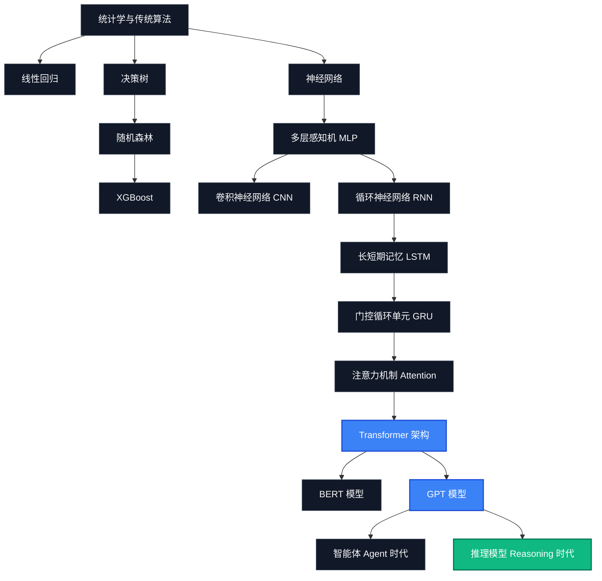

# 🧬 AI-Model-Atlas — Deep Dives (极客深潜专题)

> **一部从古典机器学习到推理大模型的 13 篇 AI 技术演进与底层算法深度科普纪录片。**

← 返回 [中文首页](README_zh.md) | [English Version (DEEP_DIVES.md)](DEEP_DIVES.md)

---

## 🗺️ AI 底层算法演进地图



---

## 第一部分：现代模型的诞生 (Part I: The Birth of Modern Models)

### 01. 为什么 AI 会变聪明？
> **从规则系统到 GPT 的 70 年计算智能进化史。**

在计算机科学发展的早期，构建人工智能（AI）主要依靠人工编写的**“规则”**。如果一个医生要诊断疾病，程序员就得写下几千行 `if-then`（如果……那么……）语句，把症状和诊断结果一一映射。这类系统被称为**专家系统 (Expert System)**——它们脆弱、无法自我学习，一旦遇到编写规则之外的情况就会瞬间崩溃。

真正的范式跃迁发生在我们停止编写规则，转而让计算机去“阅读海量数据，自己寻找规律”的时刻。

#### 1. 古典机器学习时代 (Classical ML) —— 找规律的算盘
* **随机森林 (Random Forest)**：传统的单颗决策树极易死记硬背数据（过拟合）。随机森林通过训练一大群互不相同的决策树，并在最终预测时让它们投票决定，从而大大提升了泛化能力。时至今日，它依然是处理结构化表格数据（如预测房价、银行风控、信用卡欺诈等）的王者。
* **XGBoost (极限梯度提升)**：一种极其高效的渐进式决策树提升系统。它采用串行方式构建决策树，让每一颗新树都专门去纠正上一颗树犯下的错误，是各大算法建模大赛的夺冠常客。

#### 2. 深度学习觉醒时代 (Deep Learning) —— 模拟大脑的神经网络
* **多层感知机 (MLP)**：现代深度学习的鼻祖。它通过层层相连、模拟人类神经元连接的数学加权计算，实现了复杂非线性函数的拟合。
* **卷积神经网络 (CNN)**：通过在图片上滑动微小的数学滤波器（卷积核）来提取边缘、形状和物体特征，这模仿了人类视觉皮层的工作原理，彻底改写了计算机视觉的历史。

---

### 02. Transformer 为什么统治了一切？
> **Attention 机制如何终结循环神经网络（RNN）的串行瓶颈，点燃大模型革命。**

在 2017 年之前，自然语言处理（NLP）领域的绝对霸主是 **循环神经网络 (RNN)** 和 **长短期记忆网络 (LSTM)**。它们阅读文字的方式和人类非常类似：逐字阅读，从左往右串行推进。

```text
传统的串行阅读 (RNN/LSTM):
“我” ──► “爱” ──► “人工智能” ... （必须一个字一个字处理）
```

#### 串行计算的“致命伤”
由于处理第 $t+1$ 个字必须以处理完第 $t$ 个字为前提，这种机制带来了两个毁灭性的痛点：
1. **忘事（梯度消失）**：当 LSTM 读到一份长文档的第 10 页时，它在数学上已经把第 1 页写了什么忘得一干二净了。
2. **算力浪费**：显卡（GPU）最擅长的事情是并行计算（同一时刻做成千上万次矩阵乘法）。然而，因为 RNN 必须逐字排队处理，显卡大部分算力只能闲置等待，导致训练速度极慢。

#### Transformer 架构的降临 (Attention Is All You Need)
2017 年，谷歌的研究人员提出了 **Transformer** 架构，其核心创新是 **自注意力机制 (Self-Attention)**。Transformer 彻底抛弃了逐字排队的做法，实现了“一目十行”的并行阅读。

```text
Transformer 的并行注意力机制:
[ “我”, “爱”, “人工”, “智能” ] ──► 一次性全部送入显卡计算！
```

文档中的每个字都在同一时刻去观察其他所有的字，并计算出它们之间的关联权重得分。
* **为什么它改变了历史**：
  1. 它解决了“遗忘”问题：长距离的词汇关系在第一步计算中就被直接捕捉。
  2. 它完全释放了 GPU 的洪荒之力，训练速度呈指数级提升。科学家们终于可以把整个互联网的语料源源不断地喂给模型。
* **分化流派**：
  * **BERT (双向编码器)**：擅长同时结合上下文做“完形填空”和阅读理解，适合分类和信息抽取任务。
  * **GPT (自回归解码器)**：只看左边，极度擅长“文字接龙”预测下一个字。这最终成为了生成式 AI 时代最强大的技术路线。

---

## 第二部分：RAG 核心原理 (Part II: RAG Core Principles)

### 03. Embedding 到底是什么？
> **从词汇表到多维物理空间：文本语义的坐标化表示。**

计算机根本不懂文字，它只认识数字。最粗暴的方案是给每个词打上编号（比如 `苹果 = [1, 0, 0]`，`香蕉 = [0, 1, 0]`）。但这无法体现任何含义关联——在数学上，`苹果` 与 `香蕉` 的距离，和它与 `核反应堆` 的距离是一模一样的。

**嵌入 (Embedding)** 模型将任意文字映射为一个高维虚拟空间中的一组三维/多维坐标（通常是 768 或 1536 维的向量浮点数）。

```text
输入文本          Embedding 嵌入模型            高维语义坐标向量
"国王"     ──►    [ 1536维神经网络 ]   ──►    [ 0.25, -0.47, 0.89, ... ]
"女王"     ──►    [ 1536维神经网络 ]   ──►    [ 0.23, -0.45, 0.91, ... ]
"苹果"     ──►    [ 1536维神经网络 ]   ──►    [ -0.88, 0.12, -0.34, ... ]
```

#### 向量空间代数的奇迹
因为这些浮点数坐标代表了文字背后的“语义”，概念相近的词在虚拟空间中会被拉得很近。这导致了 AI 领域最著名的向量代数公式：

$$\overrightarrow{\text{国王}} - \overrightarrow{\text{男人}} + \overrightarrow{\text{女人}} \approx \overrightarrow{\text{女王}}$$

Embedding 把玄妙的语言文字转变成了可以进行数学计算的几何空间，使得我们能够直接用计算距离的方式来评估两句话的意思是否接近。

---

### 04. 向量数据库如何理解语义？
> **告别字面匹配：最近邻搜索算法与 HNSW 索引的导航机制。**

传统的 SQL 关系型数据库依靠字面匹配进行搜索（如 `WHERE name = '苹果手机'`）。如果用户输入 `"iPhone"` 或 `"库克发布的新机"`，传统搜索会因找不到相同字面而返回空值。

**向量数据库 (Vector Database)** 的核心任务，就是存储这些文本对应的 Embedding 坐标，并在用户发起提问时，快速找出空间距离最近的文本片段。

#### 1. 距离度量衡
* **余弦相似度 (Cosine Similarity)**：计算两个向量在多维空间中的夹角。夹角越小，说明方向越一致，语义越接近。
* **欧氏距离 (Euclidean Distance)**：计算多维空间中两点之间的直线绝对距离。

#### 2. 大规模捞针：HNSW (分层导航小世界) 算法
如果你的数据库里存了 1000 万篇文档，当用户发起一次提问，让系统去和这 1000 万个向量逐一计算距离，显卡会直接卡死。为了解决这个问题，向量数据库引入了 **HNSW** 图索引技术。

```text
HNSW 多层“高速公路”索引拓扑结构:
第二层 (快速干线) ──►  [点 A] ──────────────────────────► [点 F]
第一层 (省道干线) ──►  [点 A] ──► [点 C] ────────────► [点 F]
第零层 (乡村小路) ──►  [点 A] ──► [点 B] ──► [点 C] ──► [点 F]
```

HNSW 模仿了人类世界的交通网络。搜索从最顶层的“快速干线”开始，快速跨越不相关的超大区域；定位到大致范围后，降入低层进行局部精细导航。这把每次搜索的时间复杂度从 $O(N)$ 降到了 $O(\log N)$，实现了在百万级向量中毫秒级检索。

---

### 05. RAG 为什么有效？
> **开卷考试 vs 闭卷考试：打通静态训练参数与动态实时检索的桥梁。**

在没有 RAG 之前，大模型相当于在进行 **“闭卷考试”**。它所有的知识都是在历史训练阶段，永久地“烤入”到它脑子里的参数中。

```text
闭卷考试模式 (纯大模型参数推理):
用户提问 ──► [ 冻结状态的大脑参数 ] ──► 回答 (如果数据过时，模型容易胡说八道)
```

#### 参数记忆的局限性：
1. **记忆脱节**：模型在 2024 年完成训练，它就绝对无法回答 2025 年发生的新闻。
2. **私域盲区**：模型从未读过你公司内部的 PDF 合同或私人财务报表。
3. **成本高昂**：为了让模型记住新知识而去重新训练，需要耗费数百万人民币的算力。

#### RAG 带来的“开卷考试”革命
**检索增强生成 (RAG)** 将这个过程改造成了 **“开卷考试”**。

```text
开卷考试模式 (RAG 动态工作流):
用户提问 ──► [ 去向量数据库检索相关文档 ] ──► [ 塞进 Prompt ] ──► [ 模型阅读材料写出答案 ]
```

大模型本身被“冻结”不再重新训练。当用户提问时，系统先去向量数据库里检索出与问题最相关的几段 FAQ 或文档，把它们像小抄一样贴在提示词（Prompt）里送给大模型，让大模型只扮演一个**“阅读理解官”**写出回答。这彻底解决了时效性问题，且成本极低，天然具备出处可追溯性。

---

### 06. 为什么大模型会产生幻觉？
> **理解语言生成背后的概率本质，以及 RAG 是如何充当物理锚点的。**

大模型并不像人类一样拥有一个能存储事实的“实体记忆库”。从底层来看，大模型是一个 **“文本接龙的概率计算器”**。

```text
接龙概率计算:
“今天的天气真...” ──► 晴朗 (94%) | 糟糕 (5%) | 菠萝 (0.01%)
```

#### 幻觉的本质原因
大模型输出的每一个字，都是根据前面所有字计算出的“下一个字出现概率最大值”。它没有逻辑检查机制去判定这句话是否客观真实，它只在乎这句话读起来是不是**“足够顺畅、自然、符合人类的语言习惯”**。

当遇到知识盲区时，模型依然会按照概率输出读起来极为通顺、甚至逻辑无懈可击，但内容完全捏造的谎言。这就是 **幻觉 (Hallucination)**。

#### RAG 是如何扮演“物理锚点”的
RAG 彻底改变了模型的运行机制。由于我们在 Prompt 中强行注入了客观存在的、真实的参考文档，大模型的工作从“凭空回忆接龙”变成了“做开卷阅读理解”。我们限制它“必须根据参考文档回答，不得超出文档范围”。这为大模型提供了一个物理锚点，将幻觉率拉低到了极低的商业实用级。

---

### 07. 上下文窗口与 Needle in a Haystack 测试
> **为什么 100 万 Token 的大窗口不等于 100% 记住：揭秘“Lost in the Middle”盲区。**

现在的大模型厂商经常宣传自己拥有几十万、上百万甚至上千万 Token 的 **上下文窗口 (Context Window)**（比如一次性可以读完 15 本长篇小说）。然而，大并不代表能完全读懂。

#### 1. 迷失在中间 (Lost in the Middle)
AI 学术界研究表明，大模型的注意力分配呈现一条 **“U 型曲线”**。模型能非常清晰地记住放在长提示词最开头和最末尾的细节，但极易遗忘、漏掉埋在文章正中间的信息。

```text
U 型注意力遗忘曲线:
100% |  \                               /
     |   \                             /
     |    \                           /
 0%  |     ───────────────────────────
     提示词开头       提示词中间       提示词结尾
                   (最易遗漏的盲区)
```

#### 2. 大海捞针评测 (Needle in a Haystack Test)
为了测试模型的注意力成色，科学家们设计了名为“大海捞针”的压力测试：
1. 拿一本 100 万字的长篇小说（大海，Haystack）。
2. 在小说最正中间（比如第 50 万字的地方）强行插入一句完全不相干的悄悄话（针，Needle），如：*“办公室的秘密钥匙藏在蓝色花瓶里”*。
3. 问大模型：*“办公室的秘密钥匙藏在哪里？”*
4. 科学家会不断调整这根针在小说里的位置以及小说的总长度，画出一张坐标热力图。

许多声称拥有 1M 窗口的模型，在针位于 10% 处时能考 100 分，但当针位于 50% 处时，召回率可能暴跌到 30%。这就是为什么即便模型窗口再大，优秀的工程师依然坚持在 RAG 中只切片出最相关的 3 段文本喂给模型，而不是把整本书丢给它。

---

## 第三部分：智能体时代 (Part III: The Agentic Era)

### 08. MCP —— AI 世界的 USB-C
> **终结 N x M 适配噩梦：Model Context Protocol 是如何统一大模型数据总线的。**

随着大模型开始接管各类工具（如读取 Notion、读写本地文件、自动操作 GitHub），工程师们遇到了一场极其痛苦的 **$N \times M$ 接口适配灾难**。

```text
没有统一标准时 (所有模型都得为所有工具开发专属驱动):
Claude ──► Notion 驱动 | GPT ──► Notion 驱动 | Llama ──► Notion 驱动
Claude ──► GitHub 驱动 | GPT ──► GitHub 驱动 | Llama ──► GitHub 驱动
```

如果你有 $N$ 个大模型，外接 $M$ 个工具，开发者就不得不编写 $N \times M$ 个专属的连接器代码。

#### MCP 协议的诞生（大模型接口标准化）
Anthropic 联合社区推出了 **Model Context Protocol (模型上下文协议)**。它提供了一套标准化的中间适配协议。

```text
MCP 统一标准模式 (USB-C 接口):
Claude ──┐             ┌──► GitHub 适配服务
GPT    ──┼─► [ MCP ] ──┼──► Notion 适配服务
Llama  ──┘             └──► 本地文件系统适配服务
```

它就像是 AI 世界的 **USB-C 接口**。以前每个手机、相机都有自己的充电孔，现在统一用 USB-C。大模型（Client）和外部工具（Server）现在只需要遵循 MCP 规范编写，任何支持 MCP 的模型就可以零门槛、即插即用地调用任何支持 MCP 的外部数据源与工具。

---

### 09. Agent 为什么不是 Prompt
> **控制论层面的自循环反馈：大模型大脑、长期记忆与工具执行的闭环控制。**

在代码层面，普通的 API 调用是**线性的**：给一个 Prompt 输进去，大模型吐出一个答案，调用立刻宣告结束。只写一段复杂的 Prompt（例如：*“你是一个精明的买手”*）并不能让它成为 **Agent (智能体)**。

一个真正的 Agent，是一个在后台包裹了大模型，能够进行自循环、具备控制论特征的**闭环自反馈系统**：

```text
                  ┌────────────────────────┐
                  ▼                        │
用户目标 ──► 【 拆解与规划 】 ──► 【 执行工具 】 ──► 【 外部反馈环境 】
                  ▲                        │
                  └───────── 【 记忆库 】 ◄┘
```

#### 智能体的五大核心支柱
1. **决策大脑 (LLM)**：扮演核心指挥官，理解用户意图，生成决策建议。
2. **自我反思规划 (Planning)**：当面对一个复杂的长期目标（如：*“帮我定下周去北京最划算的机票和三星级酒店”*）时，Agent 能把目标拆解为第一步、第二步，并在中途某个步骤出错（如机票售罄）时，自动反思、纠错并更换备用方案。
3. **长期与短期记忆 (Memory)**：
   * *短期记忆*：在当前任务流中记录执行到了第几步。
   * *长期记忆*：将过往的交互习惯存入向量库，使得 Agent 能够跨时间、跨设备记得用户的偏好。
4. **外部工具箱 (Tools)**：外接的 API，赋予模型在真实世界里读取网页、发送邮件、修改代码的能力（让模型有手和脚）。
5. **执行循环控制器 (Execution)**：底层运行的状态机或图结构（如 LangGraph），接管运行周期，保证 Agent 能够持续运算直到目标最终达成。

---

## 第四部分：下一代模型 (Part IV: Next-Generation Models)

### 10. MoE 专家混合架构
> **用稀疏激活打破稠密算力枷锁：大模型是如何做到高智能与白菜价并存的。**

在传统的“稠密模型 (Dense Model)”（如早期的 GPT-3）中，每一次我们发起提问，大模型脑子里数千亿个参数全部都会被激活参与数学计算。这导致了每次推理所需的 GPU 电费和算力成本极高，API 价格居高不下。

**混合专家架构 (MoE, Mixture of Experts)** 改变了这一点，它采用“稀疏激活”来分摊成本。

```text
MoE 稀疏激活路由模式:
用户提问 ──► 【 门控路由网络 】 ──► 专家 3 (负责代码) ──┐
                               ──► 专家 12 (负责翻译) ──┼──► 拼装输出结果
                               ──► [ 其他 62 位专家闲置 ]┘
```

#### MoE 架构的工作机制
MoE 将大模型内部拆分成了数十个甚至上百个更小巧的神经网络，每个小网络被称为一个 **“专家 (Expert)”**。
1. **门控路由网络 (Router)**：当用户提问时，先由一个极轻量级的路由神经网络判定这个提问最适合由谁来回答。
2. **稀疏激活 (Sparse Activation)**：路由网络只激活最匹配的 1~2 个专家（例如负责写代码的专家和负责多语言翻译的专家），其余绝大多数专家网络处于休眠状态（不消耗任何算力）。
3. **商业红利**：这让模型在逻辑层面拥有极大的总体参数规模（高智能），但每次调用在数学计算层只花费极小比例的成本。这就是近年来如 DeepSeek 等开源模型在成本上能够实现“白菜价”的底层核心基石。

---

### 11. 推理模型是怎么思考的？
> **DeepSeek-R1 与 OpenAI o1 揭秘：系统 2 慢思考与强化学习带来的认知跃迁。**

传统的大模型在生成文字时采用的是 **“系统 1 思考”**（快速、本能、直觉）。它不需要停下来打草稿，直接以毫秒级吐出下一个字。这种机制存在致命弱点：如果它在回答的第一句就说错了，为了维持语言概率的连贯性，它会一条路走到黑去强行解释自己的错误，最终导致复杂逻辑推理的彻底崩塌。

以 DeepSeek-R1 和 OpenAI o1 为代表的 **推理模型 (Reasoning Model)** 引入了 **“系统 2 思考”**（严谨、审慎、慢思考）。

```text
推理模型内部思考流 (生成时算力投入):
用户问题 ──► [ 隐蔽在后台的思维链推理、纠错、反思路径 ] ──► 输出精简的最终回答
```

#### 推理模型的两大技术支柱
1. **生成时算力 (Test-Time Compute)**：在输出最终回答之前，模型在后台先写下冗长复杂的“思维链 (Chain of Thought)”。它会在后台自己打草稿、做算术、尝试多种逻辑路径，如果发现中途算错了，它会自己划掉重新尝试。模型用生成阶段的**等待时间与算力**换取了极高的逻辑正确率。
2. **强化学习自主迭代 (Reinforcement Learning)**：在训练时，研究人员不再只喂给它人类写好的标准答案，而是只给它出题，并在它通过思考最终算对时给予“奖励信号 (Reward)”。经过数百万次自己跟自己做题博弈的自强化迭代，模型无师自通地学会了“遇到难题先审题”、“反复验算”、“发现死路自动掉头”等高等思维策略。

这标志着大模型从一个“背诵互联网文章的聊天话痨”真正进化为了一个“具备严密逻辑自审能力的思考者”。

---

## 第五部分：番外篇 (Part V: Appendix Dives)

### 12. Diffusion 为什么会画画？
> **生成扩散模型的数理美学：AI 是如何把一片随机噪声雪花点“擦拭”出高清艺术画作的。**

大语言模型通过预测“下一个字”来写文章，而 Stable Diffusion、Flux 以及 Midjourney 这一类文生图模型则依赖 **扩散 (Diffusion)** 技术。

```text
扩散图像生成路径:
纯杂乱雪花噪点 ──► 【 图像潜空间去噪循环 】 ──► 呈现高清艺术照片
                           ▲
                     提示词嵌入引导
```

#### 1. 前向扩散 (Forward Diffusion) —— 泼墨染黑
在训练阶段，我们拿一张清晰的猫咪照片，逐步往里面加入微小的数学像素噪声点。经过几百步后，原本清晰的照片就会彻底变成一片毫无规律的随机雪花点。

#### 2. 反向扩散 (Reverse Diffusion) —— 吹沙见金
我们训练一个神经网络去挑战看似不可能的任务：盯着一片带有噪声的图片，去预测“应该在每个像素点上减去多少噪声，能让这张图变得稍微清晰一点点”。

#### 3. 提示词引导 (Text Conditioning)
当你输入提示词 *"一只戴着礼帽的猫"* 时，提示词的语义向量被注入到去噪神经网络中。网络在擦除噪声时有了针对性的偏好。经过 30~50 步的反复擦除计算，原本毫无意义的随机噪点中会逐步浮现并拼接出符合你意图的猫咪画面。它本质上是从一片虚无的混沌噪点中，用概率的画笔“雕刻”出画面。

---

### 13. RLHF 为什么越来越像人？
> **人类对齐与安全性防线：通过强化学习与 DPO 技术将野性模型驯化为得体助手。**

大模型在刚刚完成互联网数据阅读的“预训练”阶段时，被称为**基座模型 (Base Model)**。此时它极度野性，毫无安全和道德概念。如果你向它提问：*“怎么写一封辞职信？”* 它可能会直接顺着你的话接龙下去：*“怎么写一封辞职信去骂我的老板？以下是来自贴吧的脏话模板……”* 它只懂得文字概率的顺畅度，不懂得什么是“礼貌、有用和安全”。

为了让它成为一个称职、得体的助理，我们必须进行 **对齐 (Alignment)**：

```text
大模型对齐工业管线:
[ 基座模型 ] ──► [ 人工示范指令微调 ] ──► [ 人类反馈强化学习 (RLHF/DPO) ] ──► [ 安全的对话助理 ]
```

#### 1. RLHF (人类反馈强化学习)
1. **人类打分**：让同一个模型输出两个不同的回答，雇佣人类测试员进行盲测打分，挑出更符合人类道德、更礼貌实用的那个。
2. **训练裁判 (Reward Model)**：用这些人类打分的数据训练一个“奖励模型”。这个模型的作用是模拟人类的喜好。
3. **强化学习 (PPO)**：大模型在生成回答时，努力去迎合这个奖励模型的喜好，以此获得更高的分值奖励，从而不断修正自己的说话语气和安全底线。

#### 2. DPO (直接偏好优化)
由于 RLHF 训练奖励模型的过程极其繁琐不稳定，斯坦福研究团队提出了 **DPO** 技术。它跳过了训练裁判的步骤，直接把大模型自身的数学公式做数学变换，使其直接在偏好数据集（包含：*提问、好回答、坏回答*）上进行微调优化。模型生成好回答的概率会被直接拉高，生成坏回答的概率被直接拉低。

对齐技术是大模型的“缰绳”。它确保了模型能够用人类习惯的对话风格沟通，并且在用户教唆它干坏事（如制作违禁品）时，能够委婉且坚定地予以拒绝。
