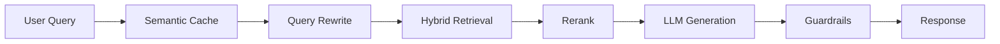

<p align="center">
  
</p>

# 🗺️ AI Model Atlas

👉 [Read This First: Why AI-Model-Atlas Exists?](INTRO.md)

## An AI DevSecOps & Security Engineering Reference Architecture

> 📖 **Bilingual docs (EN/ZH)** · Security Capability Map · Threat Models · CI/CD Pipelines
> 🎯 Evolved from a learning map into a **Production-Grade AI Security Engineering Reference Architecture**.

[](LICENSE-CODE)
[](LICENSE)
[](https://github.com/Hao610/AI-Model-Atlas/actions/workflows/security_pipeline.yml)
[](README_zh.md)

---

> **📌 Reading guide**  
> - ✅ Great for: learning AI concepts, RAG system design, and hands-on experimentation  
> - ⚠️ Model names & API prices may change — always verify against official docs  
> - 🚫 Not intended for: production deployment or real-time benchmarking

---

## 🧭 Start Here

| I want to… | Go to |
| :--- | :--- |
| 📚 **Learn from scratch** (step-by-step) | [CURRICULUM.md](docs/CURRICULUM.md) — 36 modules, Phase 1→5 |
| 🧬 **Understand the math & internals** | [DEEP_DIVES.md](docs/DEEP_DIVES.md) — 17 chapters |
| 🛡️ **See the new DevSecOps Blueprint** | [CONSTRAINT_THREAT_MODEL.md](docs/CONSTRAINT_THREAT_MODEL.md) — 36 chapters, DevSecOps Blueprint |
| 📐 **See the system architecture** | [ARCHITECTURE.md](docs/ARCHITECTURE.md) |
| ▶️ **Run the sandbox in 5 min** | [Quick Start ↓](#-quick-start) |
| 🗺️ **Pick a learning track** | [Getting Started Guide](docs/GETTING_STARTED.md) |

---

## 📦 What's Inside

| Content | Count | Description |
| :--- | :---: | :--- |
| [Curriculum](docs/CURRICULUM.md) | **36 modules** | Prompt → RAG → API → Fine-tune → Deploy → Agent |
| [Deep Dives](docs/DEEP_DIVES.md) | **17 chapters** | Transformer, MoE, Reasoning, Alignment, Evaluation… |
| [DevSecOps Blueprint](docs/CONSTRAINT_THREAT_MODEL.md) | **36 chapters** | Prompt Injection, RAG Poisoning, Agent Hijacking, Observability |
| [RAG Sandbox](projects/rag-app/README.md) | 1 app | Streamlit demo: cache, rerank, routing, security, monitoring |
| Languages | EN + ZH | Hand-written bilingual docs (not machine-translated) |

---

## 🚀 Quick Start

### Route A: Read the curriculum
→ [CURRICULUM.md](docs/CURRICULUM.md)

### Route B: Dive deep
→ [DEEP_DIVES.md](docs/DEEP_DIVES.md)

### Route C: Explore DevSecOps Blueprint
→ [CONSTRAINT_THREAT_MODEL.md](docs/CONSTRAINT_THREAT_MODEL.md)

### Route D: Run the sandbox
```bash
cd projects/rag-app
pip install -r requirements.txt
streamlit run app.py
```

---

## 🧱 How It Works

**AI Model Atlas** is a teaching-focused RAG architecture simulator. It walks you through the full stack of a modern RAG system — from semantic caching and hybrid retrieval to agent routing and fault recovery — all through runnable code and illustrated concepts.



> ⚠️ **This is a learning sandbox, not a production system.** All performance numbers are local development estimates.

---

## 📄 License & Contributing

- Code: [MIT](LICENSE-CODE)
- Documentation: [CC BY 4.0](LICENSE)

If you find this project helpful, please consider giving it a ⭐ star — it helps more people discover the roadmap.

---

## ✍️ Author & Maintainer

Developed and maintained by **[Loi Chiang Hao](https://github.com/hao610)** (hao610).  
Focusing on the intersection of Cybersecurity, AI Systems, Cloud Infrastructure, and DevSecOps.

[](https://www.linkedin.com/in/loi-chiang-hao) [](https://loichianghao.vercel.app/)
