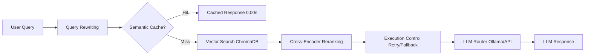
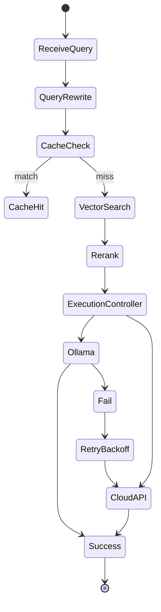
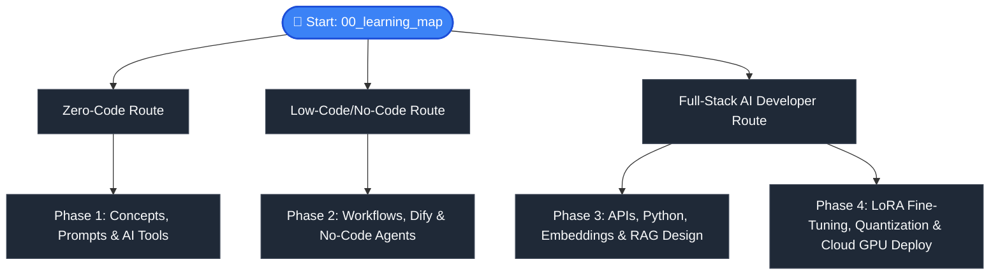

# AI-Model-Atlas 🗺️

### From Zero to Production-Grade RAG Systems — Learn, Build, Deploy, and Optimize Real AI Applications

> **A production-ready Cognitive RAG system with Semantic Cache, Query Rewriting, Reranking, and Execution Control — built for developers, researchers, and AI engineers.**

[English] | [中文 (README_zh.md)](README_zh.md)

Welcome to the **AI-Model-Atlas**! This repository is a comprehensive, beginner-friendly "dictionary-style" guide designed to take anyone from zero technical background to understanding, calling, running, and even fine-tuning modern Artificial Intelligence models.

---

## ⚡ 3-Second System Flow

---

## ⚡ Quick Demo Path (60 seconds)

Try AI-Model-Atlas locally in under a minute:
1. `git clone https://github.com/Hao610/AI-Model-Atlas.git`
2. `cd projects/rag-app && python app.py`
3. Upload a PDF & see semantic cache hits and reranking in action!

---

## 💡 Why This Repository Exists

Most RAG tutorials stop at embeddings or naïve retrieval demos. `AI-Model-Atlas` goes further: production reliability, semantic caching, query reranking, execution control, and hybrid LLM routing — providing a real-world, engineer-grade cognitive RAG reference architecture.

---

## 🔥 One-Line Pitch

`AI-Model-Atlas` is a production-grade Cognitive RAG system with Semantic Cache, Query Rewriting, and Execution Control — designed for real-world AI engineering workflows.

---

## 🚀 What This Project Offers

- **🧠 Cognitive RAG Architecture**: Complete pipeline integration of query understanding and retrieval optimization.
- **⚡ Semantic Cache**: Lightweight vector embedding dictionary checks for extreme latency reduction.
- **🔄 Query Rewriting**: Dynamic regex and prompt filters to normalize user intents before retrieval.
- **🎯 Relevance Reranking**: Distance margin filters to optimize context text blocks before inference.
- **🛡️ Execution Controller**: Orchestrated request center with fallback routing, exponential backoffs, and timeouts.
- **🌐 Hybrid LLM Core**: Dynamic routing between local Ollama installations and commercial OpenAI/DeepSeek API endpoints.
- **📊 Obsverability Dashboard**: Streamlit frontends measuring time-to-first-token (TTFT) and throughput tokens/sec speeds.

---

## ⚡ System Performance Benchmarks

*Disclaimer: Benchmarks are measured under local development test environments (single GPU / CPU fallback mode) and may vary under production load.*

| Configuration | Cache | Rerank | Backend | Latency (avg) | TTFT |
| :--- | :---: | :---: | :--- | :--- | :--- |
| **Local Ollama** | ❌ | ❌ | Ollama (Llama 3) | ~2.8s | 1.4s |
| **Local Ollama** | ✅ | ❌ | Ollama (Llama 3) | **~0.2s** | **0.05s** (Cache Hit) |
| **Hybrid Mode** | ✅ | ✅ | OpenAI API | ~0.8s | 0.3s |
| **Hybrid Mode** | ❌ | ✅ | OpenAI API | ~2.1s | 0.9s |

---

## 🛡️ Failure Recovery & Self-Healing

The system is designed to gracefully degrade under backend failure conditions to preserve service uptime:

### Scenario: Local Ollama backend goes offline
1. **ExecutionController** detects connection timeout or handshake failures.
2. **Exponential Backoff Retry** mechanism triggers (automatic delays: 200ms -> 500ms -> 1s).
3. **Graceful Fallback Routing** active: switches the query endpoint automatically to the configured cloud API (OpenAI/DeepSeek).
4. **Degraded State Visualization**: system logs warnings and state shifts to the Streamlit observability console.

*Result: System continues responding to user queries without throwing unhandled terminal crashes.*

---

## 🔍 Execution Controller State Machine

The workflow logic operates on a strict request control state machine:

---

## 🎯 Who is this for?

* 🧭 **Beginners** → Learn fundamental AI concepts with zero mathematical barrier and clear analogies.
* 💻 **Developers** → Master API integration, local model execution, and rapid UI prototyping.
* 🏗️ **Engineers & Architects** → Deploy production-ready RAG architectures, scale agent workflows, and optimize inference.
* 🚀 **Pioneers** → Dive deep into fine-tuning (LoRA), quantization, GPU selection, and cloud serving infrastructure.

---

## 📍 Start Here → Learning Map

To help you navigate through the curriculum based on your goals, choose your custom pathway:

---

## 🗺️ The "0 to 100" Roadmap

Below is the structured learning path. Each phase is designed to build on the previous one.

### 🎬 Phase 1: Learn & Awaken (0 to 1)
> **This phase demystifies AI. You will learn core concepts, open-source rules, prompting frameworks, and how to navigate the AI ecosystem.**
* **Goal**: Go from zero AI knowledge to feeling comfortable using and comparing modern model platforms.

| Module | Description | English Guide | 中文指南 |
| :--- | :--- | :--- | :--- |
| **0. Learning Map** | Choose your custom pathway (Zero-Code vs Low-Code vs Full-Stack). | [00_learning_map.md](docs/phase1_0_to_1/00_learning_map.md) | [00_learning_map_zh.md](docs/phase1_0_to_1/00_learning_map_zh.md) |
| **1. What is AI?** | AI, Machine Learning, and Deep Learning explained via analogies. | [01_what_is_ai.md](docs/phase1_0_to_1/01_what_is_ai.md) | [01_what_is_ai_zh.md](docs/phase1_0_to_1/01_what_is_ai_zh.md) |
| **2. Prompt Art** | Structured frameworks (ROLE, Few-Shot) for talking to AI. | [02_prompt_art.md](docs/phase1_0_to_1/02_prompt_art.md) | [02_prompt_art_zh.md](docs/phase1_0_to_1/02_prompt_art_zh.md) |
| **3. Open Source Licenses** | MIT, Apache 2.0, and commercial limits of models (e.g. Llama 3). | [03_licenses.md](docs/phase1_0_to_1/03_licenses.md) | [03_licenses_zh.md](docs/phase1_0_to_1/03_licenses_zh.md) |
| **4. AI Tools Guide** | Web-based daily productivity tools (ChatGPT, Claude, Midjourney). | [04_ai_tools.md](docs/phase1_0_to_1/04_ai_tools.md) | [04_ai_tools_zh.md](docs/phase1_0_to_1/04_ai_tools_zh.md) |
| **5. Model Zoo Overview** | Quick table comparing GPT, Claude, Gemini, Llama, DeepSeek, Qwen. | [05_model_zoo.md](docs/phase1_0_to_1/05_model_zoo.md) | [05_model_zoo_zh.md](docs/phase1_0_to_1/05_model_zoo_zh.md) |
| **6. Hugging Face Guide** | Understanding the Hub: repository layout, safetensors, and hub API. | [06_huggingface_guide.md](docs/phase1_0_to_1/06_huggingface_guide.md) | [06_huggingface_guide_zh.md](docs/phase1_0_to_1/06_huggingface_guide_zh.md) |
| **7. Glossary** | Essential vocab sheet (Tokens, Temperature, Context Window). | [07_glossary.md](docs/phase1_0_to_1/07_glossary.md) | [07_glossary_zh.md](docs/phase1_0_to_1/07_glossary_zh.md) |

### 🏗️ Phase 2: Build & Architect (1 to 10)
> **This phase transitions you from a prompt user to an AI systems architect using low-code/no-code platforms.**
* **Goal**: Understand AI pipelines, build autonomous agents, and configure local knowledge databases without writing code.

| Module | Description | English Guide | 中文指南 |
| :--- | :--- | :--- | :--- |
| **8. LLM Landscape** | The lineage and capabilities of modern closed & open weights models. | [08_llm_landscape.md](docs/phase2_1_to_10/08_llm_landscape.md) | [08_llm_landscape_zh.md](docs/phase2_1_to_10/08_llm_landscape_zh.md) |
| **9. No-Code Agents** | Creating autonomous assistants using Dify and Coze. | [09_no_code_agents.md](docs/phase2_1_to_10/09_no_code_agents.md) | [09_no_code_agents_zh.md](docs/phase2_1_to_10/09_no_code_agents_zh.md) |
| **10. Multimodal AI** | Images (Flux, SD), voice (Whisper, TTS), and video generation. | [10_multimodal_models.md](docs/phase2_1_to_10/10_multimodal_models.md) | [10_multimodal_models_zh.md](docs/phase2_1_to_10/10_multimodal_models_zh.md) |
| **11. RAG Introduction** | Retrieval-Augmented Generation: Giving AI a custom PDF library. | [11_rag_intro.md](docs/phase2_1_to_10/11_rag_intro.md) | [11_rag_intro_zh.md](docs/phase2_1_to_10/11_rag_intro_zh.md) |
| **12. Vector Databases** | Understanding Chroma, Milvus, FAISS, and PGVector. | [12_vector_db.md](docs/phase2_1_to_10/12_vector_db.md) | [12_vector_db_zh.md](docs/phase2_1_to_10/12_vector_db_zh.md) |
| **13. AI Workflows** | Visualizing User -> Agent -> RAG -> LLM architectures. | [13_ai_workflows.md](docs/phase2_1_to_10/13_ai_workflows.md) | [13_ai_workflows_zh.md](docs/phase2_1_to_10/13_ai_workflows_zh.md) |
| **14. Real-World Use Cases** | Core templates for CS Bots, Knowledge Bases, and AI Translators. | [14_use_cases.md](docs/phase2_1_to_10/14_use_cases.md) | [14_use_cases_zh.md](docs/phase2_1_to_10/14_use_cases_zh.md) |

### 💻 Phase 3: Build & Integrate (10 to 50)
> **This phase steps into developer territory. You will learn to control models programmatically and build user interfaces.**
* **Goal**: Build custom AI applications, program agent fleets, and architect industrial-grade RAG systems using Python and key frameworks.

| Module | Description | English Guide | 中文指南 |
| :--- | :--- | :--- | :--- |
| **15. API Integration** | Requesting model keys and calling models via simple Python scripts. | [15_api_guide.md](docs/phase3_10_to_50/15_api_guide.md) | [15_api_guide_zh.md](docs/phase3_10_to_50/15_api_guide_zh.md) |
| **16. Cost & Tokenomics** | Calculating API expenses and GPU hosting cost metrics. | [16_cost_and_tokens.md](docs/phase3_10_to_50/16_cost_and_tokens.md) | [16_cost_and_tokens_zh.md](docs/phase3_10_to_50/16_cost_and_tokens_zh.md) |
| **17. Local LLM Runner** | Deploying models locally using Ollama and LM Studio. | [17_local_llm.md](docs/phase3_10_to_50/17_local_llm.md) | [17_local_llm_zh.md](docs/phase3_10_to_50/17_local_llm_zh.md) |
| **18. UI Interfaces** | Building clean web interfaces with Streamlit & Gradio. | [18_ui_interfaces.md](docs/phase3_10_to_50/18_ui_interfaces.md) | [18_ui_interfaces_zh.md](docs/phase3_10_to_50/18_ui_interfaces_zh.md) |
| **19. Agent Frameworks** | Comparing CrewAI, AutoGen, LangChain, and LangGraph. | [19_agent_frameworks.md](docs/phase3_10_to_50/19_agent_frameworks.md) | [19_agent_frameworks_zh.md](docs/phase3_10_to_50/19_agent_frameworks_zh.md) |
| **20. Embeddings Deep Dive** | Transforming text into vectors and measuring cosine similarity. | [20_embeddings.md](docs/phase3_10_to_50/20_embeddings.md) | [20_embeddings_zh.md](docs/phase3_10_to_50/20_embeddings_zh.md) |
| **21. RAG System Design** | Chunking, reranking (Cross-Encoders), metadata filter logic. | [21_rag_system_design.md](docs/phase3_10_to_50/21_rag_system_design.md) | [21_rag_system_design_zh.md](docs/phase3_10_to_50/21_rag_system_design_zh.md) |
| **22. Model Evaluation** | Methods: BLEU, Human Eval, Chatbot Arena, and LLM-as-a-Judge. | [22_evaluation.md](docs/phase3_10_to_50/22_evaluation.md) | [22_evaluation_zh.md](docs/phase3_10_to_50/22_evaluation_zh.md) |

### 🚀 Phase 4: Train & Deploy (50 to 100)
> **This phase bridges open-source AI with real production systems. Here you deal with heavy compute, custom models, and deployment optimization.**
* **Goal**: Prepare datasets, fine-tune models, compress them using quantization, select hardware, and serve them at scale with optimized throughput.

| Module | Description | English Guide | 中文指南 |
| :--- | :--- | :--- | :--- |
| **23. Data Preparation** | Formatting JSON/JSONL datasets and synthetic data generation. | [23_data_preparation.md](docs/phase4_50_to_100/23_data_preparation.md) | [23_data_preparation_zh.md](docs/phase4_50_to_100/23_data_preparation_zh.md) |
| **24. Why Fine-Tune?** | When prompt engineering fails and model customization is needed. | [24_finetuning.md](docs/phase4_50_to_100/24_finetuning.md) | [24_finetuning_zh.md](docs/phase4_50_to_100/24_finetuning_zh.md) |
| **25. LoRA Explained** | Under the hood of Low-Rank Adaptation (the math-free version). | [25_lora_explained.md](docs/phase4_50_to_100/25_lora_explained.md) | [25_lora_explained_zh.md](docs/phase4_50_to_100/25_lora_explained_zh.md) |
| **26. LLaMA-Factory Guide** | Click-and-train GUI for fine-tuning without writing custom code. | [26_llama_factory.md](docs/phase4_50_to_100/26_llama_factory.md) | [26_llama_factory_zh.md](docs/phase4_50_to_100/26_llama_factory_zh.md) |
| **27. Model Quantization** | GGUF vs FP16, compressing 70B models down to consumer GPUs. | [27_quantization.md](docs/phase4_50_to_100/27_quantization.md) | [27_quantization_zh.md](docs/phase4_50_to_100/27_quantization_zh.md) |
| **28. GPU Selection Guide** | Finding the right hardware (RTX 4090 vs cloud GPU clusters). | [28_gpu_selection.md](docs/phase4_50_to_100/28_gpu_selection.md) | [28_gpu_selection_zh.md](docs/phase4_50_to_100/28_gpu_selection_zh.md) |
| **29. Inference Optimization** | KV Cache, continuous batching, streaming, throughput logic. | [29_inference_optimization.md](docs/phase4_50_to_100/29_inference_optimization.md) | [29_inference_optimization_zh.md](docs/phase4_50_to_100/29_inference_optimization_zh.md) |
| **30. Safety & Alignment** | RLHF, DPO, Guardrails, and understanding model boundaries. | [30_safety_alignment.md](docs/phase4_50_to_100/30_safety_alignment.md) | [30_safety_alignment_zh.md](docs/phase4_50_to_100/30_safety_alignment_zh.md) |
| **31. Cloud Deployment** | Renting compute on AutoDL/RunPod and serving models to users. | [31_deployment.md](docs/phase4_50_to_100/31_deployment.md) | [31_deployment_zh.md](docs/phase4_50_to_100/31_deployment_zh.md) |

---

## 💡 Repository Design Philosophy

1. **Text-First & Zero-Bloat**: No heavy image files that get outdated when software UI changes. We use elegant Markdown layout, detailed tables, flow charts, and structured lists.
2. **Double Portal, Localized Content**: The English and Chinese versions of the documents are written by hand (no raw robotic translations) ensuring idiomatic, easy-to-understand explanations for developers in both regions.
3. **From Scratch to Cloud**: The guide doesn't stop at "Prompting". It goes all the way to cloud GPU fine-tuning, explaining the full engineering lifecycle of model operation.

---

## 🔗 Contributing & Usage

Feel free to bookmark this atlas or clone it to use as your personal reference notes ("Knowledge External Brain"). If you find it helpful, please star the repository!

For details on contributing, please read [CONTRIBUTING.md](CONTRIBUTING.md).

## 🚀 Community & Support

If this repository helped you understand and build production-grade RAG systems, consider supporting the project by starring ⭐, sharing, or contributing your ideas. Every star or share helps more developers discover this learning path.

**Share on X / Twitter:**
> 🚀 Built a production-grade Cognitive RAG system:
> - Semantic Cache (ultra-fast responses)
> - Query Rewriting (better retrieval accuracy)
> - Reranking (higher relevance)
> - Execution Controller (fallback + retry logic)
> 
> From learning → engineering → deployment.
> GitHub: https://github.com/Hao610/AI-Model-Atlas

---

## 📄 License

AI-Model-Atlas is licensed under the Creative Commons Attribution 4.0 International License (CC BY 4.0). For details, please refer to [LICENSE](LICENSE).

You are free to share, adapt, and use the contents commercially, provided that appropriate attribution is given.

Copyright (c) 2026 AI-Model-Atlas

Created and maintained by Loi Chiang Hao.

