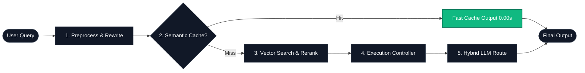

# AI Model Atlas 🗺️

### From Zero to Production-Grade RAG Systems — Learn, Build, Deploy, and Optimize Real AI Applications

> **A production-ready Agentic RAG system with Tool Routing, Evaluation, Vision, Graph Knowledge, Semantic Cache, Query Rewriting, and Execution Control.**

[English] | [中文 (README_zh.md)](README_zh.md)

[](LICENSE)
[](LICENSE-CODE)
[](#route-a-local-sandbox-interactive-ui-recommended)
[-orange?style=for-the-badge&logo=googlecolab)](https://colab.research.google.com/github/Hao610/AI-Model-Atlas/blob/main/projects/rag-app/quickstart.ipynb)

> [!NOTE]
> **New here?** Start with our [🧭 Getting Started Guide](docs/GETTING_STARTED.md) to choose the best roadmap for your goals!

Welcome to the **AI Model Atlas**! This repository is a comprehensive, beginner-friendly "dictionary-style" guide designed to take anyone from zero technical background to understanding, calling, running, and even fine-tuning modern Artificial Intelligence models. Let's play! 🚀

---

## 🧭 System Architecture Poster



---

## 🚀 Quick Start (Run Path Selector)

Select your preferred route to experience `AI Model Atlas` in under 60 seconds:

### Route A: Local Sandbox Interactive UI (Recommended)
Run the Streamlit observability app locally with semantic cache, reranking, and self-healing:
1. **Clone the repository and navigate to the project directory:**
   ```bash
   git clone https://github.com/Hao610/AI-Model-Atlas.git
   cd AI-Model-Atlas/projects/rag-app
   ```
2. **Install core dependencies:**
   ```bash
   pip install -r requirements.txt
   ```
3. **Launch the application dashboard:**
   ```bash
   python app.py
   ```
   *Note: Ensure Ollama is running locally if you want offline model execution.*

### Route B: Run the Streamlit App Directly
Enter the runnable example project and start the dashboard from your terminal:
```bash
cd projects/rag-app
streamlit run app.py
```

### Route C: Guided Conceptual Onboarding
If you want to read the step-by-step guides instead of running code, start here:
👉 **[00_learning_map.md](docs/phase1_0_to_1/00_learning_map.md)**

> **ℹ️ About Colab Playground**: Colab is provided as an optional fallback runtime. For a more reliable demo experience, we recommend running the local sandbox (Route A). Colab availability depends on Google's free backend capacity and may fail during peak usage.

---

### 🧩 What will I see in 30 seconds?

Here is the raw telemetry output from a typical cache-miss and cache-hit sequence:

```text
[🔄 Rewrite] Query normalized: "Tell me about Llama 3 license" -> "llama 3 license parameters"
[⚡ Cache]   Miss! ❌ Routing to retrieval & hybrid LLM.
[🎯 Rerank]  Passed Margin Filter (Cosine similarity: 0.89).
[Response]  "Llama 3 is licensed under..." (Latency: 1.25s)

--- Ask again: "Tell me about Llama 3 license" ---
[🔄 Rewrite] Query normalized: "Tell me about Llama 3 license" -> "llama 3 license parameters"
[⚡ Cache]   Hit! ✅ Bypassing vector search and LLM invocation.
[Response]  "Llama 3 is licensed under..." (Latency: 0.0001s)
```

---

## 💡 Why This Repository Exists

Most RAG tutorials stop at embeddings or naïve retrieval demos. `AI Model Atlas` goes further, providing a real-world, engineer-grade cognitive RAG reference architecture. By integrating Semantic Cache, Query Rewriting, Relevance Reranking, and an Execution Controller, it bridges the gap between toy demos and production-ready systems.

---

## 🚀 What This Project Offers

- **🚦 Retrieval Orchestration Layer**: A deterministic regex-based router dispatching queries to Calculator, Web Search, Graph, or Vector tools.
- **📊 Lightweight Evaluation Framework**: A native LLM-as-a-judge engine designed to evaluate routing accuracy, faithfulness, and groundedness.
- **👁️ Vision RAG & Structural Parsing**: Transparent, multi-engine extraction (`pdfplumber` + `PyMuPDF`) that preserves explicit table boundaries and natively filters structural images.
- **📦 Table-Aware Chunking**: Dynamic atomic vector blocks to guarantee tabular integrity during LLM retrieval.
- **🕸️ GraphRAG Knowledge Network**: A native, lightweight Knowledge Graph extractor using NetworkX with two-stage relation extraction and 1-hop traversal routing.
- **🧠 Cognitive Query Rewriting**: Dynamic regex and prompt filters to normalize user intents before retrieval.
- **🎯 Relevance Reranking**: Reciprocal Rank Fusion (RRF) combining Dense and Sparse (BM25) search scores.
- **🛡️ Execution Controller**: Orchestrated request center with fallback routing, exponential backoffs, and timeouts.
- **🌐 Hybrid LLM Core**: Dynamic routing between local Ollama installations and commercial OpenAI/DeepSeek API endpoints.
- **⚡ Semantic Cache**: Lightweight vector embedding dictionary checks for extreme latency reduction.

---

## 🎯 Who is this for?

* 🧭 **Beginners** → Learn fundamental AI concepts with zero mathematical barrier and clear analogies.
* 💻 **Developers** → Master API integration, local model execution, and rapid UI prototyping.
* 🏗️ **Engineers & Architects** → Deploy production-ready RAG architectures, scale agent workflows, and optimize inference.
* 🚀 **Pioneers** → Dive deep into fine-tuning (LoRA), quantization, GPU selection, and cloud serving infrastructure.

---

## 🧭 Choose Your Goal

| Your Goal | Where to Go |
| :--- | :--- |
| 🚀 **Run the system now** | ↑ [Quick Start](#-quick-start-run-path-selector) |
| 🧠 **Understand the architecture** | 📐 [ARCHITECTURE.md](docs/ARCHITECTURE.md) — Benchmarks, failure recovery, state machine |
| 📚 **Learn AI from scratch** | 📚 [CURRICULUM.md](docs/CURRICULUM.md) — 31-module "0 to 100" learning roadmap |
| 🧬 **Deep dive into algorithms** | 🧬 [DEEP_DIVES.md](docs/DEEP_DIVES.md) — The 17-chapter epic tech documentary |

---

## 💡 Repository Design Philosophy

1. **Text-First & Zero-Bloat**: No heavy image files that get outdated when software UI changes. We use elegant Markdown layout, detailed tables, flow charts, and structured lists.
2. **Double Portal, Localized Content**: The English and Chinese versions of the documents are written by hand (no raw robotic translations) ensuring idiomatic, easy-to-understand explanations for developers in both regions.
3. **From Scratch to Cloud**: The guide doesn't stop at "Prompting". It goes all the way to cloud GPU fine-tuning, explaining the full engineering lifecycle of model operation.

---

## 🌍 Built something useful?

If this project helped you learn, build, or deploy Cognitive RAG systems, we invite you to join our growing community:

* **Star & Fork** ⭐: Star the repository to show support and bookmark it for quick access.
* **Share the Journey** 📢: Share the learning path or your own RAG implementation with other developers.
* **Contribute** 🤝: Submit pull requests, report issues, or suggest new modules. Check out our [Contribution Guidelines](.github/CONTRIBUTING.md) for details.
* **Community Rules** 🧭: Read our [Code of Conduct](.github/CODE_OF_CONDUCT.md) and [Security Policy](.github/SECURITY.md) before contributing.

🚀 **Spread the word:**

> Built a production-grade Cognitive RAG system with Semantic Cache, Query Rewriting, Reranking, and Failure Recovery — from learning to deployment. Check out the AI Model Atlas!
> 👉 https://github.com/Hao610/AI-Model-Atlas

## 📄 License

AI Model Atlas uses a dual-license model:

- **Documentation, curriculum, diagrams, and educational materials**: Creative Commons Attribution 4.0 International (see [`/LICENSE`](LICENSE))
- **Source code & runnable examples**: MIT License (see [`/LICENSE-CODE`](LICENSE-CODE))

> This repository distinguishes between software and educational content licensing to ensure clear reuse rights. It is continuously updated, and all new content follows the same licensing model unless explicitly stated otherwise.

Copyright (c) 2026 Loi Chiang Hao.
