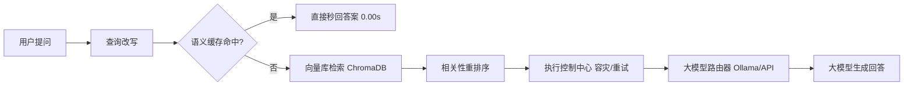
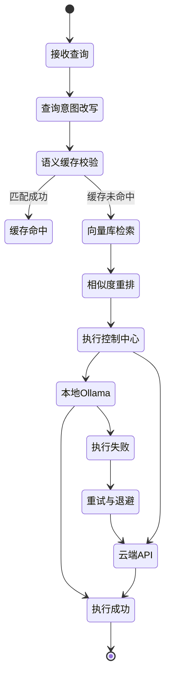
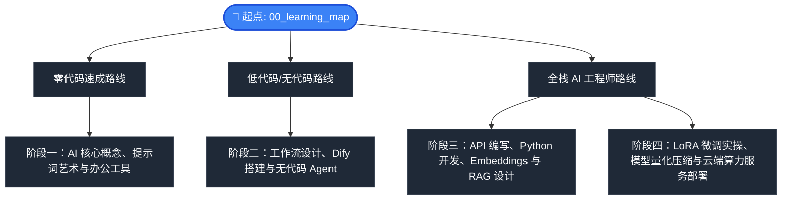

# AI-Model-Atlas 🗺️ | AI 模型图谱

### 从 0 到生产级 RAG 系统：学习 · 构建 · 部署 · 优化

> **一个具备语义缓存、查询重写、重排与执行控制的工业级智能 RAG 系统 —— 为开发者、研究者和 AI 工程师打造。**

[[English] (README.md)](README.md) | [中文]

欢迎来到 **AI-Model-Atlas** (AI 模型图谱)！本项目是一个系统化、面向初学者的“字典式”实战指南。我们的目标是：**帮助没有任何 IT、代码或算法背景的零基础学习者，一路打通关，直到能够调用、本地运行、量化并微调大模型。**

---

## ⚡ 3秒理解系统数据流向 (3-Second Flow)

---

## 🚀 快速开始 (60秒极速体验)

在本地快速尝试 AI-Model-Atlas：
1. `git clone https://github.com/Hao610/AI-Model-Atlas.git`
2. `cd projects/rag-app && python app.py`
3. 上传 PDF，实时观察语义缓存优化与重排效果！

---

## 💡 为什么发起本项目？

市面上的 RAG 教程大多停留在 Embeddings 或简单检索演示。`AI-Model-Atlas` 更进一步，提供面向生产落地的工业级认知 RAG 系统参考架构。通过整合语义缓存、查询改写、检索重排与执行控制器，打通从 Demo 到生产级系统之间的最后一步。

---

## 🚀 本项目提供什么 (Key Features)

- **🧠 认知级 RAG 架构**：从查询意图理解到检索相关性优化的完整生产级闭环。
- **⚡ 语义缓存加速**：通过向量相似度匹配与长度比例控制拦截重复请求，实现毫秒级超快响应。
- **🔄 查询意图改写**：内置智能正则和提示词过滤器，去除口语噪音，精准提取检索意图。
- **🎯 检索相关性重排**：支持设定余弦距离阈值过滤无效噪声片段，保证大模型上下文的高可信度。
- **🛡️ 强大的请求控制面**：统一接管请求生命周期，支持指数级退避重试、连接超时控制与故障降级（本地 Ollama 掉线自动切至云端 API 兜底）。
- **🌐 混合大模型推理后端**：支持在本地 Ollama (Llama 3/DeepSeek) 与云端 API 之间进行热切换。
- **📊 可观测性能看板**：Streamlit 终端实时量化首 Token 延迟 (TTFT) 与吞吐速率 (Tokens/秒)。

---

## 🧠 系统工程深度剖析

### ⚡ 系统性能基准指标

*免责声明：以下性能指标均在本地开发测试环境（单卡 GPU / CPU 兜底模式）下测量得出，生产环境高负载下可能会有所偏差。*

| 配置模式 | 语义缓存 | 相似度重排 | 推理后端 | 响应时延 (均值) | 首字延迟 (TTFT) |
| :--- | :---: | :---: | :--- | :--- | :--- |
| **本地离线模型** | ❌ | ❌ | Ollama (Llama 3) | ~2.8s | 1.4s |
| **本地离线模型** | ✅ | ❌ | Ollama (Llama 3) | **~0.2s** | **0.05s** (缓存命中) |
| **混合动力模式** | ✅ | ✅ | OpenAI API | ~0.8s | 0.3s |
| **混合动力模式** | ❌ | ✅ | OpenAI API | ~2.1s | 0.9s |

### 🛡️ 故障容灾与自愈演示

系统设计上具备完善的故障降配与容灾自愈能力，以确保服务高可用：

#### 场景模拟：本地运行的 Ollama 离线掉线
1. **ExecutionController (执行控制中心)** 检测到本地连接超时或网络握手异常。
2. **指数级退避重试 (Exponential Backoff)** 机制被激活（自动延迟梯度：200ms -> 500ms -> 1s）。
3. **优雅降级路由 (Degraded Fallback)** 触发：无需用户干预，系统自动将提问流量重定向切换至配置的云端 API（OpenAI/DeepSeek）。
4. **降级状态透明化**：控制中心向 Streamlit 终端实时输出异常告警日志与状态转移轨迹。

*最终效果：系统在此异常场景下依然保持正常响应与回答，避免客户端 unhandled 崩溃死锁。*

### 🔍 执行控制状态机

底层流水线的每一次请求调用均在严密的控制状态机管理下运行：

---

## 🎯 本项目适合谁？

* 🧭 **零基础小白** → 通过通俗比喻和无数学公式的解构，轻松跨越 AI 概念门槛。
* 💻 **应用层开发者** → 掌握 API 接入、本地大模型运行以及快速 Web 界面开发。
* 🏗️ **AI 系统架构师** → 学习工业级 RAG 架构设计、多 Agent 协同流编排及向量数据库检索优化。
* 🚀 **硬核研究与极客** → 深入模型微调（LoRA）、量化压缩原理、算力选型及云端 GPU 高并发部署。

---

## 📍 快速开始 → 学习路径导航

为了让你更清晰地根据个人目标进行针对性学习，建议选择以下量身定制的通关路线：

---

## 🗺️ “从 0 到 100” 学习路线图

以下是为你精心设计的进阶路径，每一阶段都为下一阶段打下坚实的基础。

### 🎬 阶段一：认知觉醒 (从 0 到 1)
> **本阶段旨在打破 AI 的神秘感。你将学习大模型的基本术语、开源协议规则、结构化提示词框架，并学会如何游刃有余地在现代 AI 生态中导航。**
* **学习目标**：从零 AI 概念小白，成长为能够熟练对比各主流模型平台、熟练运用提示词的高效使用者。

| 模块 | 核心内容简介 | 英文版指南 | 中文版指南 |
| :--- | :--- | :--- | :--- |
| **0. 学习路线导航** | 选择属于你的通关路线（零代码体验 vs 低代码搭建 vs 硬核研发）。 | [00_learning_map.md](docs/phase1_0_to_1/00_learning_map.md) | [00_learning_map_zh.md](docs/phase1_0_to_1/00_learning_map_zh.md) |
| **1. 什么是 AI？** | 用大白话和生活实例解释什么是机器学习、深度学习和大模型。 | [01_what_is_ai.md](docs/phase1_0_to_1/01_what_is_ai.md) | [01_what_is_ai_zh.md](docs/phase1_0_to_1/01_what_is_ai_zh.md) |
| **2. 提示词艺术** | 掌握 ROLE 框架、Few-Shot 样本等高效与大模型对话的公式。 | [02_prompt_art.md](docs/phase1_0_to_1/02_prompt_art.md) | [02_prompt_art_zh.md](docs/phase1_0_to_1/02_prompt_art_zh.md) |
| **3. 开源协议指南** | MIT、Apache 2.0 到底是什么？为什么有些模型不能拿来商用？ | [03_licenses.md](docs/phase1_0_to_1/03_licenses.md) | [03_licenses_zh.md](docs/phase1_0_to_1/03_licenses_zh.md) |
| **4. 常用 AI 工具** | 开箱即用的办公与创意工具全景图 (ChatGPT, Claude, Midjourney)。 | [04_ai_tools.md](docs/phase1_0_to_1/04_ai_tools.md) | [04_ai_tools_zh.md](docs/phase1_0_to_1/04_ai_tools_zh.md) |
| **5. 模型动物园** | 一张表看懂 GPT, Claude, Gemini, Llama, DeepSeek, Qwen。 | [05_model_zoo.md](docs/phase1_0_to_1/05_model_zoo.md) | [05_model_zoo_zh.md](docs/phase1_0_to_1/05_model_zoo_zh.md) |
| **6. Hugging Face 极简指南** | 玩转 AI 军火库：文件后缀解密、Python 自动下载模型。 | [06_huggingface_guide.md](docs/phase1_0_to_1/06_huggingface_guide.md) | [06_huggingface_guide_zh.md](docs/phase1_0_to_1/06_huggingface_guide_zh.md) |
| **7. 核心词汇表** | 新手查字典：Token、Temperature、Context Window 分别代表什么。 | [07_glossary.md](docs/phase1_0_to_1/07_glossary.md) | [07_glossary_zh.md](docs/phase1_0_to_1/07_glossary_zh.md) |

### 🏗️ 阶段二：搭建与架构 (从 1 到 10)
> **本阶段帮助你完成从“普通对话用户”到“AI 系统架构师”的跨越。通过低代码/无代码工具，构建起复杂的 AI 协作体系。**
* **学习目标**：掌握大模型外挂知识库 (RAG) 原理，学会利用工作流与智能体工具搭建自动运行的业务流。

| 模块 | 核心内容简介 | 英文版指南 | 中文版指南 |
| :--- | :--- | :--- | :--- |
| **8. 大模型全景图谱** | 探索现代闭源模型与开源权重的技术脉络与分化。 | [08_llm_landscape.md](docs/phase2_1_to_10/08_llm_landscape.md) | [08_llm_landscape_zh.md](docs/phase2_1_to_10/08_llm_landscape_zh.md) |
| **9. 无代码 Agent 搭建** | 如何使用 Coze (扣子) 和 Dify 一步步配置属于你自己的智能体。 | [09_no_code_agents.md](docs/phase2_1_to_10/09_no_code_agents.md) | [09_no_code_agents_zh.md](docs/phase2_1_to_10/09_no_code_agents_zh.md) |
| **10. 多模态 AI** | 文字之外的世界：Stable Diffusion生图、语音Whisper、Sora视频。 | [10_multimodal_models.md](docs/phase2_1_to_10/10_multimodal_models.md) | [10_multimodal_models_zh.md](docs/phase2_1_to_10/10_multimodal_models_zh.md) |
| **11. RAG 知识库检索** | 什么是检索增强生成？如何让 AI 在几秒内阅读完并学习本地 PDF。 | [11_rag_intro.md](docs/phase2_1_to_10/11_rag_intro.md) | [11_rag_intro_zh.md](docs/phase2_1_to_10/11_rag_intro_zh.md) |
| **12. 向量数据库入门** | 了解 Chroma、Milvus、FAISS 和 PGVector 的定位与选择。 | [12_vector_db.md](docs/phase2_1_to_10/12_vector_db.md) | [12_vector_db_zh.md](docs/phase2_1_to_10/12_vector_db_zh.md) |
| **13. AI 工作流架构** | 解析 用户 -> 智能体 -> RAG -> 大模型 的完整工作数据流向。 | [13_ai_workflows.md](docs/phase2_1_to_10/13_ai_workflows.md) | [13_ai_workflows_zh.md](docs/phase2_1_to_10/13_ai_workflows_zh.md) |
| **14. 真实应用案例** | 客服机器人、企业知识库、AI翻译等实战场景配置指南。 | [14_use_cases.md](docs/phase2_1_to_10/14_use_cases.md) | [14_use_cases_zh.md](docs/phase2_1_to_10/14_use_cases_zh.md) |

### 💻 阶段三：开发构建与集成 (从 10 到 50)
> **本阶段正式进入代码的世界。你将学习如何用 Python 对大模型进行精细化控制，并为其编写可视化的交互界面。**
* **学习目标**：编写代码调用多模型 API、设计可上线的语义向量搜索链路，以及零门槛开发出交付级 AI 网页应用。

| 模块 | 核心内容简介 | 英文版指南 | 中文版指南 |
| :--- | :--- | :--- | :--- |
| **15. API 接入秘籍** | 申请 API 密钥 (Key)，并用几行最简的 Python 代码调用大模型。 | [15_api_guide.md](docs/phase3_10_to_50/15_api_guide.md) | [15_api_guide_zh.md](docs/phase3_10_to_50/15_api_guide_zh.md) |
| **16. 计费与 Token 经济学** | Token计费原理、各大模型价格PK、GPU租用与API成本比对。 | [16_cost_and_tokens.md](docs/phase3_10_to_50/16_cost_and_tokens.md) | [16_cost_and_tokens_zh.md](docs/phase3_10_to_50/16_cost_and_tokens_zh.md) |
| **17. 本地大模型运行** | 使用 Ollama 和 LM Studio 在普通笔记本上本地跑起百亿模型。 | [17_local_llm.md](docs/phase3_10_to_50/17_local_llm.md) | [17_local_llm_zh.md](docs/phase3_10_to_50/17_local_llm_zh.md) |
| **18. 前端界面极速生成** | 使用 Streamlit 和 Gradio 一键为你的 AI 脚本套上好看的聊天网页。 | [18_ui_interfaces.md](docs/phase3_10_to_50/18_ui_interfaces.md) | [18_ui_interfaces_zh.md](docs/phase3_10_to_50/18_ui_interfaces_zh.md) |
| **19. 智能体开发框架** | 对比 CrewAI、AutoGen、LangChain、LangGraph，教你如何选择。 | [19_agent_frameworks.md](docs/phase3_10_to_50/19_agent_frameworks.md) | [19_agent_frameworks_zh.md](docs/phase3_10_to_50/19_agent_frameworks_zh.md) |
| **20. 向量表示与匹配** | 文本如何变成浮点数数组？解释余弦相似度匹配的物理意义。 | [20_embeddings.md](docs/phase3_10_to_50/20_embeddings.md) | [20_embeddings_zh.md](docs/phase3_10_to_50/20_embeddings_zh.md) |
| **21. RAG 系统架构设计** | 进阶切片策略（Sliding Window）、重排（Rerank）数理过滤逻辑。 | [21_rag_system_design.md](docs/phase3_10_to_50/21_rag_system_design.md) | [21_rag_system_design_zh.md](docs/phase3_10_to_50/21_rag_system_design_zh.md) |
| **22. Model Evaluation** | 如何判定大模型好坏？详解 BLEU、Human Eval 与大模型裁判。 | [22_evaluation.md](docs/phase3_10_to_50/22_evaluation.md) | [22_evaluation_zh.md](docs/phase3_10_to_50/22_evaluation_zh.md) |

### 🚀 阶段四：训练、微调与部署 (从 50 到 100)
> **本阶段是打通开源大模型与企业级私有化生产落地之间的关键桥梁。你将直接和算力服务器、显卡、自定义数据集打交道。**
* **学习目标**：独立完成数据集制作与清洗，掌握 LoRA 微调流程，学会对模型量化提速，并在云端完成私有化高并发部署。

| 模块 | 核心内容简介 | 英文版指南 | 中文版指南 |
| :--- | :--- | :--- | :--- |
| **23. 数据准备与清洗** | JSON/JSONL格式规范、去重Checklist、大模型生成合成数据。 | [23_data_preparation.md](docs/phase4_50_to_100/23_data_preparation.md) | [23_data_preparation_zh.md](docs/phase4_50_to_100/23_data_preparation_zh.md) |
| **24. 为什么要微调？** | 为什么提示词不能解决所有问题？什么时候该训练专属模型。 | [24_finetuning.md](docs/phase4_50_to_100/24_finetuning.md) | [24_finetuning_zh.md](docs/phase4_50_to_100/24_finetuning_zh.md) |
| **25. LoRA 极简原理解释** | 用修图软件中的“滤镜图层”通俗解释低秩适应（LoRA）原理。 | [25_lora_explained.md](docs/phase4_50_to_100/25_lora_explained.md) | [25_lora_explained_zh.md](docs/phase4_50_to_100/25_lora_explained_zh.md) |
| **26. LLaMA-Factory 训练** | 图形化微调利器：无需手写 PyTorch 训练循环，一键点选训练。 | [26_llama_factory.md](docs/phase4_50_to_100/26_llama_factory.md) | [26_llama_factory_zh.md](docs/phase4_50_to_100/26_llama_factory_zh.md) |
| **27. Model Quantization** | GGUF vs FP16, compressing 70B models down to consumer GPUs. | [27_quantization.md](docs/phase4_50_to_100/27_quantization.md) | [27_quantization_zh.md](docs/phase4_50_to_100/27_quantization_zh.md) |
| **28. 显卡选型备忘录** | RTX 4090/5090 能跑什么？A100、H100 究竟贵在哪里？ | [28_gpu_selection.md](docs/phase4_50_to_100/28_gpu_selection.md) | [28_gpu_selection_zh.md](docs/phase4_50_to_100/28_gpu_selection_zh.md) |
| **29. 推理优化与高并发服务** | 深入 KV Cache、动态批处理（Continuous Batching）、流式推理。 | [29_inference_optimization.md](docs/phase4_50_to_100/29_inference_optimization.md) | [29_inference_optimization_zh.md](docs/phase4_50_to_100/29_inference_optimization_zh.md) |
| **30. 对齐与安全围栏** | 解释 RLHF、DPO 以及为什么大模型会拒绝回答你的敏感问题。 | [30_safety_alignment.md](docs/phase4_50_to_100/30_safety_alignment.md) | [30_safety_alignment_zh.md](docs/phase4_50_to_100/30_safety_alignment_zh.md) |
| **31. 云端 GPU 算力部署** | 租用 AutoDL / RunPod 显卡，并完成开源模型的私有化服务上线。 | [31_deployment.md](docs/phase4_50_to_100/31_deployment.md) | [31_deployment_zh.md](docs/phase4_50_to_100/31_deployment_zh.md) |

---

## 💡 本仓库设计原则

1. **文字第一，免于维护**：我们坚决不用界面截图。因为 AI 平台和工具的 UI 变化极快，截图极易失效。我们通过手绘 Markdown 图表、表格对比和文字解构来传达永不过时的原理。
2. **拒绝生硬机翻，真双语并行**：英文版 and 中文版均是由算法开发人员人工编写与校验，用词贴近中西方开发者日常习惯，杜绝死板晦涩的机器直译。
3. **闭环式实操**：不搞纯空洞理论。每一阶段的最后，读者都能得到完整的“配置清单”或“一键启动代码”，确保知识能够真正落地。

---

## 🌍 创造了有价值的工具？

如果本项目帮助你学习、构建或部署了认知级 RAG 系统，我们诚挚地邀请你加入我们的共建社区：

* **点亮 Star & Fork** ⭐：点亮 Star 以示支持，并 Fork 项目以便快速检索。
* **分享学习旅程** 📢：将本图谱或你自己的 RAG 实战成果分享给更多开发者。
* **参与共建** 🤝：提交 Pull Request、反馈 Bug 或提出新模块建议。详情请参阅我们的[贡献指南](CONTRIBUTING_zh.md)。

🚀 **一键分享：**

> 我使用 Python 搭建了一个具备语义缓存、查询改写、重排与故障自愈的工业级认知 RAG 系统！推荐正在学习和构建 AI 应用的开发者看看 AI-Model-Atlas。
> 👉 https://github.com/Hao610/AI-Model-Atlas

---

## 📄 开源协议 (License)

AI-Model-Atlas 遵循 Creative Commons Attribution 4.0 International License (CC BY 4.0) 开源知识共享协议。详细中文说明请参考 [LICENSE_zh](LICENSE_zh)。

只要您遵守署名等基本协议条款，即可自由分享、传播以及进行商业化利用。

Copyright (c) 2026 AI-Model-Atlas

Created and maintained by Loi Chiang Hao.
