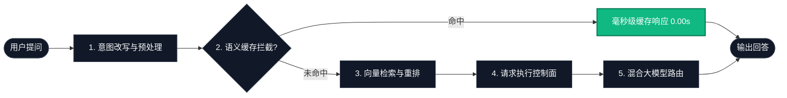

# AI-Model-Atlas 🗺️ | AI 模型图谱

### 从 0 到生产级 RAG 系统：学习 · 构建 · 部署 · 优化

> **一个具备语义缓存、查询重写、重排与执行控制的工业级智能 RAG 系统 —— 为开发者、研究者和 AI 工程师打造。**

[[English] (README.md)](README.md) | [中文]

[](#%E8%B7%AF%E5%BE%84-a%E6%9C%AC%E5%9C%B0%E6%B2%99%E7%9B%92%E4%BA%A4%E4%BA%92%E5%BC%8F-ui-%E6%8E%A8%E8%8D%90)
[-orange?style=for-the-badge&logo=googlecolab)](https://colab.research.google.com/github/Hao610/AI-Model-Atlas/blob/main/projects/rag-app/quickstart.ipynb)

欢迎来到 **AI-Model-Atlas** (AI 模型图谱)！本项目是一个系统化、面向初学者的"字典式"实战指南。我们的目标是：**帮助没有任何 IT、代码或算法背景的零基础学习者，一路打通关，直到能够调用、本地运行、量化并微调大模型。直接上手玩玩看！** 🚀

---

## 🧭 系统架构图谱



---

## 🚀 快速开始 (运行路径选择器)

选择你最想体验 `AI-Model-Atlas` 的路径，在 60 秒内上手：

### 路径 A：本地沙盒交互式 UI (推荐)
在本地运行 Streamlit 可观测性面板，实时体验语义缓存、检索重排序与自愈控制：
1. **克隆仓库并进入项目目录：**
   ```bash
   git clone https://github.com/Hao610/AI-Model-Atlas.git
   cd AI-Model-Atlas/projects/rag-app
   ```
2. **安装核心依赖：**
   ```bash
   pip install -r requirements.txt
   ```
3. **启动应用面板：**
   ```bash
   python app.py
   ```
   *提示：如果需要本地离线大模型支持，请确保 Ollama 服务已在后台运行。*

### 路径 B：直接启动 Streamlit 应用
进入可运行示例项目，并从终端启动交互式应用面板：
```bash
cd projects/rag-app
streamlit run app.py
```

### 路径 C：概念与学习路线图
如果你当前无法运行代码，可以从手把手教程入口开始阅读：
👉 **[00_learning_map_zh.md](docs/phase1_0_to_1/00_learning_map_zh.md)**

> **ℹ️ 关于 Colab 在线体验**：Colab 仅作为可选的备用运行环境。如需更稳定的体验，建议使用本地沙盒（路径 A）。Colab 的可用性取决于 Google 免费后端算力资源池，高峰期可能出现分配失败。

---

### 🧩 运行后我能看到什么？

以下是系统在"缓存未命中"与"缓存命中"状态下的典型终端/看板输出日志：

```text
[🔄 查询改写] 意图归一化: "帮我查一下 Llama 3 开源协议" -> "llama 3 license parameters"
[⚡ 语义缓存] 未命中! ❌ 正在路由至向量库检索与大模型调用。
[🎯 相关重排] 成功通过相似度阈值过滤 (余弦距离评分: 0.89)。
[回复内容]   "Llama 3 遵循 LLAMA 3 社区许可协议..." (响应时延: 1.25秒)

--- 再次输入相同提问: "帮我查一下 Llama 3 开源协议" ---
[🔄 查询改写] 意图归一化: "帮我查一下 Llama 3 开源协议" -> "llama 3 license parameters"
[⚡ 语义缓存] 命中! ✅ 成功拦截，直接绕过向量检索与大模型推理。
[回复内容]   "Llama 3 遵循 LLAMA 3 社区许可协议..." (响应时延: 0.0001秒)
```

---

## 💡 为什么发起本项目？

市面上的 RAG 教程大多停留在 Embeddings 或简单检索演示。`AI-Model-Atlas` 更进一步，提供面向生产落地的工业级认知 RAG 系统参考架构。通过整合语义缓存、查询改写、检索重排与执行控制器，打通从 Demo 到生产级系统之间的最后一步。

---

## 🚀 本项目提供什么 (Key Features)

- **🧠 认知级 RAG 架构**：从查询意图理解到检索相关性优化的完整生产级闭环。
- **⚡ 语义缓存加速**：通过向量相似度匹配与长度比例控制拦截重复请求，实现毫秒级超快响应。
- **🔄 查询意图改写**：内置智能正则和提示词过滤器，去除口语噪音，精准提取检索意图。
- **🎯 检索相关性重排**：支持设定余弦距离阈值过滤无效噪声片段，保证大模型上下文的高可信度。
- **🛡️ 强大的请求控制面**：统一接管请求生命周期，支持指数级退避重试、连接超时控制与故障降级（本地 Ollama 掉线自动切至云端 API 兜底）。
- **🌐 混合大模型推理后端**：支持在本地 Ollama (Llama 3/DeepSeek) 与云端 API 之间进行热切换。
- **📊 可观测性能看板**：Streamlit 终端实时量化首 Token 延迟 (TTFT) 与吞吐速率 (Tokens/秒)。

---

## 🎯 本项目适合谁？

* 🧭 **零基础小白** → 通过通俗比喻和无数学公式的解构，轻松跨越 AI 概念门槛。
* 💻 **应用层开发者** → 掌握 API 接入、本地大模型运行以及快速 Web 界面开发。
* 🏗️ **AI 系统架构师** → 学习工业级 RAG 架构设计、多 Agent 协同流编排及向量数据库检索优化。
* 🚀 **硬核研究与极客** → 深入模型微调（LoRA）、量化压缩原理、算力选型及云端 GPU 高并发部署。

---

## 🧭 选择你的目标

| 你的目标 | 前往 |
| :--- | :--- |
| 🚀 **立刻运行系统** | ↑ [快速开始](#-快速开始-运行路径选择器) |
| 🧠 **理解系统架构** | 📐 [ARCHITECTURE_zh.md](ARCHITECTURE_zh.md) — 性能指标、容灾自愈、状态机 |
| 📚 **从零学习 AI** | 📚 [CURRICULUM_zh.md](CURRICULUM_zh.md) — 31 模块 "从 0 到 100" 学习路线图 |

---

## 💡 本仓库设计原则

1. **文字第一，免于维护**：我们坚决不用界面截图。因为 AI 平台和工具的 UI 变化极快，截图极易失效。我们通过手绘 Markdown 图表、表格对比和文字解构来传达永不过时的原理。
2. **拒绝生硬机翻，真双语并行**：英文版 and 中文版均是由算法开发人员人工编写与校验，用词贴近中西方开发者日常习惯，杜绝死板晦涩的机器直译。
3. **闭环式实操**：不搞纯空洞理论。每一阶段的最后，读者都能得到完整的"配置清单"或"一键启动代码"，确保知识能够真正落地。

---

## 🌍 创造了有价值的工具？

如果本项目帮助你学习、构建或部署了认知级 RAG 系统，我们诚挚地邀请你加入我们的共建社区：

* **点亮 Star & Fork** ⭐：点亮 Star 以示支持，并 Fork 项目以便快速检索。
* **分享学习旅程** 📢：将本图谱或你自己的 RAG 实战成果分享给更多开发者。
* **参与共建** 🤝：提交 Pull Request、反馈 Bug 或提出新模块建议。详情请参阅我们的[贡献指南](CONTRIBUTING_zh.md)。

🚀 **一键分享：**

> 我使用 Python 搭建了一个具备语义缓存、查询改写、重排与故障自愈的工业级认知 RAG 系统！推荐正在学习和构建 AI 应用的开发者看看 AI-Model-Atlas。
> 👉 https://github.com/Hao610/AI-Model-Atlas

---

## 📄 开源协议 (License)

AI-Model-Atlas 采用双协议模式：

- **源代码与可运行示例项目**：[MIT License](LICENSE)
- **文档、课程体系、图示与教学内容**：[CC BY 4.0](LICENSE-CONTENT)

协议详情：
- 代码 → [LICENSE](LICENSE)
- 内容 → [LICENSE-CONTENT](LICENSE-CONTENT) (https://creativecommons.org/licenses/by/4.0/)

Copyright (c) 2026 Loi Chiang Hao

Created and maintained by Loi Chiang Hao.
