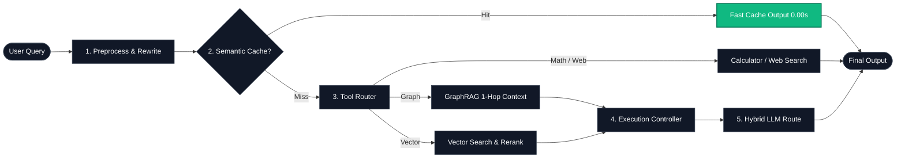
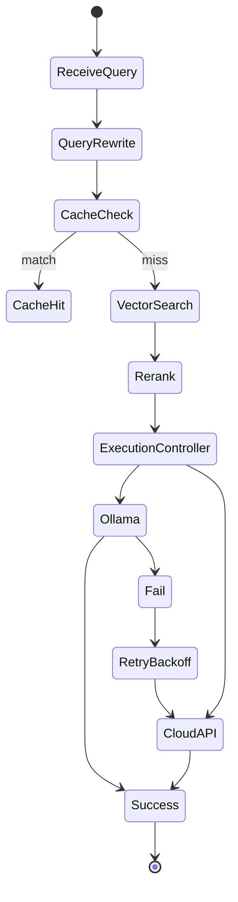
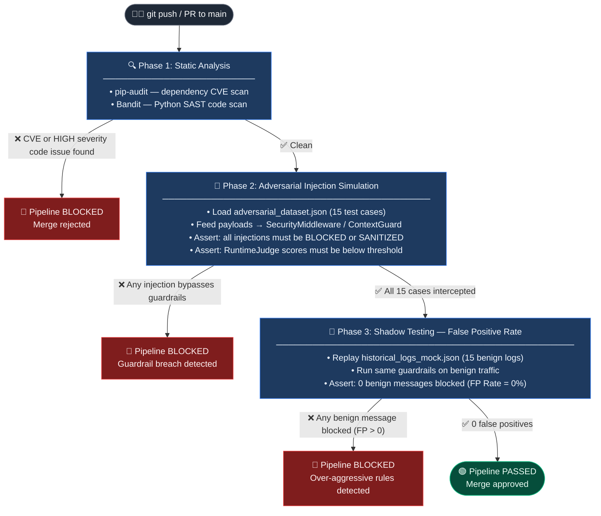

<p align="center">
  
</p>

# 📐 AI Model Atlas — System Architecture

> Engineering-grade deep dive into the Cognitive RAG system internals: benchmarks, failure recovery, and execution control.

← Back to [README](../README.md) | [中文架构文档 (ARCHITECTURE_zh.md)](ARCHITECTURE_zh.md)

---

## 🧭 System Architecture Poster



---

## 🚀 Key Features (with Code References)

- **🧠 Cognitive RAG Architecture**: Complete pipeline integration orchestrating the application flow. 
  - *Source:* [`rag_pipeline.py`](../projects/rag-app/core/rag_pipeline.py)
- **🛡️ Zero-Trust Boundaries**: Strict security enforcement between user inputs, retrieved context, and the execution engine.
- **🛡️ SafetyJudge & ContextGuard**: Real-time evaluation engines to intercept prompt injection, RAG poisoning, and malicious outputs.
- **⚙️ Automated CI/CD Pipeline**: Continuous security validation and DevSecOps workflows integrated directly into the deployment process.
- **⚡ Persistent Semantic Cache**: Lightweight vector embedding dictionary checks for extreme latency reduction. State is persisted in JSON.
  - *Source:* [`cache/semantic_cache.py`](../projects/rag-app/core/cache/semantic_cache.py)
- **🔄 Query Rewriting**: Dynamic regex and prompt filters to normalize user intents before retrieval.
  - *Source:* [`intelligence/query_rewriter.py`](../projects/rag-app/core/intelligence/query_rewriter.py)
- **🎯 Hybrid Retrieval & RRF Reranking**: Combines Dense (ChromaDB) and Sparse (BM25) search, then fuses scores via Reciprocal Rank Fusion.
  - *Source:* [`intelligence/reranker.py`](../projects/rag-app/core/intelligence/reranker.py) | [`vectorstore.py`](../projects/rag-app/core/vectorstore.py)
- **🛡️ Execution Controller**: Orchestrated request center with fallback routing, exponential backoffs, and timeouts.
  - *Source:* [`execution_controller.py`](../projects/rag-app/core/execution_controller.py)
- **🌐 Hybrid LLM Core**: Dynamic routing between local Ollama installations and commercial OpenAI/DeepSeek API endpoints.
  - *Source:* [`llm_router.py`](../projects/rag-app/core/llm_router.py)
- **👁️ Structural Parsing & Table-Aware Chunking (Vision RAG)**: Complete atomic chunking for Markdown tables and PyMuPDF image extractions to prevent data fragmentation.
  - *Source:* [`parsing/pdf_parser.py`](../projects/rag-app/core/parsing/pdf_parser.py) | [`chunking/element_chunker.py`](../projects/rag-app/core/chunking/element_chunker.py)
- **🕸️ Lightweight Native GraphRAG**: Memory-based NetworkX Knowledge Graph running on a two-stage LLM entity/relation extraction architecture with 1-Hop traversal routing.
  - *Source:* [`graph/graph_store.py`](../projects/rag-app/core/graph/graph_store.py) | [`graph/graph_search_tool.py`](../projects/rag-app/core/graph/graph_search_tool.py)

---

## 🧠 System Runtime Model

### ⚡ Speed (What you feel)

*Disclaimer: Benchmarks are measured under local development test environments (single GPU / CPU fallback mode) and may vary under production load.*

| Configuration | Cache | Rerank | Backend | Latency (avg) | TTFT |
| :--- | :---: | :---: | :--- | :--- | :--- |
| **Local Ollama** | ❌ | ❌ | Ollama (Llama 3) | ~2.8s | 1.4s |
| **Local Ollama** | ✅ | ❌ | Ollama (Llama 3) | **~0.2s** | **0.05s** (Cache Hit) |
| **Hybrid Mode** | ✅ | ✅ | OpenAI API | ~0.8s | 0.3s |
| **Hybrid Mode** | ❌ | ✅ | OpenAI API | ~2.1s | 0.9s |

### 🛡️ Stability (When things break)

The system is designed to gracefully degrade under backend failure conditions to preserve service uptime:

#### Scenario: Local Ollama backend goes offline
1. **ExecutionController** detects connection timeout or handshake failures.
2. **Exponential Backoff Retry** mechanism triggers (automatic delays: 200ms -> 500ms -> 1s).
3. **Graceful Fallback Routing** active: switches the query endpoint automatically to the configured cloud API (OpenAI/DeepSeek).
4. **Degraded State Visualization**: system logs warnings and state shifts to the Streamlit observability console.

*Result: System continues responding to user queries without throwing unhandled terminal crashes.*

### 🧭 Logic (How choices are made)

The workflow logic operates on a strict request control state machine. You can trace this logic flow directly inside [`rag_pipeline.py`](../projects/rag-app/core/rag_pipeline.py).




---

## 🛡️ DevSecOps CI/CD Lifecycle

Every code commit or Pull Request to `main` automatically triggers a 3-phase security validation pipeline via GitHub Actions. The pipeline acts as a **security gate**: all three phases must pass before a merge is permitted.

### CI/CD Pipeline Flow



### Source References

| Artifact | Purpose |
| :--- | :--- |
| [`.github/workflows/security_pipeline.yml`](../.github/workflows/security_pipeline.yml) | GitHub Actions workflow — orchestrates all 3 phases |
| [`tests/red_teaming/adversarial_dataset.json`](../projects/rag-app/tests/red_teaming/adversarial_dataset.json) | 15 sanitized adversarial test cases (Phase 2 input) |
| [`tests/red_teaming/historical_logs_mock.json`](../projects/rag-app/tests/red_teaming/historical_logs_mock.json) | 15 benign conversation logs (Phase 3 input) |
| [`tests/red_teaming/test_pipeline.py`](../projects/rag-app/tests/red_teaming/test_pipeline.py) | pytest suite — `TestAdversarialInjection` + `TestShadowFalsePositives` |

> Run the full red teaming suite locally before opening a PR:
> ```bash
> cd projects/rag-app
> poetry run pytest tests/red_teaming/ -v
> ```

---

## 📄 License

This document is part of [AI Model Atlas](../README.md), licensed under [CC BY 4.0](../LICENSE).
