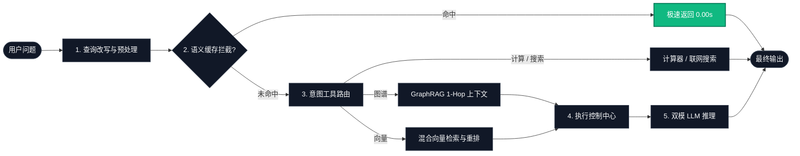
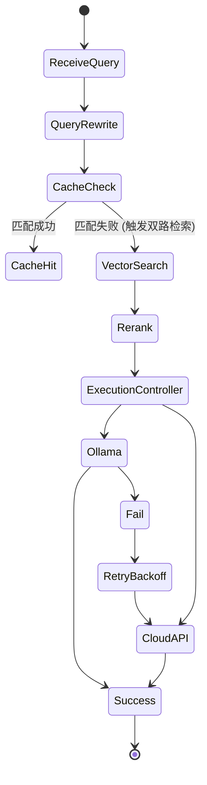

  

# 📐 AI Model Atlas — 系统架构文档

> 认知级 RAG 系统的工程深度剖析：性能指标、容灾自愈与执行控制。

← 返回 [中文首页](../README_zh.md) | [English Architecture (ARCHITECTURE.md)](ARCHITECTURE.md)

---

## 🚀 本项目提供什么 (Key Features)

*   **零信任安全边界 (Zero-Trust Boundaries)**: 集成 `SecurityMiddleware` 和 `ContextGuard` 进行全局流量拦截与净化。
*   **多维运行时评估 (RuntimeJudge)**: 实时对大模型交互进行安全性、可靠性与韧性打分。
*   **自动化 DevSecOps 流水线**: 开箱即用的 CI/CD，实现持续的威胁建模与对抗性基准测试。
*   **解耦式 Prompt 管理 (PromptOps)**: 告别代码里硬编码长文本，实现提示词与业务逻辑完全分离。
*   **意图路由 (Agentic Routing)**: 基于零样本推理，让 LLM 自动决定该调用哪个工具或知识库。
*   **语义缓存 (Semantic Cache)**: 亚毫秒级的向量缓存拦截，为你省下 90% 的 API 账单。
*   **多 Agent 协同 (Multi-Agent)**: 相互独立的智能体共享上下文，协同完成复杂任务。

---

## 🧭 系统数据流向与架构设计

---

## 🚀 核心架构与源码映射 (Code References)

- **🧠 认知级 RAG 主干**: 统一串联组件，调度系统的整体数据流转链路。
  - *源码路径:* [`rag_pipeline.py`](../projects/rag-app/core/rag_pipeline.py)
- **🛡️ 零信任边界 (Zero-Trust Boundaries)**: 在用户输入、检索到的上下文和执行引擎之间执行严格的安全控制。
- **🛡️ 安全裁判与上下文守卫 (SafetyJudge & ContextGuard)**: 实时评估引擎，拦截提示词注入、RAG 投毒和恶意输出。
- **⚙️ 自动化 CI/CD 流水线 (Automated CI/CD Pipeline)**: 持续安全验证和 DevSecOps 工作流直接集成到部署过程中。
- **⚡ 持久化语义缓存**: 内存级向量比对机制，通过本地 JSON 持久化，实现 0 时延拦截高频相似问题。
  - *源码路径:* [`cache/semantic_cache.py`](../projects/rag-app/core/cache/semantic_cache.py)
- **🔄 智能查询改写**: 动态 Prompt 过滤器，在检索前剥离用户的口语化噪音。
  - *源码路径:* [`intelligence/query_rewriter.py`](../projects/rag-app/core/intelligence/query_rewriter.py)
- **🎯 混合检索与 RRF 重排**: 融合 ChromaDB 稠密向量与 BM25 稀疏检索，并通过倒数秩融合(RRF)进行双重打分排序。
  - *源码路径:* [`intelligence/reranker.py`](../projects/rag-app/core/intelligence/reranker.py) | [`vectorstore.py`](../projects/rag-app/core/vectorstore.py)
  - *源码路径:* [`execution_controller.py`](../projects/rag-app/core/execution_controller.py)
- **🌐 双模 LLM 推理层**: 动态解耦 Ollama 本地模型与商业云端 API (如 OpenAI/DeepSeek)。
  - *源码路径:* [`llm_router.py`](../projects/rag-app/core/llm_router.py)
- **👁️ 结构化解析与原子化切片 (Vision RAG)**: 引入 `pdfplumber` 获取表格原生 Markdown 并保持原子切块，同时由 `PyMuPDF` 精准提取关键配图。
  - *源码路径:* [`parsing/pdf_parser.py`](../projects/rag-app/core/parsing/pdf_parser.py) | [`chunking/element_chunker.py`](../projects/rag-app/core/chunking/element_chunker.py)
- **🕸️ 原生轻量级知识图谱 (GraphRAG)**: 抛弃重度图数据库，采用 NetworkX 在内存中构建关系网。通过大模型两阶段抽取提取实体与关系，并在查询时支持 1-Hop 路由补充。
  - *源码路径:* [`graph/graph_store.py`](../projects/rag-app/core/graph/graph_store.py) | [`graph/graph_search_tool.py`](../projects/rag-app/core/graph/graph_search_tool.py)

---

## 🧠 系统运行模型 (System Runtime Model)

### ⚡ 速度与性能指标

*注：以下基准测试在单卡消费级 GPU/CPU 降级环境中进行，生产环境中并发性能可能会有所不同。*

| 配置 | 缓存 | 重排 | 后端引擎 | 总体延迟 (avg) | 首字输出延迟 (TTFT) |
| :--- | :---: | :---: | :--- | :--- | :--- |
| **纯本地模式** | ❌ | ❌ | Ollama (Llama 3) | ~2.8s | 1.4s |
| **纯本地模式** | ✅ | ❌ | Ollama (Llama 3) | **~0.2s** | **0.05s** (缓存命中) |
| **云端混合模式** | ✅ | ✅ | OpenAI API | ~0.8s | 0.3s |
| **云端混合模式** | ❌ | ✅ | OpenAI API | ~2.1s | 0.9s |

### 🛡️ 容灾与自愈机制 (当系统崩溃时)

为了保证工业级的可用性，系统采用了**优雅降级 (Graceful Degradation)** 的防御设计：

#### 场景演练：当本地 Ollama 节点宕机断电时
1. **执行控制中心 (ExecutionController)** 感知到 TCP 握手失败或连接超时。
2. **指数退避重试** 被激活 (阻断延时自动攀升: 200ms -> 500ms -> 1s)。
3. **故障降级路由** 生效：强制阻断本地请求，自动将用户提示词平滑重定向至备用云端 API (OpenAI/DeepSeek)。
4. **前端可观测性**：Streamlit UI 依然保持可用，同时日志控制台会高亮打印状态迁移告警。

*结果：用户体验零中断，完全感知不到底层服务器已经挂掉。*

### 🧭 状态机流转逻辑

整个生命周期的核心流转逻辑是一个严格的状态机。你可以在 [`rag_pipeline.py`](../projects/rag-app/core/rag_pipeline.py) 中对照查阅具体的执行逻辑：

---

## 📄 开源协议

本文档为 [AI Model Atlas](../README_zh.md) 项目的一部分，遵循 [CC BY 4.0](../LICENSE) 协议。
