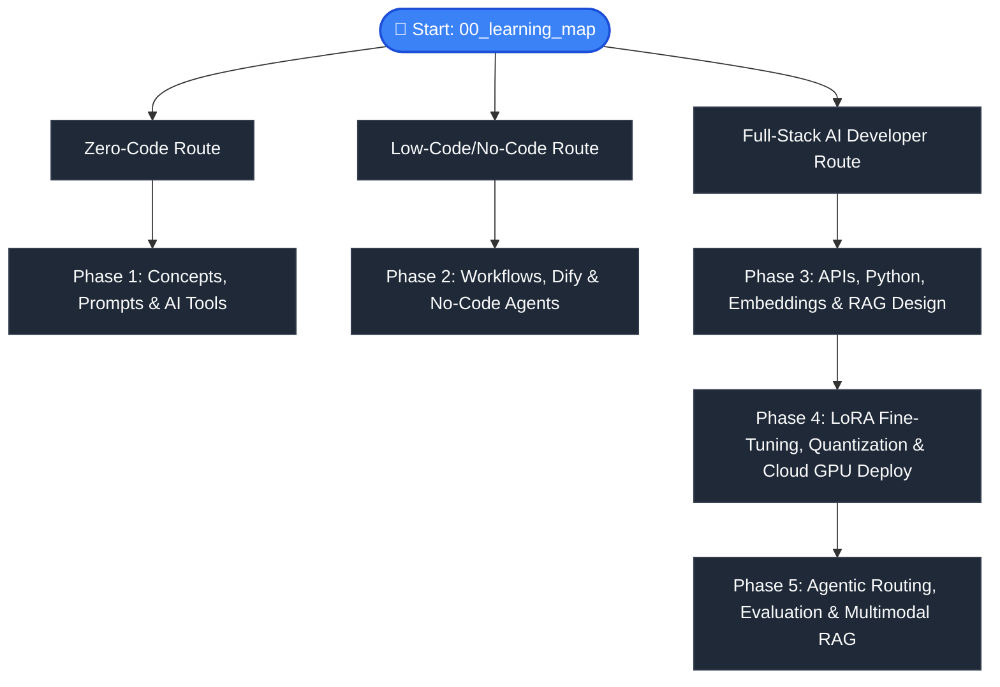

# 📚 AI Model Atlas — Learning Curriculum

### The "0 to 100" Roadmap: From Zero to Production-Grade AI Systems

> A structured, phase-based learning path covering 35 modules across 5 stages — from basic AI concepts to frontier agentic architectures.

← Back to [README](../README.md) | [中文课程 (CURRICULUM_zh.md)](CURRICULUM_zh.md)

---

## 📍 Choose Your Learning Path

---

> [!NOTE]
> **💡 Quick Note on the Reading Order:**
> The 31 modules listed in the table below are physically organized linearly by technical level (Phases 1 to 4). However, to keep your learning experience smooth and cohesive, the `Next Chapter` link at the bottom of each document is linked **non-linearly by cognitive dependency** (e.g., *No-Code Agents* skips *Multimodal AI* and goes straight to *RAG Introduction*).
> 
> We highly recommend **following the navigation links at the bottom of each page** for a guided, step-by-step experience, or using this curriculum as a **dictionary** to lookup specific topics. You can also expand the section below to view our 4 curated learning tracks:

<b>🔍 Expand to view the 4 Curated Reading Tracks (Recommended Flow)</b>

* **🔄 Track A: Zero-Code / No-Code Application Track (For Beginners & Productivity)**
  * **Flow**: `01 (What is AI)` ➔ `02 (Prompt Art)` ➔ `03 (Licenses)` ➔ `04 (AI Tools)` ➔ `05 (Model Zoo)` ➔ `07 (Glossary)` ➔ `08 (LLM Landscape)` ➔ `09 (No-Code Agents)` ➔ `11 (RAG Intro)` ➔ `12 (Vector DB)` ➔ `13 (AI Workflows)` ➔ `14 (Use Cases)`.
  * **Goal**: Learn how core concepts connect to visual agents, custom knowledge bases, and automation loops without writing code.

* **🔄 Track B: Full-Stack Developer & RAG Engineering Track (For Software & AI Engineers)**
  * **Flow**: `14 (Use Cases)` ➔ `15 (API Integration)` ➔ `17 (Local LLM)` ➔ `18 (UI Interfaces)` ➔ `19 (Agent Frameworks)` ➔ `20 (Embeddings)` ➔ `22 (Model Evaluation)` ➔ `24 (Why Fine-Tune)`.
  * **Goal**: Code your way from simple API scripting to multi-agent frontends and advanced semantic search logic.

* **🔄 Track C: Data Engineering, Assets & Fine-Tuning Track (For ML & DevOps Engineers)**
  * **Flow**: `06 (Hugging Face)` ➔ `10 (Multimodal AI)` ➔ `16 (Cost & Tokens)` ➔ `23 (Data Prep)` ➔ `24 (Why Fine-Tune)` ➔ `25 (LoRA)` ➔ `26 (LLaMA-Factory)` ➔ `27 (Quantization)` ➔ `28 (GPU Selection)` ➔ `30 (Safety & Alignment)` ➔ `31 (Cloud Deployment)`.
  * **Goal**: Focus on the heavy-lifting pipeline of models: data curation, token economics, LoRA fine-tuning, quantization, and cloud serving.

* **⚡ Track D: High-Concurrency & Low-Latency Architecture (For Backend & Architecture Geeks)**
  * **Flow**: `21 (RAG System Design)` ➔ `29 (Inference Optimization)`.
  * **Goal**: Master performance optimizations: from Reranker latency filters to KV Cache memory saving and high-throughput vLLM orchestration.

---

### 🎬 Phase 1: Learn & Awaken (0 to 1)
> **This phase demystifies AI. You will learn core concepts, open-source rules, prompting frameworks, and how to navigate the AI ecosystem.**
* **Goal**: Go from zero AI knowledge to feeling comfortable using and comparing modern model platforms.

| Module | Description | English Guide | 中文指南 |
| :--- | :--- | :--- | :--- |
| **0. Learning Map** | Choose your custom pathway (Zero-Code vs Low-Code vs Full-Stack). | [00_learning_map.md](phase1_0_to_1/00_learning_map.md) | [00_learning_map_zh.md](phase1_0_to_1/00_learning_map_zh.md) |
| **1. What is AI?** | AI, Machine Learning, and Deep Learning explained via analogies. | [01_what_is_ai.md](phase1_0_to_1/01_what_is_ai.md) | [01_what_is_ai_zh.md](phase1_0_to_1/01_what_is_ai_zh.md) |
| **2. Prompt Art** | Structured frameworks (ROLE, Few-Shot) for talking to AI. | [02_prompt_art.md](phase1_0_to_1/02_prompt_art.md) | [02_prompt_art_zh.md](phase1_0_to_1/02_prompt_art_zh.md) |
| **3. Open Source Licenses** | MIT, Apache 2.0, and commercial limits of models (e.g. Llama 3). | [03_licenses.md](phase1_0_to_1/03_licenses.md) | [03_licenses_zh.md](phase1_0_to_1/03_licenses_zh.md) |
| **4. AI Tools Guide** | Web-based daily productivity tools (ChatGPT, Claude, Midjourney). | [04_ai_tools.md](phase1_0_to_1/04_ai_tools.md) | [04_ai_tools_zh.md](phase1_0_to_1/04_ai_tools_zh.md) |
| **5. Model Zoo Overview** | Quick table comparing GPT, Claude, Gemini, Llama, DeepSeek, Qwen. | [05_model_zoo.md](phase1_0_to_1/05_model_zoo.md) | [05_model_zoo_zh.md](phase1_0_to_1/05_model_zoo_zh.md) |
| **6. Hugging Face Guide** | Understanding the Hub: repository layout, safetensors, and hub API. | [06_huggingface_guide.md](phase1_0_to_1/06_huggingface_guide.md) | [06_huggingface_guide_zh.md](phase1_0_to_1/06_huggingface_guide_zh.md) |
| **7. Glossary** | Essential vocab sheet (Tokens, Temperature, Context Window). | [07_glossary.md](phase1_0_to_1/07_glossary.md) | [07_glossary_zh.md](phase1_0_to_1/07_glossary_zh.md) |

---

### 🏗️ Phase 2: Build & Architect (1 to 10)
> **This phase transitions you from a prompt user to an AI systems architect using low-code/no-code platforms.**
* **Goal**: Understand AI pipelines, build autonomous agents, and configure local knowledge databases without writing code.

| Module | Description | English Guide | 中文指南 |
| :--- | :--- | :--- | :--- |
| **8. LLM Landscape** | The lineage and capabilities of modern closed & open weights models. | [08_llm_landscape.md](phase2_1_to_10/08_llm_landscape.md) | [08_llm_landscape_zh.md](phase2_1_to_10/08_llm_landscape_zh.md) |
| **9. No-Code Agents** | Creating autonomous assistants using Dify and Coze. | [09_no_code_agents.md](phase2_1_to_10/09_no_code_agents.md) | [09_no_code_agents_zh.md](phase2_1_to_10/09_no_code_agents_zh.md) |
| **10. Multimodal AI** | Images (Flux, SD), voice (Whisper, TTS), and video generation. | [10_multimodal_models.md](phase2_1_to_10/10_multimodal_models.md) | [10_multimodal_models_zh.md](phase2_1_to_10/10_multimodal_models_zh.md) |
| **11. RAG Introduction** | Retrieval-Augmented Generation: Giving AI a custom PDF library. | [11_rag_intro.md](phase2_1_to_10/11_rag_intro.md) | [11_rag_intro_zh.md](phase2_1_to_10/11_rag_intro_zh.md) |
| **12. Vector Databases** | Understanding Chroma, Milvus, FAISS, and PGVector. | [12_vector_db.md](phase2_1_to_10/12_vector_db.md) | [12_vector_db_zh.md](phase2_1_to_10/12_vector_db_zh.md) |
| **13. AI Workflows** | Visualizing User -> Agent -> RAG -> LLM architectures. | [13_ai_workflows.md](phase2_1_to_10/13_ai_workflows.md) | [13_ai_workflows_zh.md](phase2_1_to_10/13_ai_workflows_zh.md) |
| **14. Real-World Use Cases** | Core templates for CS Bots, Knowledge Bases, and AI Translators. | [14_use_cases.md](phase2_1_to_10/14_use_cases.md) | [14_use_cases_zh.md](phase2_1_to_10/14_use_cases_zh.md) |

---

### 💻 Phase 3: Build & Integrate (10 to 50)
> **This phase steps into developer territory. You will learn to control models programmatically and build user interfaces.**
* **Goal**: Build custom AI applications, program agent fleets, and architect industrial-grade RAG systems using Python and key frameworks.

| Module | Description | English Guide | 中文指南 |
| :--- | :--- | :--- | :--- |
| **15. API Integration** | Requesting model keys and calling models via simple Python scripts. | [15_api_guide.md](phase3_10_to_50/15_api_guide.md) | [15_api_guide_zh.md](phase3_10_to_50/15_api_guide_zh.md) |
| **16. Cost & Tokenomics** | Calculating API expenses and GPU hosting cost metrics. | [16_cost_and_tokens.md](phase3_10_to_50/16_cost_and_tokens.md) | [16_cost_and_tokens_zh.md](phase3_10_to_50/16_cost_and_tokens_zh.md) |
| **17. Local LLM Runner** | Deploying models locally using Ollama and LM Studio. | [17_local_llm.md](phase3_10_to_50/17_local_llm.md) | [17_local_llm_zh.md](phase3_10_to_50/17_local_llm_zh.md) |
| **18. UI Interfaces** | Building clean web interfaces with Streamlit & Gradio. | [18_ui_interfaces.md](phase3_10_to_50/18_ui_interfaces.md) | [18_ui_interfaces_zh.md](phase3_10_to_50/18_ui_interfaces_zh.md) |
| **19. Agent Frameworks** | Comparing CrewAI, AutoGen, LangChain, and LangGraph. | [19_agent_frameworks.md](phase3_10_to_50/19_agent_frameworks.md) | [19_agent_frameworks_zh.md](phase3_10_to_50/19_agent_frameworks_zh.md) |
| **20. Embeddings Deep Dive** | Transforming text into vectors and measuring cosine similarity. | [20_embeddings.md](phase3_10_to_50/20_embeddings.md) | [20_embeddings_zh.md](phase3_10_to_50/20_embeddings_zh.md) |
| **21. RAG System Design** | Chunking, reranking (Cross-Encoders), metadata filter logic. | [21_rag_system_design.md](phase3_10_to_50/21_rag_system_design.md) | [21_rag_system_design_zh.md](phase3_10_to_50/21_rag_system_design_zh.md) |
| **22. Model Evaluation** | Methods: BLEU, Human Eval, Chatbot Arena, and LLM-as-a-Judge. | [22_evaluation.md](phase3_10_to_50/22_evaluation.md) | [22_evaluation_zh.md](phase3_10_to_50/22_evaluation_zh.md) |

---

### 🚀 Phase 4: Train & Deploy (50 to 100)
> **This phase bridges open-source AI with real production systems. Here you deal with heavy compute, custom models, and deployment optimization.**
* **Goal**: Prepare datasets, fine-tune models, compress them using quantization, select hardware, and serve them at scale with optimized throughput.

| Module | Description | English Guide | 中文指南 |
| :--- | :--- | :--- | :--- |
| **23. Data Preparation** | Formatting JSON/JSONL datasets and synthetic data generation. | [23_data_preparation.md](phase4_50_to_100/23_data_preparation.md) | [23_data_preparation_zh.md](phase4_50_to_100/23_data_preparation_zh.md) |
| **24. Why Fine-Tune?** | When prompt engineering fails and model customization is needed. | [24_finetuning.md](phase4_50_to_100/24_finetuning.md) | [24_finetuning_zh.md](phase4_50_to_100/24_finetuning_zh.md) |
| **25. LoRA Explained** | Under the hood of Low-Rank Adaptation (the math-free version). | [25_lora_explained.md](phase4_50_to_100/25_lora_explained.md) | [25_lora_explained_zh.md](phase4_50_to_100/25_lora_explained_zh.md) |
| **26. LLaMA-Factory Guide** | Click-and-train GUI for fine-tuning without writing custom code. | [26_llama_factory.md](phase4_50_to_100/26_llama_factory.md) | [26_llama_factory_zh.md](phase4_50_to_100/26_llama_factory_zh.md) |
| **27. Model Quantization** | GGUF vs FP16, compressing 70B models down to consumer GPUs. | [27_quantization.md](phase4_50_to_100/27_quantization.md) | [27_quantization_zh.md](phase4_50_to_100/27_quantization_zh.md) |
| **28. GPU Selection Guide** | Finding the right hardware (RTX 4090 vs cloud GPU clusters). | [28_gpu_selection.md](phase4_50_to_100/28_gpu_selection.md) | [28_gpu_selection_zh.md](phase4_50_to_100/28_gpu_selection_zh.md) |
| **29. Inference Optimization** | KV Cache, continuous batching, streaming, throughput logic. | [29_inference_optimization.md](phase4_50_to_100/29_inference_optimization.md) | [29_inference_optimization_zh.md](phase4_50_to_100/29_inference_optimization_zh.md) |
| **30. Safety & Alignment** | RLHF, DPO, Guardrails, and understanding model boundaries. | [30_safety_alignment.md](phase4_50_to_100/30_safety_alignment.md) | [30_safety_alignment_zh.md](phase4_50_to_100/30_safety_alignment_zh.md) |
| **31. Cloud Deployment** | Renting compute on AutoDL/RunPod and serving models to users. | [31_deployment.md](phase4_50_to_100/31_deployment.md) | [31_deployment_zh.md](phase4_50_to_100/31_deployment_zh.md) |

---

### 🌌 Phase 5: Frontier AI Architecture (100 to 200)
> **This phase pushes you into the bleeding edge. You will construct agentic workflows, establish quantitative evaluation baselines, and expand into multi-modal inputs.**
* **Goal**: Evolve your RAG pipeline from a passive search engine into an evaluated, multi-modal autonomous system.

| Module | Description | English Guide | 中文指南 |
| :--- | :--- | :--- | :--- |
| **32. Tool Routing (Agentic RAG)** | Replacing static pipelines with intelligent dispatch routers (Calculator, Web). | [32_tool_routing.md](phase5_100_to_200/32_tool_routing.md) | [32_tool_routing_zh.md](phase5_100_to_200/32_tool_routing_zh.md) |
| **33. RAG Evaluation** | Establishing baselines with Ragas (Faithfulness, Context Precision). | [33_rag_evaluation.md](phase5_100_to_200/33_rag_evaluation.md) | [33_rag_evaluation_zh.md](phase5_100_to_200/33_rag_evaluation_zh.md) |
| **34. Vision RAG & OCR** | Processing complex PDF charts, tables, and raw image inputs. | [34_vision_rag.md](phase5_100_to_200/34_vision_rag.md) | [34_vision_rag_zh.md](phase5_100_to_200/34_vision_rag_zh.md) |
| **35. GraphRAG (Advanced)** | Extracting entities and mapping knowledge graphs for global queries. | [35_graph_rag.md](phase5_100_to_200/35_graph_rag.md) | [35_graph_rag_zh.md](phase5_100_to_200/35_graph_rag_zh.md) |

---

## 📄 License

This document is part of [AI Model Atlas](../README.md), licensed under [CC BY 4.0](../LICENSE).
