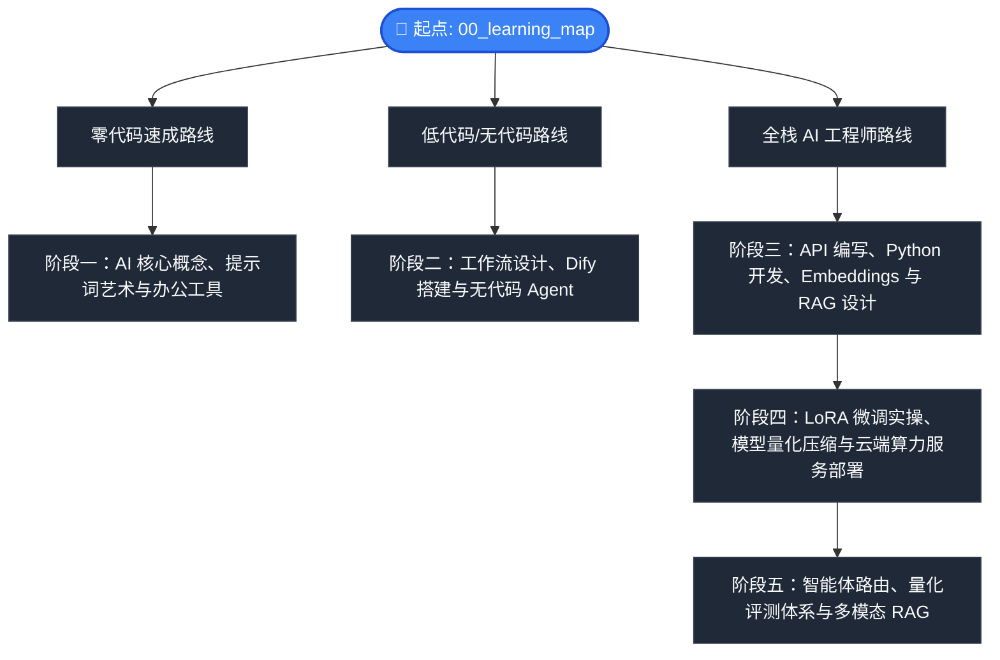

# 📚 AI Model Atlas — 学习课程体系

### “从 0 到 200” 全栈 AI 学习路线图

> 一套系统化、分阶段的学习路径，涵盖 5 大阶段、36 个模块 —— 从 AI 基础概念到前沿的智能体自治架构。

← 返回 [中文首页](../README_zh.md) | [English Curriculum (CURRICULUM.md)](CURRICULUM.md)

---

## 📍 选择你的学习路径

---

> [!NOTE]
> **💡 温馨提示（关于阅读顺序）：**
> 本页面下方的 31 个模块是按技术体系线性排列的。为了保障您的学习心流，每个文档底部的 `下一章` 链接是根据**心智依赖关系**进行非线性串联的（例如：读完《无代码智能体》会跳过《多模态》，直接进入《RAG原理》）。
> 
> 推荐您直接**跟随每个文档底部的导航一站式通关**，或者将本页面作为**字典**随时检索。您也可以展开下方查看我们推荐的 4 条主题学习路线：

<b>🔍 展开查看 4 条主题心流链路（推荐阅读顺序）</b>

* **🔄 链路 A：零代码 / 无代码应用主线 (适合初学者与业务提效)**
  * **路径**：`01 (什么是AI)` ➔ `02 (提示词)` ➔ `03 (开源协议)` ➔ `04 (日常工具)` ➔ `05 (模型动物园)` ➔ `07 (核心词汇)` ➔ `08 (LLM全景图)` ➔ `09 (无代码智能体)` ➔ `11 (RAG原理)` ➔ `12 (向量库)` ➔ `13 (工作流)` ➔ `14 (实战案例)`。
  * **目的**：打通 “核心概念 ➔ 可视化智能体 ➔ 知识库 ➔ 工作流架构”，全程无代码或数学门槛，快速赋能业务。

* **🔄 链路 B：全栈开发与 RAG 工程主线 (适合软件与 AI 工程师)**
  * **路径**：`14 (案例)` ➔ `15 (Python API)` ➔ `17 (本地大模型)` ➔ `18 (网页UI)` ➔ `19 (多Agent框架)` ➔ `20 (向量Embedding)` ➔ `22 (模型评估)` ➔ `24 (为什么要微调)` ➔ `32 (智能体路由)` ➔ `33 (量化评测)`。
  * **目的**：从最基础的 Python SDK 调用，通关至多智能体协同开发，最终攻克向量检索数学原理。

* **🔄 链路 C：数据重工业与模型微调 (适合算法与运维工程师)**
  * **路径**：`06 (Hugging Face)` ➔ `10 (多模态AI)` ➔ `16 (计费与成本)` ➔ `23 (数据清洗)` ➔ `24 (为什么要微调)` ➔ `25 (LoRA)` ➔ `26 (LLaMA-Factory)` ➔ `27 (量化)` ➔ `28 (显卡选型)` ➔ `31 (部署上云)`。
  * **目的**：大模型生命周期“重工业”生产线——从数据清洗、多模态资产获取，到显卡算力评估、LoRA 微调、量化提速与部署。

* **⚡ 链路 D：高并发与极速检索架构 (适合后端与架构极客)**
  * **路径**：`21 (RAG深度设计)` ➔ `29 (推理优化与高并发服务)` ➔ `34 (视觉解析)` ➔ `35 (知识图谱)`。
  * **目的**：专注大模型高并发与检索性能优化——攻克从 Rerank 检索延迟到 KV Cache 及 vLLM 显存控制的极客路线。

---

### 🎬 阶段一：认知觉醒 (从 0 到 1)
> **本阶段旨在打破 AI 的神秘感。你将学习大模型的基本术语、开源协议规则、结构化提示词框架，并学会如何游刃有余地在现代 AI 生态中导航。**
* **学习目标**：从零 AI 概念小白，成长为能够熟练对比各主流模型平台、熟练运用提示词的高效使用者。

| 模块 | 核心内容简介 | 英文版指南 | 中文版指南 |
| :--- | :--- | :--- | :--- |
| **0. 学习路线导航** | 选择属于你的通关路线（零代码体验 vs 低代码搭建 vs 硬核研发）。 | [00_learning_map.md](phase1_0_to_1/00_learning_map.md) | [00_learning_map_zh.md](phase1_0_to_1/00_learning_map_zh.md) |
| **1. 什么是 AI？** | 用大白话和生活实例解释什么是机器学习、深度学习和大模型。 | [01_what_is_ai.md](phase1_0_to_1/01_what_is_ai.md) | [01_what_is_ai_zh.md](phase1_0_to_1/01_what_is_ai_zh.md) |
| **2. 提示词艺术** | 掌握 ROLE 框架、Few-Shot 样本等高效与大模型对话的公式。 | [02_prompt_art.md](phase1_0_to_1/02_prompt_art.md) | [02_prompt_art_zh.md](phase1_0_to_1/02_prompt_art_zh.md) |
| **3. 开源协议指南** | MIT、Apache 2.0 到底是什么？为什么有些模型不能拿来商用？ | [03_licenses.md](phase1_0_to_1/03_licenses.md) | [03_licenses_zh.md](phase1_0_to_1/03_licenses_zh.md) |
| **4. 常用 AI 工具** | 开箱即用的办公与创意工具全景图 (ChatGPT, Claude, Midjourney)。 | [04_ai_tools.md](phase1_0_to_1/04_ai_tools.md) | [04_ai_tools_zh.md](phase1_0_to_1/04_ai_tools_zh.md) |
| **5. 模型动物园** | 一张表看懂 GPT, Claude, Gemini, Llama, DeepSeek, Qwen。 | [05_model_zoo.md](phase1_0_to_1/05_model_zoo.md) | [05_model_zoo_zh.md](phase1_0_to_1/05_model_zoo_zh.md) |
| **6. Hugging Face 极简指南** | 玩转 AI 军火库：文件后缀解密、Python 自动下载模型。 | [06_huggingface_guide.md](phase1_0_to_1/06_huggingface_guide.md) | [06_huggingface_guide_zh.md](phase1_0_to_1/06_huggingface_guide_zh.md) |
| **7. 核心词汇表** | 新手查字典：Token、Temperature、Context Window 分别代表什么。 | [07_glossary.md](phase1_0_to_1/07_glossary.md) | [07_glossary_zh.md](phase1_0_to_1/07_glossary_zh.md) |

---

### 🏗️ 阶段二：搭建与架构 (从 1 到 10)
> **本阶段帮助你完成从"普通对话用户"到"AI 系统架构师"的跨越。通过低代码/无代码工具，构建起复杂的 AI 协作体系。**
* **学习目标**：掌握大模型外挂知识库 (RAG) 原理，学会利用工作流与智能体工具搭建自动运行的业务流。

| 模块 | 核心内容简介 | 英文版指南 | 中文版指南 |
| :--- | :--- | :--- | :--- |
| **8. 大模型全景图谱** | 探索现代闭源模型与开源权重的技术脉络与分化。 | [08_llm_landscape.md](phase2_1_to_10/08_llm_landscape.md) | [08_llm_landscape_zh.md](phase2_1_to_10/08_llm_landscape_zh.md) |
| **9. 无代码 Agent 搭建** | 如何使用 Coze (扣子) 和 Dify 一步步配置属于你自己的智能体。 | [09_no_code_agents.md](phase2_1_to_10/09_no_code_agents.md) | [09_no_code_agents_zh.md](phase2_1_to_10/09_no_code_agents_zh.md) |
| **10. 多模态 AI** | 文字之外的世界：Stable Diffusion生图、语音Whisper、Sora视频。 | [10_multimodal_models.md](phase2_1_to_10/10_multimodal_models.md) | [10_multimodal_models_zh.md](phase2_1_to_10/10_multimodal_models_zh.md) |
| **11. RAG 知识库检索** | 什么是检索增强生成？如何让 AI 在几秒内阅读完并学习本地 PDF。 | [11_rag_intro.md](phase2_1_to_10/11_rag_intro.md) | [11_rag_intro_zh.md](phase2_1_to_10/11_rag_intro_zh.md) |
| **12. 向量数据库入门** | 了解 Chroma、Milvus、FAISS 和 PGVector 的定位与选择。 | [12_vector_db.md](phase2_1_to_10/12_vector_db.md) | [12_vector_db_zh.md](phase2_1_to_10/12_vector_db_zh.md) |
| **13. AI 工作流架构** | 解析 用户 -> 智能体 -> RAG -> 大模型 的完整工作数据流向。 | [13_ai_workflows.md](phase2_1_to_10/13_ai_workflows.md) | [13_ai_workflows_zh.md](phase2_1_to_10/13_ai_workflows_zh.md) |
| **14. 真实应用案例** | 客服机器人、企业知识库、AI翻译等实战场景配置指南。 | [14_use_cases.md](phase2_1_to_10/14_use_cases.md) | [14_use_cases_zh.md](phase2_1_to_10/14_use_cases_zh.md) |

---

### 💻 阶段三：开发构建与集成 (从 10 到 50)
> **本阶段正式进入代码的世界。你将学习如何用 Python 对大模型进行精细化控制，并为其编写可视化的交互界面。**
* **学习目标**：编写代码调用多模型 API、设计可上线的语义向量搜索链路，以及零门槛开发出交付级 AI 网页应用。

| 模块 | 核心内容简介 | 英文版指南 | 中文版指南 |
| :--- | :--- | :--- | :--- |
| **15. API 接入秘籍** | 申请 API 密钥 (Key)，并用几行最简的 Python 代码调用大模型。 | [15_api_guide.md](phase3_10_to_50/15_api_guide.md) | [15_api_guide_zh.md](phase3_10_to_50/15_api_guide_zh.md) |
| **16. 计费与 Token 经济学** | Token计费原理、各大模型价格PK、GPU租用与API成本比对。 | [16_cost_and_tokens.md](phase3_10_to_50/16_cost_and_tokens.md) | [16_cost_and_tokens_zh.md](phase3_10_to_50/16_cost_and_tokens_zh.md) |
| **17. 本地大模型运行** | 使用 Ollama 和 LM Studio 在普通笔记本上本地跑起百亿模型。 | [17_local_llm.md](phase3_10_to_50/17_local_llm.md) | [17_local_llm_zh.md](phase3_10_to_50/17_local_llm_zh.md) |
| **18. 前端界面极速生成** | 使用 Streamlit 和 Gradio 一键为你的 AI 脚本套上好看的聊天网页。 | [18_ui_interfaces.md](phase3_10_to_50/18_ui_interfaces.md) | [18_ui_interfaces_zh.md](phase3_10_to_50/18_ui_interfaces_zh.md) |
| **19. 智能体开发框架** | 对比 CrewAI、AutoGen、LangChain、LangGraph，教你如何选择。 | [19_agent_frameworks.md](phase3_10_to_50/19_agent_frameworks.md) | [19_agent_frameworks_zh.md](phase3_10_to_50/19_agent_frameworks_zh.md) |
| **20. 向量表示与匹配** | 文本如何变成浮点数数组？解释余弦相似度匹配的物理意义。 | [20_embeddings.md](phase3_10_to_50/20_embeddings.md) | [20_embeddings_zh.md](phase3_10_to_50/20_embeddings_zh.md) |
| **21. RAG 系统架构设计** | 进阶切片策略（Sliding Window）、重排（Rerank）数理过滤逻辑。 | [21_rag_system_design.md](phase3_10_to_50/21_rag_system_design.md) | [21_rag_system_design_zh.md](phase3_10_to_50/21_rag_system_design_zh.md) |
| **22. Model Evaluation** | 如何判定大模型好坏？详解 BLEU、Human Eval 与大模型裁判。 | [22_evaluation.md](phase3_10_to_50/22_evaluation.md) | [22_evaluation_zh.md](phase3_10_to_50/22_evaluation_zh.md) |

---

### 🚀 阶段四：训练、微调与部署 (从 50 到 100)
> **本阶段是打通开源大模型与企业级私有化生产落地之间的关键桥梁。你将直接和算力服务器、显卡、自定义数据集打交道。**
* **学习目标**：独立完成数据集制作与清洗，掌握 LoRA 微调流程，学会对模型量化提速，并在云端完成私有化高并发部署。

| 模块 | 核心内容简介 | 英文版指南 | 中文版指南 |
| :--- | :--- | :--- | :--- |
| **23. 数据准备与清洗** | JSON/JSONL格式规范、去重Checklist、大模型生成合成数据。 | [23_data_preparation.md](phase4_50_to_100/23_data_preparation.md) | [23_data_preparation_zh.md](phase4_50_to_100/23_data_preparation_zh.md) |
| **24. 为什么要微调？** | 为什么提示词不能解决所有问题？什么时候该训练专属模型。 | [24_finetuning.md](phase4_50_to_100/24_finetuning.md) | [24_finetuning_zh.md](phase4_50_to_100/24_finetuning_zh.md) |
| **25. LoRA 极简原理解释** | 用修图软件中的"滤镜图层"通俗解释低秩适应（LoRA）原理。 | [25_lora_explained.md](phase4_50_to_100/25_lora_explained.md) | [25_lora_explained_zh.md](phase4_50_to_100/25_lora_explained_zh.md) |
| **26. LLaMA-Factory 训练** | 图形化微调利器：无需手写 PyTorch 训练循环，一键点选训练。 | [26_llama_factory.md](phase4_50_to_100/26_llama_factory.md) | [26_llama_factory_zh.md](phase4_50_to_100/26_llama_factory_zh.md) |
| **27. Model Quantization** | GGUF vs FP16, compressing 70B models down to consumer GPUs. | [27_quantization.md](phase4_50_to_100/27_quantization.md) | [27_quantization_zh.md](phase4_50_to_100/27_quantization_zh.md) |
| **28. 显卡选型备忘录** | RTX 4090/5090 能跑什么？A100、H100 究竟贵在哪里？ | [28_gpu_selection.md](phase4_50_to_100/28_gpu_selection.md) | [28_gpu_selection_zh.md](phase4_50_to_100/28_gpu_selection_zh.md) |
| **29. 推理优化与高并发服务** | 深入 KV Cache、动态批处理（Continuous Batching）、流式推理。 | [29_inference_optimization.md](phase4_50_to_100/29_inference_optimization.md) | [29_inference_optimization_zh.md](phase4_50_to_100/29_inference_optimization_zh.md) |
| **30. 对齐与安全围栏** | 解释 RLHF、DPO 以及为什么大模型会拒绝回答你的敏感问题。 | [30_safety_alignment.md](phase4_50_to_100/30_safety_alignment.md) | [30_safety_alignment_zh.md](phase4_50_to_100/30_safety_alignment_zh.md) |
| **31. 云端 GPU 算力部署** | 租用 AutoDL / RunPod 显卡，并完成开源模型的私有化服务上线。 | [31_deployment.md](phase4_50_to_100/31_deployment.md) | [31_deployment_zh.md](phase4_50_to_100/31_deployment_zh.md) |

---

### 🌌 阶段五：前沿架构与智能体 (从 100 到 200)
> **本阶段将带你进入真正的无人区。你将把静态的 RAG 系统演进为能够自主思考、调用工具、看懂图片并接受量化评测的智能体大脑。**
* **学习目标**：从被动的搜索系统进化为可评测的、多模态自治的 Agentic RAG 系统。

| 模块 | 核心内容简介 | 英文版指南 | 中文版指南 |
| :--- | :--- | :--- | :--- |
| **32. Tool Routing (智能体路由)** | 告别静态流水线，实现能够调用计算器与联网搜索的意图路由器。 | [32_tool_routing.md](phase5_100_to_200/32_tool_routing.md) | [32_tool_routing_zh.md](phase5_100_to_200/32_tool_routing_zh.md) |
| **33. RAG Evaluation (量化评测)** | 如何证明 RAG 系统真的变强了？深入理解 Faithfulness、上下文精度与 LLM-as-a-Judge 裁判引擎。 | [33_rag_evaluation.md](phase5_100_to_200/33_rag_evaluation.md) | [33_rag_evaluation_zh.md](phase5_100_to_200/33_rag_evaluation_zh.md) |
| **34. Vision RAG (视觉增强与解析)** | 攻克 PDF 解析最后壁垒：图表、表格与扫描件处理。 | [34_vision_rag.md](phase5_100_to_200/34_vision_rag.md) | [34_vision_rag_zh.md](phase5_100_to_200/34_vision_rag_zh.md) |
| **35. GraphRAG (进阶图谱搜索)** | 专为高密度关联数据设计的关系图谱。在法律、医疗等垂直领域极其有用，但在大多数基础 RAG 中并非刚需。 | [35_graph_rag.md](phase5_100_to_200/35_graph_rag.md) | [35_graph_rag_zh.md](phase5_100_to_200/35_graph_rag_zh.md) |
| **36. AI Safety & Alignment (AI 安全与对齐)** | AI 为什么会产生幻觉？现代大模型是如何对齐人类价值观的？不受控的自主 AI 会带来什么风险？ | [36_ai_safety.md](phase5_100_to_200/36_ai_safety.md) | [36_ai_safety_zh.md](phase5_100_to_200/36_ai_safety_zh.md) |

---

### 🛸 附录：前沿技术雷达 (Frontier AI Radar)
> **超越 Phase 5：写给新手的未来 AI 发展概览**
* **MCP (Model Context Protocol)**: AI 的 USB-C 接口。让 AI 统一、标准化地调用外部工具。
* **Multi-Agent (多智能体)**: 一个 AI 像一个人，多个 AI 协作就像一个团队。
* **Long Context (超长上下文)**: 百万级 Token。让 AI 一次性读完整本书，甚至代替部分 RAG 搜索。
* **World Models (世界模型)**: 让 AI 学会模拟、理解真实的物理世界法则。
* **Robotics (具身智能)**: 给 AI 装上身体，在物理环境里执行任务。

---

## 📄 开源协议

本文档为 [AI Model Atlas](../README_zh.md) 项目的一部分，遵循 [CC BY 4.0](../LICENSE) 协议。
