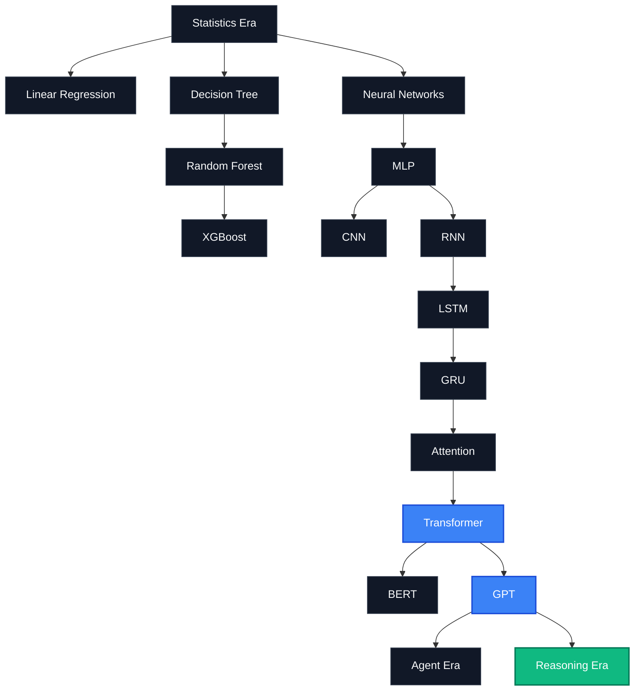

  

# 🧬 AI Model Atlas — Deep Dives (极客深潜专题)

### Tracing the mathematical and architectural evolution of AI: from classical machine learning to reasoning models.

> A 17-chapter epic technical documentary deep-diving into the core algorithms, RAG internals, agent mechanics, MoE, reasoning, and alignment.

← Back to [README](../README.md) | [中文版 (DEEP_DIVES_zh.md)](DEEP_DIVES_zh.md)

---

## 🗺️ The AI Deep Dive Map

---

## 📚 Deep Dives Curriculum

### Part I — Foundations

| Chapter | Description | English Guide | 中文指南 |
| :--- | :--- | :--- | :--- |
| **01. Why Does AI Become Smart?** | From rules-based systems to GPT: A 70-year evolution of computational intelligence. | [01_ai_intelligence.md](appendix_deep_dives/01_ai_intelligence.md) | [01_ai_intelligence_zh.md](appendix_deep_dives/01_ai_intelligence_zh.md) |
| **02. Why Does Transformer Rule?** | How Attention ended the sequential bottleneck of RNNs and ushered in the LLM revolution. | [02_transformer.md](appendix_deep_dives/02_transformer.md) | [02_transformer_zh.md](appendix_deep_dives/02_transformer_zh.md) |

### Part II — RAG Fundamentals

| Chapter | Description | English Guide | 中文指南 |
| :--- | :--- | :--- | :--- |
| **03. Embedding Under the Hood** | From raw words to coordinate spaces: The visual geometry of vector representation. | [03_embedding.md](appendix_deep_dives/03_embedding.md) | [03_embedding_zh.md](appendix_deep_dives/03_embedding_zh.md) |
| **04. Vector Database Retrieval** | Moving beyond string matches: Nearest neighbor algorithms and the mechanics of HNSW. | [04_vector_db.md](appendix_deep_dives/04_vector_db.md) | [04_vector_db_zh.md](appendix_deep_dives/04_vector_db_zh.md) |
| **05. Why is RAG so Effective?** | Open-book vs. closed-book exams: Bridging the gap between static knowledge and dynamic lookup. | [05_rag_principles.md](appendix_deep_dives/05_rag_principles.md) | [05_rag_principles_zh.md](appendix_deep_dives/05_rag_principles_zh.md) |
| **06. Why Do Models Hallucinate?** | Understanding the probabilistic nature of language generation and why RAG acts as an anchor. | [06_hallucination.md](appendix_deep_dives/06_hallucination.md) | [06_hallucination_zh.md](appendix_deep_dives/06_hallucination_zh.md) |
| **07. Context Windows & NIAH** | Why 1M tokens does not equal 100% understanding: Lost in the Middle and attention degradation. | [07_needle_test.md](appendix_deep_dives/07_needle_test.md) | [07_needle_test_zh.md](appendix_deep_dives/07_needle_test_zh.md) |

### Part III — Agentic Systems

| Chapter | Description | English Guide | 中文指南 |
| :--- | :--- | :--- | :--- |
| **08. Model Context Protocol (MCP)** | Solving the N x M integration problem: How a unified protocol standardizes AI tools. | [08_mcp_protocol.md](appendix_deep_dives/08_mcp_protocol.md) | [08_mcp_protocol_zh.md](appendix_deep_dives/08_mcp_protocol_zh.md) |
| **09. Agent Mechanics** | The cybernetic feedback loop: Orchestrating memory, tools, planning, and execution. | [09_agent_mechanics.md](appendix_deep_dives/09_agent_mechanics.md) | [09_agent_mechanics_zh.md](appendix_deep_dives/09_agent_mechanics_zh.md) |

### Part IV — Next-Generation Models

| Chapter | Description | English Guide | 中文指南 |
| :--- | :--- | :--- | :--- |
| **10. Why MoE Makes Scale Cheap** | Understanding Mixture of Experts: How sparse routing enables giant models at tiny costs. | [10_moe_architecture.md](appendix_deep_dives/10_moe_architecture.md) | [10_moe_architecture_zh.md](appendix_deep_dives/10_moe_architecture_zh.md) |
| **11. Reasoning Models** | DeepSeek-R1 and o1: The transition from fast intuition to systematic computation. | [11_reasoning_models.md](appendix_deep_dives/11_reasoning_models.md) | [11_reasoning_models_zh.md](appendix_deep_dives/11_reasoning_models_zh.md) |

### Part V — Generative AI Appendix

| Chapter | Description | English Guide | 中文指南 |
| :--- | :--- | :--- | :--- |
| **12. How AI Draws Pictures** | Understanding Diffusion: How Stable Diffusion and Flux turn noise into high-art. | [12_diffusion_art.md](appendix_deep_dives/12_diffusion_art.md) | [12_diffusion_art_zh.md](appendix_deep_dives/12_diffusion_art_zh.md) |
| **13. Why GPT Talks Like a Human** | RLHF and DPO: The mechanics of alignment and how safety boundaries are established. | [13_rlhf_alignment.md](appendix_deep_dives/13_rlhf_alignment.md) | [13_rlhf_alignment_zh.md](appendix_deep_dives/13_rlhf_alignment_zh.md) |

### Part VI — Evaluation, Failure & Unified Systems

| Chapter | Description | English Guide | 中文指南 |
| :--- | :--- | :--- | :--- |
| **14. AI Evaluation** | Benchmarks and human-in-the-loop arenas: understanding MMLU, GPQA, SWE-bench, and LMSYS Chatbot Arena. | [14_ai_evaluation.md](appendix_deep_dives/14_ai_evaluation.md) | [14_ai_evaluation_zh.md](appendix_deep_dives/14_ai_evaluation_zh.md) |
| **15. AI System Failure Modes** | From evaluation to breakdown: formalizing retrieval, loop, alignment, and evaluation failures into a latent failure manifold. | [15_failure_modes.md](appendix_deep_dives/15_failure_modes.md) | [15_failure_modes_zh.md](appendix_deep_dives/15_failure_modes_zh.md) |
| **16. AI Unified Systems Theory** | From evaluation and failure to closed-loop convergence: constructing the five-tuple axiomatic definition, dual manifold, evaluation-failure duality, and final synthesis. | [16_unified_theory.md](appendix_deep_dives/16_unified_theory.md) | [16_unified_theory_zh.md](appendix_deep_dives/16_unified_theory_zh.md) |

### Part VII — LLM Application Engineering

| Chapter | Description | English Guide | 中文指南 |
| :--- | :--- | :--- | :--- |
| **17. LLM App Core Pillars** | Cache vs Memory vs Prompt vs Structured Output: Disambiguating the foundation of LLM systems. | [17_llm_core_patterns.md](appendix_deep_dives/17_llm_core_patterns.md) | [17_llm_core_patterns_zh.md](appendix_deep_dives/17_llm_core_patterns_zh.md) |

---

## 📄 License

This document is part of [AI Model Atlas](../README.md), licensed under [CC BY 4.0](../LICENSE).
