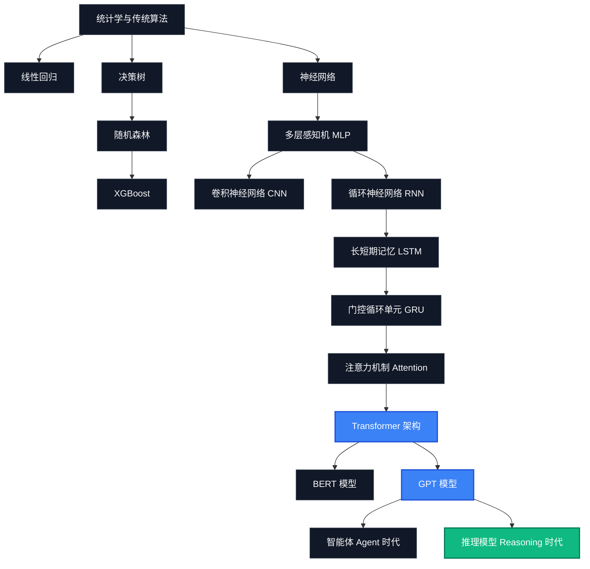

  

# 🧬 AI Model Atlas — Deep Dives (极客深潜专题)

### 从古典机器学习到推理大模型，追踪 AI 的数学与架构演进史。

> 一部由 17 篇技术章节组成的高质量底层算法与大模型技术深度科普纪录片。

← 返回 [中文首页](../README_zh.md) | [English Version (DEEP_DIVES.md)](DEEP_DIVES.md)

---

## 🗺️ AI 底层算法演进地图

---

## 📚 深潜专题课程体系

### 第一部分 — 现代模型的诞生 (Part I — Foundations)

| 章节 | 描述 | English Guide | 中文指南 |
| :--- | :--- | :--- | :--- |
| **01. 为什么 AI 会变聪明？** | 从规则系统到 GPT 的 70 年计算智能进化史。 | [01_ai_intelligence.md](deep_dives/01_ai_intelligence.md) | [01_ai_intelligence_zh.md](deep_dives/01_ai_intelligence_zh.md) |
| **02. Transformer 为什么统治了一切？** | Attention 机制如何终结循环神经网络（RNN）的串行瓶颈，点燃大模型革命。 | [02_transformer.md](deep_dives/02_transformer.md) | [02_transformer_zh.md](deep_dives/02_transformer_zh.md) |

### 第二部分 — RAG 核心原理 (Part II — RAG Fundamentals)

| 章节 | 描述 | English Guide | 中文指南 |
| :--- | :--- | :--- | :--- |
| **03. Embedding 到底是什么？** | 从词汇表到多维物理空间：文本语义的坐标化表示。 | [03_embedding.md](deep_dives/03_embedding.md) | [03_embedding_zh.md](deep_dives/03_embedding_zh.md) |
| **04. 向量数据库如何理解语义？** | 告别字面匹配：最近邻搜索算法与 HNSW 索引的导航机制。 | [04_vector_db.md](deep_dives/04_vector_db.md) | [04_vector_db_zh.md](deep_dives/04_vector_db_zh.md) |
| **05. RAG 为什么有效？** | 开卷考试 vs 闭卷考试：打通静态训练参数与动态实时检索的桥梁。 | [05_rag_principles.md](deep_dives/05_rag_principles.md) | [05_rag_principles_zh.md](deep_dives/05_rag_principles_zh.md) |
| **06. 为什么大模型会产生幻觉？** | 理解语言生成背后的概率本质，以及 RAG 是如何充当物理锚点的。 | [06_hallucination.md](deep_dives/06_hallucination.md) | [06_hallucination_zh.md](deep_dives/06_hallucination_zh.md) |
| **07. 上下文窗口与 Needle in a Haystack 测试** | 为什么 100 万 Token 的大窗口不等于 100% 记住：揭秘“Lost in the Middle”盲区。 | [07_needle_test.md](deep_dives/07_needle_test.md) | [07_needle_test_zh.md](deep_dives/07_needle_test_zh.md) |

### 第三部分 — 智能体时代 (Part III — Agentic Systems)

| 章节 | 描述 | English Guide | 中文指南 |
| :--- | :--- | :--- | :--- |
| **08. MCP —— AI 世界的 USB-C** | 终结 N x M 适配噩梦：Model Context Protocol 是如何统一大模型数据总线的。 | [08_mcp_protocol.md](deep_dives/08_mcp_protocol.md) | [08_mcp_protocol_zh.md](deep_dives/08_mcp_protocol_zh.md) |
| **09. Agent 为什么不是 Prompt** | 控制论层面的自循环反馈：大模型大脑、长期记忆与工具执行的闭环控制。 | [09_agent_mechanics.md](deep_dives/09_agent_mechanics.md) | [09_agent_mechanics_zh.md](deep_dives/09_agent_mechanics_zh.md) |

### 第四部分 — 下一代模型 (Part IV — Next-Generation Models)

| 章节 | 描述 | English Guide | 中文指南 |
| :--- | :--- | :--- | :--- |
| **10. MoE 专家混合架构** | 用稀疏激活打破稠密算力枷锁：大模型是如何做到高智能与白菜价并存的。 | [10_moe_architecture.md](deep_dives/10_moe_architecture.md) | [10_moe_architecture_zh.md](deep_dives/10_moe_architecture_zh.md) |
| **11. 推理模型是怎么思考的？** | DeepSeek-R1 与 OpenAI o1 揭秘：系统 2 慢思考与强化学习带来的认知跃迁。 | [11_reasoning_models.md](deep_dives/11_reasoning_models.md) | [11_reasoning_models_zh.md](deep_dives/11_reasoning_models_zh.md) |

### 第五部分 — 番外篇 (Part V — Generative AI Appendix)

| 章节 | 描述 | English Guide | 中文指南 |
| :--- | :--- | :--- | :--- |
| **12. Diffusion 为什么会画画？** | 生成扩散模型的数理美学：AI 是如何把一片随机噪声雪花点“擦拭”出高清艺术画作的。 | [12_diffusion_art.md](deep_dives/12_diffusion_art.md) | [12_diffusion_art_zh.md](deep_dives/12_diffusion_art_zh.md) |
| **13. RLHF 为什么越来越像人？** | 人类对齐与安全性防线：通过强化学习与 DPO 技术将野性模型驯化为得体助手。 | [13_rlhf_alignment.md](deep_dives/13_rlhf_alignment.md) | [13_rlhf_alignment_zh.md](deep_dives/13_rlhf_alignment_zh.md) |

### 第六部分 — 评测、失效与统一系统理论 (Part VI — Evaluation, Failure & Unified Systems)

| 章节 | 描述 | English Guide | 中文指南 |
| :--- | :--- | :--- | :--- |
| **14. AI 评测体系** | 基准测试与人类对局竞技场：深度解析 MMLU、GPQA、SWE-bench 与 LMSYS 竞技场。 | [14_ai_evaluation.md](deep_dives/14_ai_evaluation.md) | [14_ai_evaluation_zh.md](deep_dives/14_ai_evaluation_zh.md) |
| **15. AI 系统失效模式** | 从评测到崩溃：将检索失效、循环失效、对齐失效和评测过拟合形式化为隐式失效流形。 | [15_failure_modes.md](deep_dives/15_failure_modes.md) | [15_failure_modes_zh.md](deep_dives/15_failure_modes_zh.md) |
| **16. AI 系统统一理论** | 从评测、失效到闭环收束：构建 AI 系统统一的五元组形式化公理体系，探讨双流形结构、评测-失效对偶性与终极收束。 | [16_unified_theory.md](deep_dives/16_unified_theory.md) | [16_unified_theory_zh.md](deep_dives/16_unified_theory_zh.md) |

### 第七部分 — LLM 应用工程架构 (Part VII — LLM Application Engineering)

| 章节 | 描述 | English Guide | 中文指南 |
| :--- | :--- | :--- | :--- |
| **17. LLM 应用四大基石** | 缓存 (Cache) vs 记忆 (Memory) vs 提示词 (Prompt) vs 结构化输出：厘清 LLM 系统架构的底层概念。 | [17_llm_core_patterns.md](deep_dives/17_llm_core_patterns.md) | [17_llm_core_patterns_zh.md](deep_dives/17_llm_core_patterns_zh.md) |

---

## 📄 开源协议

本文档为 [AI Model Atlas](../README_zh.md) 项目的一部分，遵循 [CC BY 4.0](../LICENSE) 协议。
