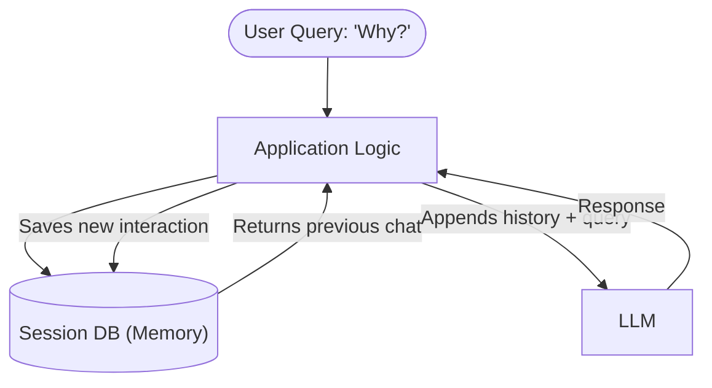
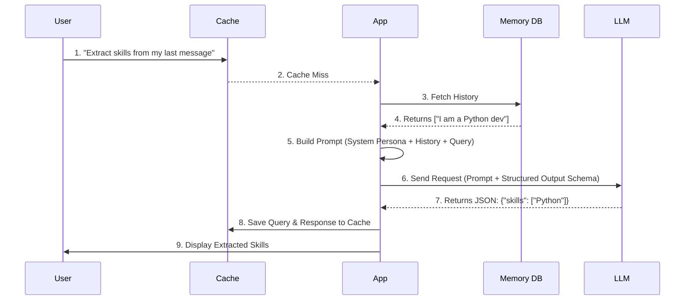

# 17. LLM App Core Pillars: Cache vs Memory vs Prompt vs Structured Output

When building applications with Large Language Models (LLMs), developers often encounter a mix of concepts that seem similar but serve entirely different architectural purposes. Four of the most frequently confused mechanisms are **Cache**, **Memory**, **Prompt**, and **Structured Output**.

In this deep dive, we will unpack each concept, explore their differences, and show you exactly when—and how—to use them.

> [!NOTE]
> Understanding the distinction between these four pillars is crucial for building cost-effective, scalable, and reliable AI applications. Misusing them can lead to skyrocketing token costs, context window overflow, or erratic model behavior.

---

## 1. Memory: The "Thread of Conversation"

**Memory** is how an LLM application maintains conversational continuity. Since LLMs are inherently stateless—they don't "remember" past API calls—Memory mechanisms involve storing past interactions and injecting them into the current request.

### Key Characteristics
- **Purpose**: Provides conversation history and context continuity.
- **Cost**: Consumes tokens for every turn, as past history must be re-sent to the model.
- **Mechanism**: Chat History arrays, sliding windows, or summarization chains.

### How it Works
When a user asks, "What was the previous point?", the application fetches the last `N` messages from a database (like Redis or PostgreSQL) and appends them to the current prompt.

> [!WARNING]
> Do not confuse Memory with Cache! Memory *increases* token usage to preserve context, whereas Cache *bypasses* the LLM to save tokens and reduce latency.

---

## 2. Cache: The "Cost & Latency Saver"

**Cache** (especially Semantic Cache) is a layer that sits between the user and the LLM. It stores previously generated responses to specific queries. If a user asks a question that is semantically identical to a past question, the cache intercepts the request and returns the stored answer without ever hitting the LLM API.

### Key Characteristics
- **Purpose**: Reduces API costs, token consumption, and response latency.
- **Cost**: Saves money (zero API tokens used on a cache hit).
- **Mechanism**: Exact string matching or Semantic Caching via Vector Databases (e.g., RedisVL, Pinecone).

### Semantic Cache in Action
Unlike traditional web caching, a semantic cache understands intent. If User A asks, "What is the capital of France?" and User B asks, "Tell me the French capital," a semantic cache recognizes they mean the same thing.

> [!TIP]
> Cache has no concept of "chat history" or "context." It only evaluates the current incoming query against previously cached queries.

---

## 3. Prompt: The "Context & Persona Injector"

A **Prompt** is the unstructured natural language instruction set sent to the LLM. It defines the model's behavior, sets its persona, and provides the immediate context or knowledge required to answer the current query.

### Key Characteristics
- **Purpose**: Guides model behavior, reasoning (e.g., Chain of Thought), and provides real-time knowledge.
- **Cost**: High token consumption, especially in RAG (Retrieval-Augmented Generation) scenarios where large documents are injected.
- **Mechanism**: System prompts, few-shot examples, dynamic string templates.

### The RAG Connection
In a RAG system, the retrieved documents are injected directly into the Prompt. The Prompt tells the LLM: *"You are an expert. Answer the query using ONLY the following documents. [Document Text here]"*.

> [!IMPORTANT]
> The Prompt is the operational core of the request. Everything else (Memory, Structured Output definitions) is essentially formatted into or appended to the Prompt before being sent to the model.

---

## 4. Structured Output: The "Machine-Readable Enforcer"

**Structured Output** (often implemented via Function Calling or JSON Mode) forces the LLM to return its response in a strict, predictable format (like a JSON object) rather than a conversational text block.

### Key Characteristics
- **Purpose**: Ensures the LLM's output can be reliably parsed by downstream application code.
- **Behavior**: Prevents the LLM from "chatting" (e.g., omitting "Sure, here is the JSON you requested...").
- **Mechanism**: OpenAI JSON Mode, Function Calling tools, or grammar-constrained generation (e.g., using Pydantic models).

### Why We Need It
If you want an LLM to extract data from a resume, you don't want a friendly paragraph. You want `{"name": "Alice", "skills": ["Python", "Go"]}`. Structured Output guarantees this contract between the natural language engine and your deterministic code.

---

## The Ultimate "VS" Comparison Table

Here is a side-by-side breakdown of the four pillars:

| Feature | Memory | Cache | Prompt | Structured Output |
| :--- | :--- | :--- | :--- | :--- |
| **Primary Goal** | Contextual continuity | Cost & latency reduction | Persona & knowledge injection | Deterministic parsing |
| **Token Impact** | Increases token usage | Eliminates token usage (on hit) | Consumes tokens | Neutral (forces format) |
| **Data Format** | Message arrays | Key-Value pairs / Vectors | Unstructured Text | Strict JSON / API Calls |
| **Awareness** | Knows past conversation | Unaware of conversation history | Knows what you explicitly tell it | Unaware, just follows schema |
| **Example Tool** | LangChain `BufferMemory` | GPTCache, Redis Semantic Cache | Jinja2 templates, RAG chunks | OpenAI Function Calling |

---

## Bringing It All Together: A Complete Workflow

In a production-grade LLM application, these four pillars work in harmony. Here is how a single request flows through all of them:

### Summary
- Use **Prompt** to give the LLM its brain and current task.
- Use **Memory** to give the LLM a sense of time and history.
- Use **Structured Output** to make the LLM's brain talk to your application's code.
- Use **Cache** to bypass the LLM entirely when it's about to repeat itself.

---

Congratulations! You have completed the entire Deep Dives curriculum. Go back to the [Deep Dives Directory](../DEEP_DIVES.md) or explore the [Main Curriculum](../CURRICULUM.md).
