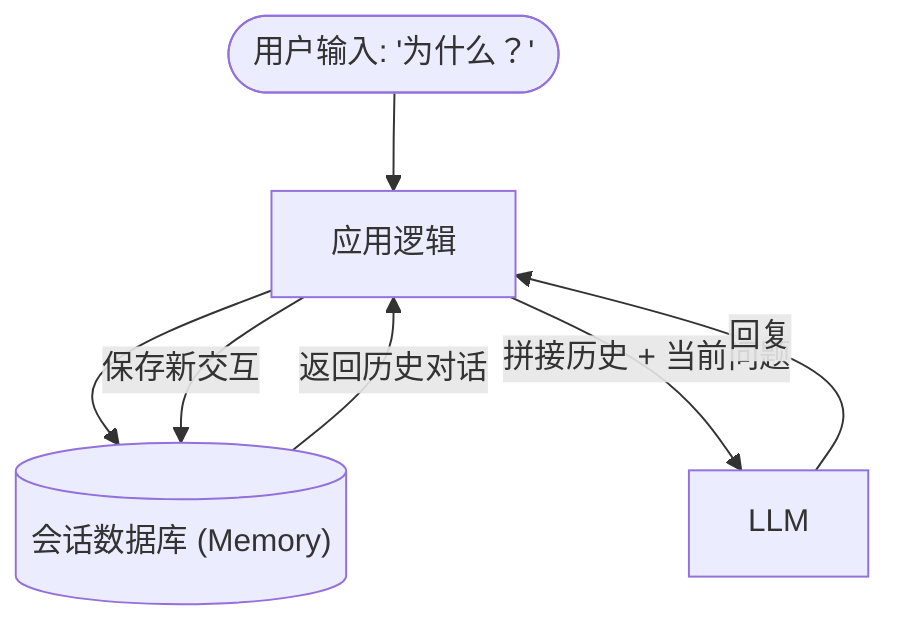
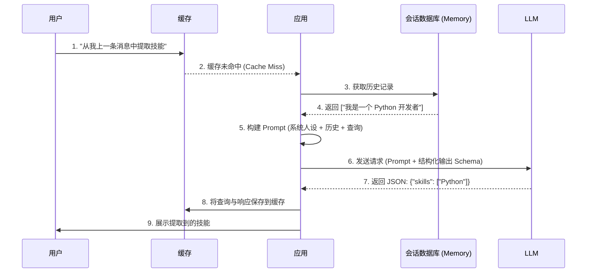

# 17. LLM 应用四大基石：Cache vs Memory vs Prompt vs 结构化输出

在构建大语言模型 (LLM) 应用时，开发者经常会遇到一些看似相似但架构用途完全不同的概念。其中最容易混淆的四个机制是：**缓存 (Cache)**、**记忆 (Memory)**、**提示词 (Prompt)** 和 **结构化输出 (Structured Output)**。

在本次深入探讨中，我们将拆解每个概念，分析它们之间的差异，并准确地展示何时以及如何使用它们。

> [!NOTE]
> 理解这四大基石的区别对于构建高性价比、可扩展且可靠的 AI 应用至关重要。误用它们可能导致 token 成本飙升、上下文窗口溢出或模型行为异常。

---

## 1. 记忆 (Memory)：“对话的纽带”

**记忆** 是 LLM 应用保持对话连贯性的方式。由于 LLM 本质上是无状态的——它们不“记得”过去的 API 调用——记忆机制涉及存储过去的交互，并将它们注入到当前的请求中。

### 核心特征
- **目的**：提供历史对话和上下文连贯性。
- **成本**：每轮对话都会消耗 token，因为历史记录必须重新发送给模型。
- **机制**：聊天历史数组 (Chat History)、滑动窗口或对话摘要链。

### 工作原理
当用户问“上一条说的是什么？”时，应用程序会从数据库（如 Redis 或 PostgreSQL）中获取最近的 `N` 条消息，并将它们附加到当前的提示词中。

> [!WARNING]
> 不要将 Memory 与 Cache 混淆！Memory 通过*增加* token 使用量来保留上下文，而 Cache 则通过*绕过* LLM 来节省 token 并降低延迟。

---

## 2. 缓存 (Cache)：“成本与延迟的救星”

**缓存**（尤其是语义缓存，Semantic Cache）是位于用户和 LLM 之间的一层。它存储了先前针对特定查询生成的响应。如果用户提出了一个在语义上与过去问题相同的问题，缓存会拦截该请求并返回存储的答案，而根本不需要调用 LLM API。

### 核心特征
- **目的**：降低 API 成本、token 消耗和响应延迟。
- **成本**：省钱（缓存命中时消耗零 API token）。
- **机制**：精确字符串匹配或通过向量数据库实现的语义缓存 (如 RedisVL, Pinecone)。

### 语义缓存实战
与传统的 Web 缓存不同，语义缓存能够理解意图。如果用户 A 问：“法国的首都在哪里？”而用户 B 问：“告诉我法国首都，”语义缓存会识别出它们的意思是相同的。

> [!TIP]
> 缓存没有“聊天历史”或“上下文”的概念。它仅仅将当前传入的查询与之前缓存的查询进行比对。

---

## 3. 提示词 (Prompt)：“上下文与人设注入器”

**提示词** 是发送给 LLM 的非结构化自然语言指令集。它定义了模型的行为，设定了其角色（Persona），并提供了回答当前查询所需的即时上下文或知识。

### 核心特征
- **目的**：引导模型行为、推理（如思维链，CoT），并提供实时知识。
- **成本**：较高的 token 消耗，特别是在 RAG（检索增强生成）场景中，会注入大量文档。
- **机制**：系统提示词 (System prompt)、少样本示例 (Few-shot)、动态字符串模板。

### 与 RAG 的联系
在 RAG 系统中，检索到的文档会直接注入到 Prompt 中。Prompt 会告诉 LLM：*“你是一个专家。请仅使用以下文档来回答查询。[此处插入文档内容]”*。

> [!IMPORTANT]
> Prompt 是请求的业务核心。其他一切（Memory、结构化输出定义）本质上都是在发送给模型之前，被格式化或附加到 Prompt 中的。

---

## 4. 结构化输出 (Structured Output)：“机器可读的执行者”

**结构化输出**（通常通过函数调用 Function Calling 或 JSON 模式实现）强制 LLM 以严格、可预测的格式（如 JSON 对象）返回其响应，而不是一段对话式的文本块。

### 核心特征
- **目的**：确保 LLM 的输出能够被下游应用程序代码可靠地解析。
- **行为**：防止 LLM “闲聊”（例如，省去“好的，这是您要求的 JSON...”这类的废话）。
- **机制**：OpenAI JSON 模式、函数调用 (Function Calling) 工具，或受语法约束的生成（如使用 Pydantic 模型）。

### 为什么需要它
如果您希望 LLM 从简历中提取数据，您不需要一段友好的段落。您需要的是 `{"name": "Alice", "skills": ["Python", "Go"]}`。结构化输出保证了自然语言引擎与您确定性的代码之间的契约。

---

## 终极 "VS" 对比表

以下是这四大基石的横向对比：

| 特性 | 记忆 (Memory) | 缓存 (Cache) | 提示词 (Prompt) | 结构化输出 (Structured Output) |
| :--- | :--- | :--- | :--- | :--- |
| **首要目标** | 上下文连贯性 | 降低成本与延迟 | 人设与知识注入 | 确定性解析 |
| **对 Token 的影响** | 增加 token 消耗 | 消除 token 消耗 (命中时) | 消耗 token | 中立 (强制格式) |
| **数据格式** | 消息数组 | 键值对 / 向量 | 非结构化文本 | 严格的 JSON / API 调用 |
| **状态感知** | 知道历史对话 | 不了解对话历史 | 知道你明确告诉它的内容 | 不了解，只遵循 Schema |
| **典型工具** | LangChain `BufferMemory` | GPTCache, Redis Semantic Cache | Jinja2 模板, RAG 文本块 | OpenAI 函数调用 |

---

## 融会贯通：一个完整的业务流

在一个生产级的 LLM 应用中，这四个基石是协同工作的。以下是一个单一请求是如何流经它们的：

### 总结
- 使用 **Prompt** 赋予 LLM 大脑和当前任务。
- 使用 **Memory** 赋予 LLM 时间感和历史感。
- 使用 **结构化输出** 让 LLM 的大脑能与你应用程序的代码进行对话。
- 使用 **Cache** 在 LLM 即将重复自己时完全绕过它。

---

恭喜！你已完成了全部深潜专题的学习。返回 [深潜专题目录](../DEEP_DIVES_zh.md) 或探索 [主课程体系](../CURRICULUM_zh.md)。
