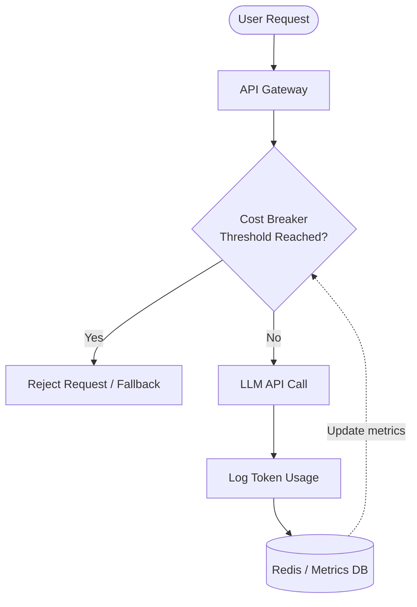

← Back to [Constraint & Threat Model](../../CONSTRAINT_THREAT_MODEL.md) | [中文版 (06_system_prompt_tokens_zh.md)](06_system_prompt_tokens_zh.md)

---

# 💸 Chapter 6: System Prompt Compression & Token Cost Breakers

Tokenomics are the reality of working with LLMs—every character you send to an API costs you money. Bloated system prompts act like massive tax deductions on every request, while sudden traffic spikes can drain your budget overnight.

## 📦 The Telegram Analogy
* **The Analogy**: Sending a system prompt is like paying for a telegram by the word.
* **How it works**: A massive system prompt forces you to pay overhead costs on *every single interaction* before the user even types a query.
* **Key Concept**: Trim the fat out of your instructions, and install circuit breakers to stop budget bleeds during uncontrolled loops or spikes.

## 📊 Quick Comparison
| Concept | Traditional | LLM Era | Impact |
| :--- | :--- | :--- | :--- |
| **Instruction Size** | Long and overly polite instructions. | Terse, compressed, and direct. | Cheaper, faster inferences. |
| **Example Loading** | All examples loaded statically in the prompt. | RAG-injected or dynamic few-shot examples. | Massive token reduction and better focus. |
| **Usage Limits** | Hardcoded API quotas at the platform level. | Dynamic, application-layer Cost Breakers. | Granular control and graceful degradation. |

## 🧠 Core Concept
1. **Refactor and Distill**: Strip out conversational filler. Replace "Please ensure you always respond in JSON format, thank you" with "Output JSON."
2. **Optimize Examples**: Shrink few-shot examples or move them entirely into dynamic RAG injection so they only load when strictly necessary.
3. **Use Algorithmic Compression**: Utilize tools like LLMLingua to mathematically prune non-essential tokens from your prompt without destroying its semantic meaning.
4. **Implement Cost Breakers**: Track `usage` metadata on every API response to monitor rolling budgets. 
5. **Trip the Breaker**: If consumption reaches the threshold, block outbound LLM API requests and fall back to a smaller local model or a static error message to protect your wallet.

### Cost Breaker Architecture Example

---

← [Prev Chapter](05_prompt_dev_staging_p.md) | [Next Chapter](../phase2/07_dynamic_few_shot.md) →
