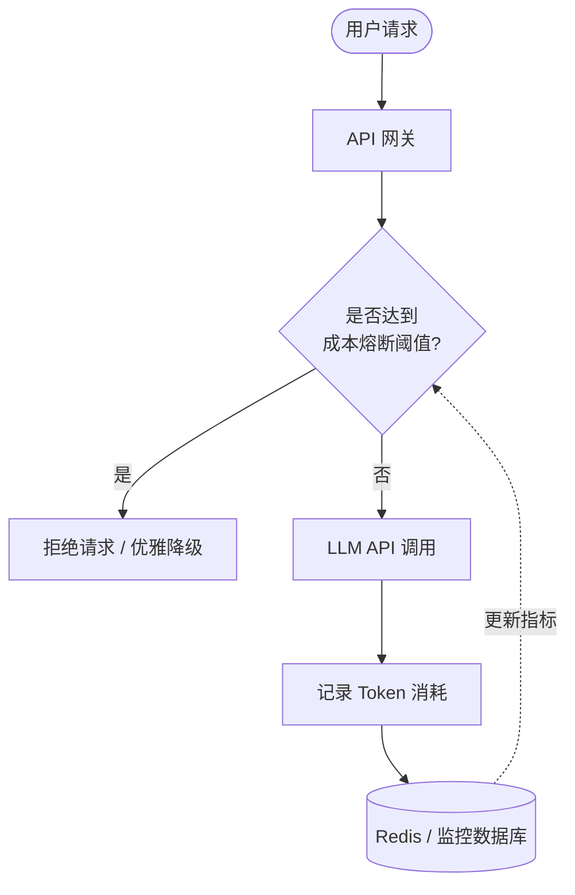

← 返回 [约束与威胁模型](../../CONSTRAINT_THREAT_MODEL_zh.md) | [English Version (06_system_prompt_tokens.md)](06_system_prompt_tokens.md)

---

# 📉 第六章：系统提示词压缩与 Token 成本熔断机制

每次调用大模型 API 时，冗长的提示词都在悄悄消耗你的预算。通过系统提示词压缩和成本熔断机制，你能有效防止账单失控并提升模型的专注度。

## 💸 The Tokenomics Analogy

* **类比**： 臃肿的系统提示词就像是每次发包裹都为一箱塞满减震泡沫的废品支付高昂的次日达运费。
* **原理**： 每次 API 请求都会完整传输整个系统提示词。如果提示词过长，不仅会在每一次交互中极度烧钱，还会导致大模型“注意力稀释”，忽略关键的安全约束。
* **核心概念**： 压缩系统提示词并部署防止恶意刷量的硬性成本熔断机制，是保障 AI 应用财务生存的安全底线。

## 📊 快速对比

| 概念 | 传统方式 | LLM 时代 | 影响 |
|---|---|---|---|
| **请求成本** | 按服务器资源或带宽固定收费 | 按每次请求传输的 Token 数量计费 | 提示词越长，每次交互的运营成本越高 |
| **规则下发** | 代码库中编写的全局通用逻辑 | 冗长且臃肿的全局系统提示词 | 导致“注意力稀释”与模型遵循度下降 |
| **风险拦截** | 监控 CPU、内存或网络带宽阈值 | 监控 Token 消耗并触发成本熔断器 | 防止 API 费用失控或被恶意死循环请求攻击 |

## 🧠 核心概念

1. **提炼与重构 (Refine & Refactor)**：像审查代码一样精简提示词，移除无效的客套话，合并冗余重叠的约束规则。
2. **少样本 (Few-Shot) 优化**：仅保留最具代表性的极少量示例。对于海量示例，使用 RAG 技术按需动态检索注入。
3. **动态提示词 (Dynamic Prompting)**：拒绝大一统的系统提示词，根据当前状态或用户意图，按需加载模块化指令。
4. **算法压缩 (Algorithmic Compression)**：使用 LLMLingua 等专业工具，在保留语义完整性的同时剔除无用 Token。
5. **成本熔断机制 (Cost Breakers)**：建立 Token 消耗拦截机制。
   * **监控与阈值**：实时监控 API 返回的 Token 使用量，设定滚动窗口的预算上限。
   * **跳闸拦截**：当消耗达到阈值时，拦截外部请求，并返回优雅降级响应。

---

← [上一章](05_prompt_dev_staging_p_zh.md) | [下一章](../phase2/07_dynamic_few_shot_zh.md) →
