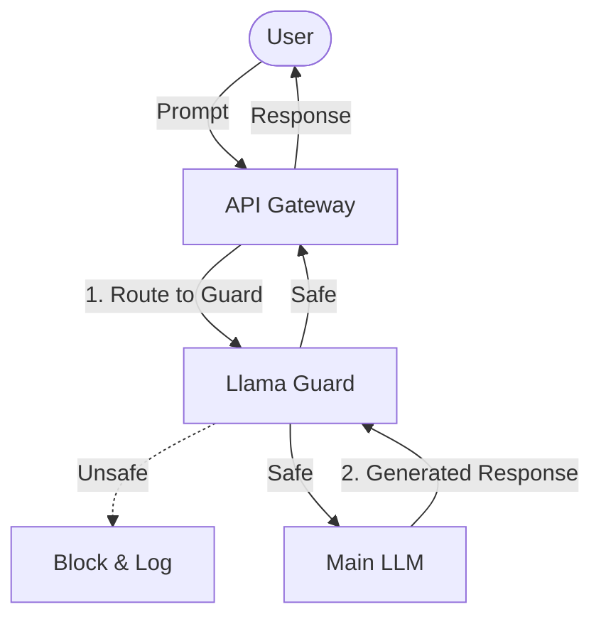

← Back to [Constraint & Threat Model](../../CONSTRAINT_THREAT_MODEL.md) | [中文版 (35_llama_guard_guardrai_zh.md)](35_llama_guard_guardrai_zh.md)

---

# 🛡️ Chapter 35: Local Guard Models (Llama Guard)

Stop trusting every prompt and generated response by default. Deploying a lightweight, local guard model gives you a low-latency safety layer directly under your control.

## 🦠 The Antivirus Scanner Analogy

* **The Analogy**: A local guard model operates exactly like an active antivirus scanner for your incoming and outgoing AI traffic.
* **How it works**: It intercepts every user prompt before generation and every AI response before delivery, scanning for malicious intent, policy violations, or hallucinations.
* **Key Concept**: Never execute unverified code; similarly, never process unverified prompts.

## 📊 Quick Comparison

| Concept | Traditional | LLM Era | Impact |
| --- | --- | --- | --- |
| **Safety Enforcement** | Rely on upstream API filters | Deploy local Llama Guard | More granular control over safety policies. |
| **Data Privacy** | Send sensitive queries to 3rd-party moderators | Kept entirely local | Reduces exposure to moderation APIs. |
| **Latency** | Network round-trip per safety check | Local hardware inference | Usually lower delay for the user. |

## 🧠 Core Concept

1. **Input Interception**: The API Gateway intercepts the user prompt and routes it directly to the Llama Guard instance.
2. **Pre-Flight Check**: Llama Guard evaluates the prompt against your custom safety taxonomy (e.g., blocking jailbreaks or malicious code). If flagged as `unsafe`, the request can be blocked or routed for review.
3. **Generation**: If safe, the prompt is passed to the main generative LLM to create a response.
4. **Output Interception**: The newly generated response passes back through Llama Guard to prevent hallucinated or policy-violating content from ever reaching the user.

---

← [Prev Chapter](34_nvidia_nemo_guardrai.md) | [Next Chapter](36_chapter_36.md) →
