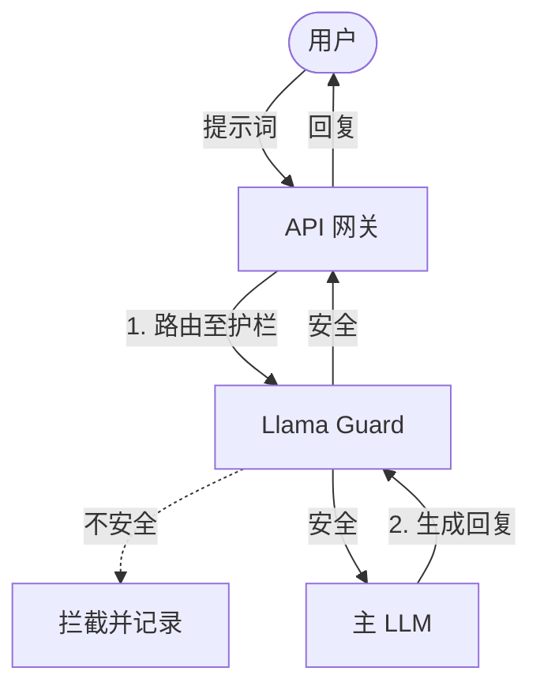

← 返回 [约束与威胁模型](../../CONSTRAINT_THREAT_MODEL_zh.md) | [English Version (35_llama_guard_guardrai.md)](35_llama_guard_guardrai.md)

---

# 🛡️ 第 35 章：本地护栏模型 (Llama Guard)

不要默认信任任何输入或生成的回复。部署一个轻量级的本地护栏模型，能为您提供一个低延迟、由您掌控的安全防护层。

## 🦠 防病毒扫描程序比喻

* **比喻**：本地护栏模型就像是一个在你的 AI 流量入口和出口实时运行的防病毒扫描程序。
* **工作原理**：它会在生成之前拦截每个用户提示词，并在发送之前拦截每个 AI 回复，扫描其中是否存在恶意意图、违规内容或幻觉。
* **核心概念**：绝不执行未经安全验证的代码；同理，绝不处理未经安全扫描的提示词。

## 📊 快速对比

| 概念 | 传统方式 | LLM 时代 | 影响 |
| --- | --- | --- | --- |
| **安全执行** | 依赖上游 API 的内容过滤 | 部署本地 Llama Guard | 对安全策略拥有更细粒度的控制。 |
| **数据隐私** | 将敏感查询发给第三方审核 | 数据完全留在本地计算 | 降低暴露给审核 API 的风险。 |
| **延迟** | 每次检查都需要网络往返 | 本地硬件直接推理 | 通常带来更低的用户延迟。 |

## 🧠 核心概念

1. **输入拦截**：API 网关拦截用户的提示词，并将其直接路由到本地 Llama Guard 实例。
2. **前置检查**：Llama Guard 根据您的自定义安全分类法（例如：拦截越狱、恶意代码）评估提示词。如果判定为 `unsafe`（不安全），则可以拦截请求或转人工复核。
3. **模型生成**：如果是安全的，提示词被传递给主生成式大模型以创建回复。
4. **输出拦截**：新生成的回复再次通过 Llama Guard 检查，防止包含幻觉或违规信息的内容到达用户端。

---

← [上一章](34_nvidia_nemo_guardrai_zh.md) | [下一章](36_chapter_36_zh.md) →
