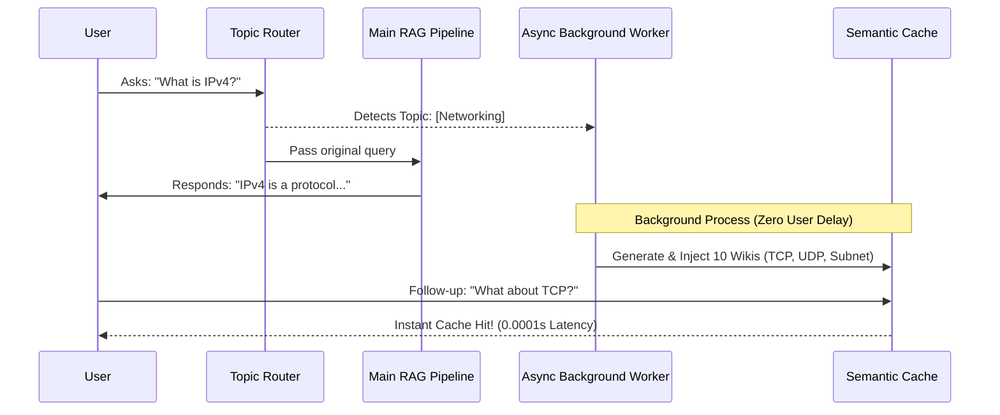

# RAG System Design 🏗️

[English] | [中文 (21_rag_system_design_zh.md)](21_rag_system_design_zh.md)

Building a basic RAG system that reads a PDF and answers questions is easy. But building a **production-grade** RAG system that is accurate, handles thousands of documents, and has low latency is highly complex.

This guide explains the architectural bridge from a prototype RAG to a production system.

---

## 🗺️ The Production RAG Pipeline

In a production system, we add **Preprocessing** and **Post-Retrieval** steps to make sure the AI gets the absolute best context:

```text
User Query ──► [ Query Rewriting ] ──► [ Vector DB Search ] ──► [ Reranker (Filter) ] ──► LLM
```

---

## ⚡ 1. Advanced Chunking Strategies

Standard RAG slices text by character limits (e.g. every 500 characters). This can cut sentences in half, destroying their meaning. Production systems use smarter strategies:

* **Sliding Window (Overlap)**: Slicing text into paragraphs but leaving an overlap (e.g. 500-character chunks with 100 characters of overlap). This ensures context from the end of one chunk is carried over to the start of the next.
* **Semantic Chunking**: Slicing text only when the semantic meaning changes (e.g., detecting paragraph breaks or using an embedding model to split when the distance coordinate jumps).

---

## 🔄 2. The Power of Reranking

When you search a vector database, it returns the top 10 chunks based on vector distance. However, vector distance can be imprecise for complex reasoning.

To solve this, we add a **Reranker** (using a Cross-Encoder model like `cohere-rerank` or `bge-reranker`):

1. **Step 1 (Fast Retrieval)**: The Vector DB runs a fast, cheap search and fetches the top 50 candidates.
2. **Step 2 (Reranking)**: The Reranker model reads the user query and the 50 candidates, analyzing them deeply to re-sort them.
3. **Step 3 (Selection)**: We feed only the top 3 reranked, high-accuracy chunks to the LLM.

*This two-stage system gives you the speed of vector search combined with the analytical accuracy of a deep neural network.*

---

## ⏱️ 3. Latency Optimization

Retrieval adds latency. To keep your app fast:

* **Embedding Caching**: Store vectors of frequently searched queries.
* **Metadata Filtering**: Restrict your search *before* calculating vector distances. For example, if you know the user is asking about "2026", filter out all documents that aren't tagged with "2026" in the DB.

---

## 🌟 Advanced: The Enterprise RAG Solution — Hybrid Search

In enterprise RAG systems, relying solely on vector search often isn't enough. We need **Hybrid Search**.

> [!TIP]
> Think of the two search methods like this:
> 
> * **Vector Search (Dense) = "The Vibe-reading Artist" (懂氛围的文艺青年)**
>   It understands the deep semantic meaning and "vibe" of your query. It knows that "Tomato" and "Pomodoro" are related. However, it is terrible at exact matches. If you search for "iPhone 15 Pro Max error code 404", it might just return documents about phones in general and miss the exact ID.
>   
> * **BM25 / Full Text Search (Sparse) = "The Dictionary Grandpa" (死板的查字典老头)**
>   It doesn't understand context or semantics at all. But it is brilliant at exact keyword matches (like `Ctrl+F`). If you need to find an exact product ID, a serial number, or a specific name, the Dictionary Grandpa will find it instantly.

**Hybrid Search = We want both! (Dual Retrieval)**
We run both search engines simultaneously and combine their results. But how do we combine a semantic distance score from Vector DB with a keyword frequency score from BM25? They are on completely different scales!

Enter **Reciprocal Rank Fusion (RRF) — "The Smart Vote Counter" (聪明的计票员)**.
RRF elegantly merges these two completely different scoring systems without needing any machine learning training. It ignores the raw scores and instead looks at the *rankings* of the documents. 

It uses a simple formula for each document:
`Score = 1 / (k + rank)` 
*(where `k` is a small constant, usually 60, to prevent the #1 rank from dominating too much).*

By combining the Vibe-reading Artist, the Dictionary Grandpa, and the Smart Vote Counter, your RAG system will successfully retrieve both deep semantic concepts and exact keyword matches!

---
## 🚀 Beyond Naive RAG: Advanced Architectures
When standard "Vector Search + LLM" fails in production, engineers turn to advanced RAG variants:
### 1. Dynamic Reasoning
* **Corrective RAG (CRAG)**: If local retrieval yields poor data, a "grader" LLM triggers a Web Search fallback.
* **Self-RAG**: The LLM iterates and reflects on its answer until it perfectly matches the retrieved text.
### 2. Multi-Format & Multimodal
* **Table-Aware RAG**: Parses tables into strict Markdown to preserve grid integrity before indexing. **[✅ AI-Model-Atlas Implements This!]**
* **Vision RAG**: Extracts raw images/diagrams from PDFs and uses Multimodal LLMs (like GPT-4o) during retrieval.
### 3. Structural Reorganization
* **Parent-Child Chunking**: The document is split into tiny sentences (Child) for hyper-accurate searching, but returns the entire surrounding paragraph (Parent) to the LLM to preserve context.
---
## 🔮 The Frontier: Predictive Prefetching (LLM Wiki)
Traditional semantic caching is reactive. **Predictive prefetching** anticipates the user's next step.
### ⚙️ How it works


1. **Topic Extraction**: User asks about "IPv4", system recognizes `[Computer Networking]`.
2. **Background Async Generation**: A background thread generates 10 related mini-articles (e.g., TCP, UDP).
3. **Cache Injection**: Articles are preloaded into the Semantic Cache.
4. **Zero-Latency Follow-up**: User asks "What about TCP?", system hits cache in 0.0001s with zero token cost.

> **Analogy**: A traditional cache is a waiter pouring water after you ask. Predictive prefetching is a waiter who sees you order fried chicken and silently pre-pours a cola because they know you'll want it next.

---

Now that you know how to architect search, let's explore inference optimizations to make the model run faster on your GPU in [Inference Optimization](../phase4_50_to_100/29_inference_optimization.md).

