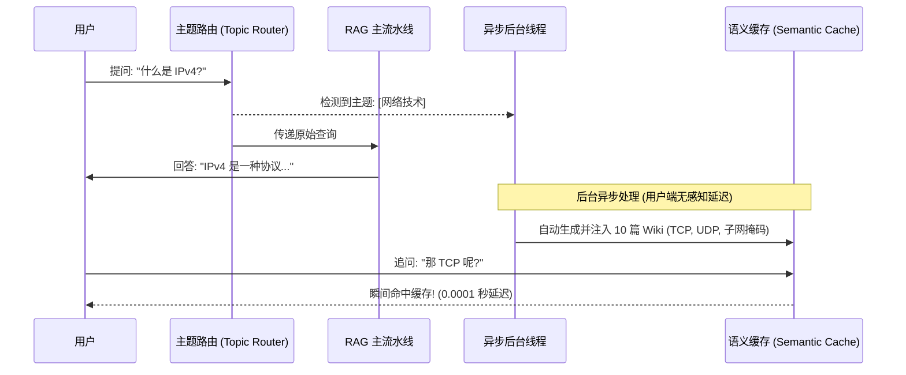

# RAG 系统架构设计 🏗️

[[English] (21_rag_system_design.md)](21_rag_system_design.md) | [中文]

做一个“读取 PDF 并回答问题”的玩具级 RAG demo 非常简单。但要做出一个**企业级/生产环境**的 RAG 系统——要求极高的回答准确率、能处理几十万页文档、且要求低延迟——则面临着极大的工程挑战。

本章将带你跨越玩具级 Demo，了解企业级 RAG 系统设计的核心技术。

---

## 🗺️ 工业级 RAG 检索流水线

在真实的生产环境里，我们会在“向量检索”的前后加入 **查询重写** 和 **重排（Rerank）** 步骤，以确保喂给大模型的是最精准、废话最少的信息：

```text
用户问题 ──► 【 查询重写/纠错 】 ──► 【 向量数据库快速搜索 】 ──► 【 重排过滤器 (Reranker) 】 ──► 喂给大模型
```

---

## ⚡ 1. 进阶文本切片策略 (Chunking)

普通的 RAG 切片非常死板（比如每 500 个字符强制切一刀）。这经常会把一句话拦腰折断，破坏语义。生产环境通常使用以下更聪明的策略：

* **滑动窗口切片 (Overlap)**：依然按段落切分，但前后段落保留重叠区域（例如：切片长度 500 字，重叠 100 字）。这样可以确保前一个切片末尾和后一个切片开头的上下文信息不会丢失。
* **语义切片 (Semantic Chunking)**：利用 Embedding 模型计算相邻句子之间的语义距离。当遇到句意跳转非常大的地方（例如换了个话题）才切一刀，确保切出来的段落语义高度连贯。

---

## 🔄 2. 核心技术：重排 (Reranking)

向量数据库检索是基于“空间距离”的快速计算，它在拉取前 10 个候选段落时速度极快，但在细节语义理解上精度有限。

为了解决这一问题，我们在中间引入了 **重排模型 (Reranker)**（使用交叉编码器 Cross-Encoder，如 `bge-reranker`）：

1. **第一阶段 (快速拉取)**：向量数据库利用简单的向量距离，快速捞出前 50 个可能相关的候选文本卡片。
2. **第二阶段 (精细重排)**：Reranker 模型读取用户的问题和这 50 个候选卡片，像人类阅读一样深度分析它们的语义匹配度，并重新打分排序。
3. **第三阶段 (精简输出)**：只保留经过重排后评分最高的前 3 个段落，喂给大模型。

*这种“两阶段”设计完美结合了向量检索的速度优势与重排模型的高精度语义理解能力。*

---

## ⏱️ 3. 检索延迟优化 (Latency)

频繁检索数据库会增加用户等待回复的延迟。我们可以使用以下手段优化：

* **问题缓存 (Query Caching)**：对于频繁搜索的相同意图问题，直接缓存其对应的检索文档向量，省去去数据库检索的时间。
* **元数据过滤 (Metadata Filtering)**：在计算向量距离之前，先进行“硬过滤”。例如，如果你知道用户问的是“2026年”的数据，先通过数据库的 Metadata 过滤掉所有非 2026 年的文档，大幅缩小向量计算的范围。

---

## 🌟 进阶篇：企业级 RAG 的终极答案 —— 混合检索 (Hybrid Search)

在企业级 RAG 系统中，仅靠单纯的向量检索往往是不够的。我们需要引入**混合检索 (Hybrid Search)**。

> [!TIP]
> 我们可以用这样一个比喻来理解两种检索方式：
> 
> * **向量检索 (Dense / Vector Search) = “懂氛围的文艺青年”**
>   他能深刻理解你话语背后的“语义”和“氛围”，知道“番茄 (Tomato)”和“番茄工作法 (Pomodoro)”是相关的。但是他非常粗心，如果你让他找确切的型号，比如 `iPhone 15 Pro Max 错误码 404`，他可能只会给你找一堆关于手机的泛泛而谈的资料，完全漏掉这个精准的 ID。
>   
> * **全文检索 / BM25 (Sparse) = “死板的查字典老头”**
>   他完全不懂语义，也不懂什么是“氛围”。但是他极其严谨，是个完美的 `Ctrl+F` 机器。如果你需要寻找一个确切的产品 ID、序列号或者特定人名，查字典老头能瞬间帮你精准定位。

**混合检索 = 我们全都要！(双路召回)**
我们会同时运行这两个搜索引擎，然后合并它们的结果。但问题来了：向量数据库给出的是“空间距离分数”，而 BM25 给出的是“关键词词频分数”，这两套分数体系完全不在一个维度上，该怎么合并？

这就需要请出 **RRF (Reciprocal Rank Fusion) 算法 —— “聪明的计票员”**。
RRF 能够非常优雅地融合两套完全不同的打分系统，而且不需要任何机器学习训练。它直接忽略了绝对分数，而是只看文档在各自列表中的**排名 (Rank)**。

它对每个文档使用这样一个极简公式：
`Score = 1 / (k + rank)`
*(其中 `k` 是一个平滑常数，通常取 60，用来防止排名第一的文档权重过大)。*

通过结合“懂氛围的文艺青年”、“死板的查字典老头”和“聪明的计票员”，你的 RAG 系统就能做到既懂深层语义，又绝不错失任何精准关键词！

---
## 🚀 超越基础 RAG：高级架构
当标准的“向量搜索 + 大模型”架构在实际生产中失效时，工程师通常会使用更高级的 RAG 变体：
### 1. 动态推理
* **纠错 RAG (Corrective RAG, CRAG)**：如果本地检索召回的资料质量很差，会通过一个“评分器 (Grader)”大模型来触发网页搜索作为备用方案（Fallback）。
* **自我反思 RAG (Self-RAG)**：大模型会对自己的回答进行多次迭代和自我反思，直到回答与检索到的文本完美匹配。
### 2. 多格式与多模态
* **表格感知 RAG (Table-Aware RAG)**：将文档中的表格解析为严格的 Markdown 格式，以确保在索引之前保持表格的网格结构连贯性。**[✅ AI-Model-Atlas 已实现该功能！]**
* **视觉 RAG (Vision RAG)**：直接提取 PDF 中的原始图像/图表，并在检索时使用多模态大模型（如 GPT-4o）进行理解和回答。
### 3. 结构重组
* **父子切片 (Parent-Child Chunking)**：将文档分割为非常细小的句子或段落（子切片 Child），用于极高精度的向量搜索；但在将内容喂给大模型时，则返回其周围完整的段落（父切片 Parent），以最大程度保留上下文。
---
## 🔮 前沿：预测性预取 (Predictive Prefetching / LLM Wiki)
传统的语义缓存（Semantic Cache）是“被动”的。而**预测性预取**则能预判用户的下一步动作。
### ⚙️ 工作原理


1. **主题提取**：用户提问“IPv4”，系统识别出当前主题属于`[计算机网络]`。
2. **异步后台生成**：后台线程默默生成 10 篇相关的迷你科普文章（如 TCP、UDP 等）。
3. **缓存注入**：将这些预生成的文章预先加载到语义缓存中。
4. **零延迟追问**：当用户接着问“那 TCP 呢？”时，系统在 0.0001 秒内直接命中缓存，无需任何 Token 消耗。

> **生活比喻**：传统的缓存就像是服务员等你点完水之后再给你倒。预测性预取则是一个极其聪明的服务员，看到你点了炸鸡，就默默地在后台给你倒好了一杯冰可乐，因为他知道你下一步必然会想要它。

---

掌握了 RAG 架构设计，接下来让我们去了解大模型服务在线上运行时，显存优化与高并发推理的幕后逻辑：进入 [推理优化与服务](../phase4_50_to_100/29_inference_optimization_zh.md)。

