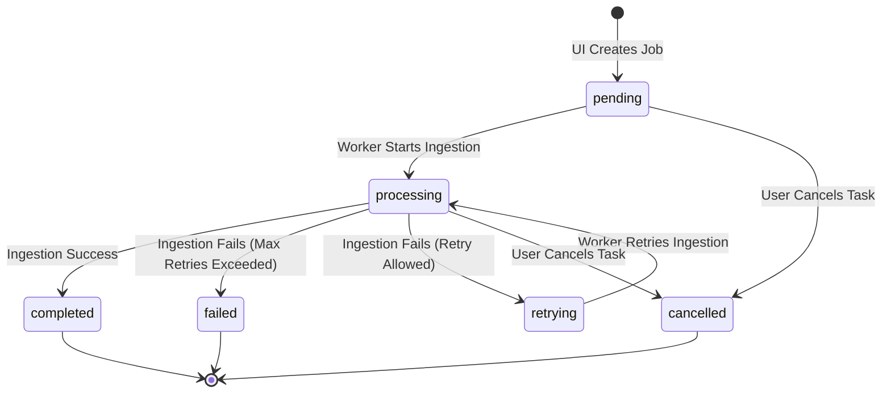

# Appendix: Decoupling RAG with Docker Orchestration 🐳

[English] | [中文 (appendix_docker_orchestration_zh.md)](appendix_docker_orchestration_zh.md)

In the previous modules, you built advanced RAG subsystems—routing queries, indexing tables, and extracting knowledge graphs. However, running all of these in a single Python script or Streamlit app creates a major engineering bottleneck: **Resource Contention**.

If a user uploads a huge PDF, the CPU-heavy parsing and embedding processes will freeze the UI thread. If multiple users query the system simultaneously, the database and the app will fight over memory.

In this appendix, we will learn how to transition from a **monolithic RAG script** to a **decoupled, production-grade multi-service system** using Docker Compose.

---

## 🏗️ The Decoupled Architecture

Instead of stuffing everything into one process, we break our system into three isolated services (containers):

```text
                     [ User Browser ]
                            │
                            ▼ (Streamlit UI / Port 8501)
                 ┌────────────────────┐
                 │    streamlit-ui    │ (Lightweight Frontend)
                 └────────────────────┘
                            │
              (Reads status / Writes jobs)
                            │
                            ▼
               ┌────────────────────────┐
               │  Shared Volume (/data) │
               └────────────────────────┘
                            ▲
                            │
              (Reads jobs / Writes embeddings)
                            │
                 ┌────────────────────┐          ┌────────────────────┐
                 │  ingestion-worker  │ ────────>│     qdrant-db      │
                 └────────────────────┘          └────────────────────┘
                  (Heavy PDF Processing)          (Vector DB / Port 6333)
```

1. **`streamlit-ui`**: A thin, lightweight frontend that focuses purely on accepting queries, uploading files, and rendering statuses. It does not perform heavy AI calculations.
2. **`qdrant-db`**: A dedicated vector database running as its own isolated server.
3. **`ingestion-worker`**: An independent backend process (daemon) running in the background. It listens for new document ingestion tasks, parses PDFs, extracts graphs, generates embeddings, and saves them to Qdrant.

---

## 📂 Data Shared Volume & Job Manifest State Machine

Without introducing complex enterprise message queues (like RabbitMQ or Celery), how do `streamlit-ui` and `ingestion-worker` communicate?

We use a **Job Manifest System** built on a **Shared Directory (`data/`)** mounted by both containers.

### 1. The Directory Structure
The containers share a folder on the host machine containing:
* `data/raw/`: Store raw uploaded PDFs.
* `data/jobs/`: Store JSON job manifest files representing tasks.
* `data/status/`: Store worker heartbeat files.

### 2. The Finite State Machine (FSM)
Each ingestion task is represented by a JSON file (e.g., `job_001.json`). The state of the task changes deterministically:



By reading and writing to these JSON files, the UI and Worker remain fully synchronized without direct network calls.

---

## 💓 System Heartbeat & Observability

To make the system reliable, we implement two observability features:

### 1. Atomic Heartbeats
To prevent the "zombie worker" problem (where the worker dies but the UI thinks it is still processing), the worker writes its health status to `data/status/worker_heartbeat.json` every 30 seconds.
To prevent the UI from reading a partially written JSON file, the worker writes to a temporary file first and atomically renames it:
```python
# Atomic replace pattern prevents race conditions
os.replace(temp_file_path, target_path)
```

### 2. System Capability Matrix
The Streamlit UI acts as a **read-only observer** of the system health. By pinging the Qdrant API and checking the worker's heartbeat freshness, it maps the system's current capacity:
* **🟢 Healthy**: All systems are green. Full features active.
* **🟡 Busy**: Worker is actively processing documents.
* **🟠 Degraded**: Vector DB or LLM API is offline. The UI dynamically disables vector indexing and falls back to **local BM25 keyword search** so the user can still find documents.
* **🔴 Offline**: Ingestion worker or database has completely crashed.

---

## 🐳 Summary of Benefits

By wrapping this decoupled architecture into Docker Compose:
* **One-Click Run**: Running `docker-compose up` sets up the networks, volumes, environment variables, and services automatically.
* **Isolation & Scalability**: If document processing bottlenecks, you can scale the `ingestion-worker` service without affecting UI responsiveness.
* **Fault Tolerance**: If the database crashes, the UI degrades gracefully to local files rather than raising a system-wide error.

---

← Prev: [Module 36: AI Safety & Alignment](36_ai_safety.md) | Next: [Appendix: Where AI May Go Next](appendix_future.md) →
