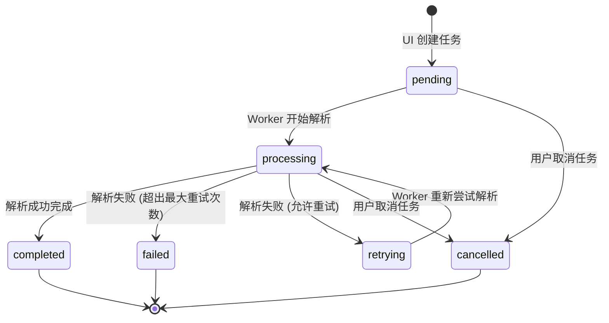

# 附录: 使用 Docker 进行 RAG 系统解耦编排 🐳

[[English] (appendix_docker_orchestration.md)](appendix_docker_orchestration.md) | [中文]

在前面的模块中，你已经构建了非常先进的 RAG 子系统——意图路由、表格索引以及提取知识图谱。然而，将所有这些逻辑都在单个 Python 脚本或 Streamlit 应用中运行会带来严重的工程瓶颈：**资源争抢 (Resource Contention)**。

如果用户上传了一个超大 PDF，CPU 密集的解析和向量化过程会直接导致 UI 线程卡死。如果多个用户同时发起查询，数据库和应用进程会疯狂争夺内存。

在本附录中，我们将学习如何使用 Docker Compose，将一个**单进程的 RAG 脚本**重构为**高度解耦、生产级的多服务系统**。

---

## 🏗️ 解耦架构设计

我们不再把所有任务塞进同一个进程，而是将系统拆分为三个相互隔离的服务（容器）：

```text
                     [ 用户浏览器 ]
                           │
                           ▼ (Streamlit UI / 端口 8501)
                 ┌────────────────────┐
                 │    streamlit-ui    │ (轻量级前端)
                 └────────────────────┘
                           │
             (读取任务状态 / 写入任务契约)
                           │
                           ▼
               ┌────────────────────────┐
               │   共享数据卷 (/data)   │
               └────────────────────────┘
                           ▲
                           │
             (读取任务契约 / 写入向量数据)
                           │
                 ┌────────────────────┐          ┌────────────────────┐
                 │  ingestion-worker  │ ────────>│     qdrant-db      │
                 └────────────────────┘          └────────────────────┘
                  (重度 PDF 解析与处理)          (向量数据库 / 端口 6333)
```

1. **`streamlit-ui`**：极轻量的前端服务，专注于接收查询、上传文件和渲染状态，绝不执行繁重的 AI 计算。
2. **`qdrant-db`**：作为独立服务运行的专属向量数据库。
3. **`ingestion-worker`**：在后台独立运行的后端守护进程（Worker）。它监听新的文档入库任务，解析 PDF，提取图谱，生成 Embedding，并将其保存到 Qdrant。

---

## 📂 共享数据卷与任务契约状态机

在不引入 Celery 或 RabbitMQ 等企业级复杂消息队列的前提下，`streamlit-ui` 和 `ingestion-worker` 是如何通信的？

我们使用了一套基于**共享目录 (`data/`)** 的**任务契约系统 (Job Manifest)**，两个容器都挂载该目录。

### 1. 目录结构
容器之间共享宿主机上的一个文件夹，其包含：
* `data/raw/`：存放上传的原始 PDF 文件。
* `data/jobs/`：存放表示任务状态的 JSON 契约文件。
* `data/status/`：存放 Worker 心跳文件。

### 2. 有限状态机 (FSM)
每个入库任务都由一个 JSON 文件表示（例如 `job_001.json`）。任务状态在 Worker 和 UI 之间以确定性的方式流转：



通过读写这些 JSON 文件，UI 与 Worker 实现了完全的异步协同，无需进行直接的进程网络调用。

---

## 💓 系统心跳与可观测性

为了确保系统的稳定性，我们实现了两套可观测性机制：

### 1. 原子心跳 (Atomic Heartbeats)
为了防止“僵尸 Worker”问题（即 Worker 崩溃了，但 UI 依然显示它正在处理），Worker 每隔 30 秒向 `data/status/worker_heartbeat.json` 写入一次当前时间戳。
为防止 UI 读到写了一半的损坏 JSON，Worker 写入时采用**原子替换模式**：先写临时文件，然后通过操作系统级命令原子重命名覆盖：
```python
# 原子替换模式防止读写竞争冲突
os.replace(temp_file_path, target_path)
```

### 2. 局部降级能力矩阵 (Capability Matrix)
Streamlit UI 作为系统健康的**只读观测者**。通过轮询探测 Qdrant 的健康接口以及检查 Worker 心跳的新鲜度，它会动态映射当前的系统可用性：
* **🟢 正常 (Healthy)**：全服务可用。
* **🟡 繁忙 (Busy)**：Worker 正在处理任务。
* **🟠 降级 (Degraded)**：当向量数据库掉线或大模型 API 异常时，系统**降级运行**。UI 会自动禁用向量入库，并将检索降级为**本地 BM25 关键词检索**，保证用户依然能查到资料。
* **🔴 故障 (Offline)**：Worker 或数据库彻底失联。

---

## 🐳 Docker Compose 带来的工程收益

通过使用 Docker Compose 封装解耦架构：
* **一键运行**：一个 `docker-compose up` 命令即可自动设置网络、挂载卷、注入环境变量并拉起所有服务。
* **隔离与水平扩展**：当文档解析出现瓶颈时，可以单独扩展 `ingestion-worker` 容器，而不会影响 Streamlit 前端的流畅度。
* **高容灾**：当数据库奔溃时，前端能优雅降级到本地文件服务，而不是让整个系统瘫痪报错。

---

← 上一章: [模块 36: 安全对齐 (AI Safety)](36_ai_safety_zh.md) | 下一章: [附录: AI 的下一步去向 🔭](appendix_future_zh.md) →
