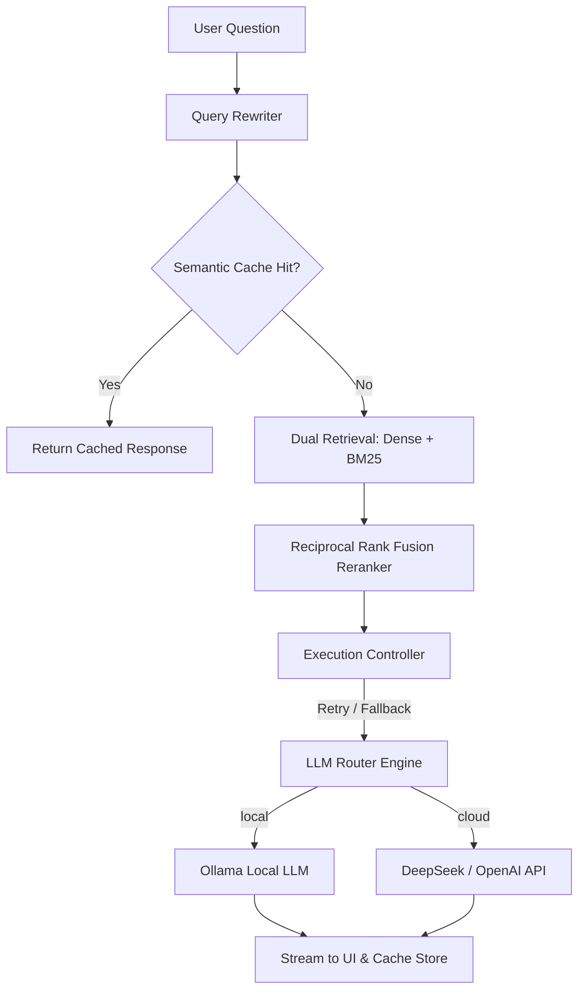

# 🧠 Cognitive RAG System with Execution Control & Semantic Cache

> **A production-grade, hybrid RAG reference architecture designed for extreme reliability, cognitive intelligence, and semantic acceleration.**

[English] | [中文 (README_zh.md)](README_zh.md)

This project showcases a complete **Cognitive RAG System** demonstrating how to transition an AI application from a simple proof-of-concept into a resilient, production-ready system. It features a dual-inference backend allowing seamless runtime switching between local models (Ollama) and cloud APIs (OpenAI/DeepSeek).

---

## 🗺️ System Data Flow & Architecture



---

## ⚡ Key Highlights

* **🧠 Cognitive Query Rewriting**: Standardizes and optimizes conversational queries by removing grammatical noise and syntax prefixes before vector search, improving retrieval accuracy.
* **🛡️ Execution Control Plane**: Orchestrates all request lifetimes. Handles exponential backoff retries, connection timeouts, and automatic graceful degradation (seamlessly falling back from local Ollama to cloud API if local nodes go offline).
* **⚡ Persistent Semantic Cache**: Prevents redundant model execution. Repeated or semantically matching queries are bypassed and returned instantly. State is persisted securely to local JSON, surviving system restarts.
* **🔍 Hybrid Search & RRF Engine**: Combines ChromaDB Dense Vector embeddings with BM25 Sparse keyword matching, fused algorithmically via Reciprocal Rank Fusion for unparalleled context retrieval precision.
* **📈 Deep Observability Dashboard**: Streamlit interface containing dynamic threshold parameters, live system latency metrics, and transparent pre-vs-post rerank document context diagnostics.

---

## 📂 System Packages Directory

```text
rag-app/
├── app.py                # Subprocess runner launcher
├── requirements.txt      # Module dependencies (Streamlit, ChromaDB, pypdf)
├── START_HERE.md         # 1-minute quickstart guide
│
├── config/
│   └── settings.py       # Centralized runtime configuration state
│
└── core/
    ├── rag_pipeline.py          # Application glue and logic orchestrator
    ├── execution_controller.py  # Orchestrates retries, timeouts, and API fallbacks
    ├── prompt_templates.py      # Centralized prompts and fallback boundaries
    ├── llm_router.py            # Adapts output streaming for Ollama/Cloud API
    ├── embeddings.py            # Local SentenceTransformers / OpenAI embeddings interface
    ├── chunking.py              # Recursive character paragraph splitter
    ├── vectorstore.py           # Dual Indexing ChromaDB + BM25 persistent manager
    ├── cache/
    │   ├── semantic_cache.py    # Persistent semantic similarity cache engine
    │   └── cache_metrics.py     # Hit ratio and latency analytics
    └── intelligence/
        ├── query_rewriter.py    # Removes prefix noise and conversational grammar
        └── reranker.py          # Implements Reciprocal Rank Fusion (RRF)
```

> [!WARNING]
> **BM25 Production Scaling Note:** The current Hybrid Search implementation uses an in-memory `BM25Okapi` index that reconstructs itself via full rehydration from ChromaDB upon ingestion. This is perfect for POCs and small-to-medium knowledge bases, but can become an O(N) bottleneck as data scales to thousands of documents. For massive enterprise deployments, consider swapping the BM25 memory backend for an incremental search engine like Elasticsearch or OpenSearch.

---

## 🏃‍♂️ 1-Minute Setup & Launch

To run the system locally, make sure you have python 3.9+ and Ollama running locally.

```bash
# Install dependencies
pip install -r requirements.txt

# Start Ollama local model
ollama pull llama3

# Launch the dashboard
python app.py
```
For detailed workflow walkthroughs, read **[START_HERE.md](START_HERE.md)**.

---

## 📄 License

This example project is part of [AI-Model-Atlas](../../README.md). Source code is licensed under the [MIT License](../../LICENSE-CODE), while documentation content is licensed under [CC BY 4.0](../../LICENSE).
