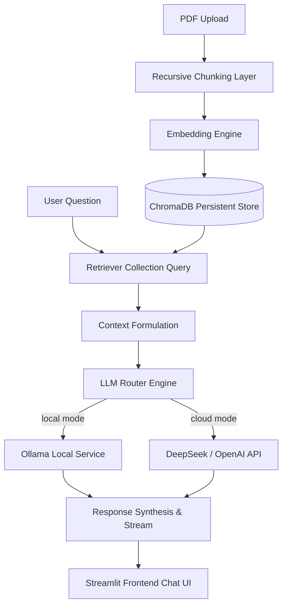

# 🗺️ Hybrid RAG Reference Application

This directory contains the reference-grade **Hybrid RAG Application** corresponding to the **v2.1 Release** of the **[AI-Model-Atlas](https://github.com/Hao610/AI-Model-Atlas)** curriculum.

Designed as both a clean, comprehensive teaching resource and a production-ready system blueprint, it features a dual runtime backend allowing users to toggle between a localized setup and commercial cloud endpoints.

---

## 🛠️ Architecture & System Data Flow



---

## 📂 Project Directory Structure

```text
rag-app/
├── app.py                # Main project entrypoint
├── requirements.txt      # Module dependencies (Streamlit, ChromaDB, pypdf)
├── README.md             # This architecture design document
│
├── config/
│   └── settings.py       # Configuration parameters and environment parser
│
└── core/
    ├── llm_router.py     # Streaming router abstraction between local Ollama and APIs
    ├── embeddings.py     # Local SentenceTransformer & OpenAI Embeddings API adapter
    ├── chunking.py       # Recursive paragraph & sentence character splitter
    ├── vectorstore.py    # ChromaDB persistent collection adapter
    └── rag_pipeline.py   # Complete ingestion and query execution pipeline
```

---

## ⚙️ Fast Local Setup & Installation

### 1. Install Dependencies
Make sure you have Python 3.9+ installed. Execute:
```bash
pip install -r requirements.txt
```

### 2. Configure Local Settings (Optional)
Create a `.env` file in this directory to customize execution:
```env
RAG_MODE=ollama
OLLAMA_MODEL=llama3
# If using Cloud API mode:
# RAG_MODE=api
# API_KEY=your_api_key_here
# API_BASE_URL=https://api.deepseek.com/v1
# API_MODEL=deepseek-chat
```

### 3. Start Local Services
If you are running in the default `ollama` mode, make sure the Ollama application is active in the background and pull your model of choice:
```bash
ollama pull llama3
```

### 4. Run the Application
Start the interactive user dashboard:
```bash
python app.py
```
This launches a browser session pointing to the Streamlit local server (typically `http://localhost:8501`).

---

## 💡 Key Highlights

* **Multi-Backend Router**: Decoupled interface to route model inference dynamically to locally running LLMs (via Ollama) or public endpoints.
* **Granular Extraction Provenance**: Side-by-side comparison log displaying the distance calculation metrics, source file attributes, and chunk indexes for retrieved paragraphs.
* **Recursive Splitting**: Text chunks are parsed cleanly across paragraph and sentence margins to preserve text context and cohesion.
