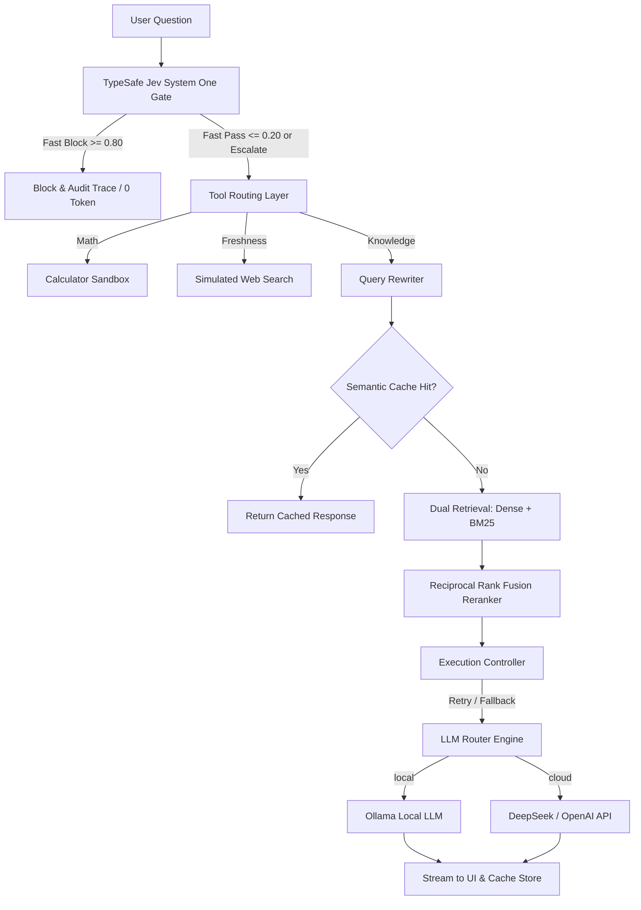

# 🧠 Agentic RAG System with Tool Routing & Evaluation

> **A production-grade, hybrid Agentic RAG reference architecture designed for extreme reliability, tool orchestration, and quantitative evaluation.**

[English] | [中文 (README_zh.md)](README_zh.md)

This project showcases a complete **Agentic RAG System** demonstrating how to transition an AI application from a simple proof-of-concept into a more resilient, production-ready system. It features a Tool Routing layer for deterministic multi-tool dispatch, a native LLM-as-a-judge evaluation framework, and a dual-inference backend that supports runtime switching between local models (Ollama) and cloud APIs (OpenAI/DeepSeek).

---

## 🗺️ System Data Flow & Architecture


```mermaid
flowchart TD
    UserQuery[User Question] --> JevGate[TypeSafe Jev System One Gate]
    JevGate -->|Fast Block >= 0.80| DirectBlock[Block & Audit Trace / 0 Token]
    JevGate -->|Fast Pass <= 0.20 or Escalate| ToolRouter[Tool Routing Layer]
    ToolRouter -->|Math| CalculatorTool[Calculator Sandbox]
    ToolRouter -->|Freshness| WebTool[Simulated Web Search]
    ToolRouter -->|Knowledge| QueryRewriter[Query Rewriter]
    
    QueryRewriter --> SemanticCacheCheck{Semantic Cache Hit?}
    
    SemanticCacheCheck -->|Yes| InstantReturn[Return Cached Response]
    SemanticCacheCheck -->|No| VectorSearch[Dual Retrieval: Dense + BM25]
    
    VectorSearch --> Reranker[Reciprocal Rank Fusion Reranker]
    Reranker --> ExecutionController[Execution Controller]
    
    ExecutionController -->|Retry / Fallback| LLMRouter[LLM Router Engine]
    LLMRouter -->|local| Ollama[Ollama Local LLM]
    LLMRouter -->|cloud| CloudAPI[DeepSeek / OpenAI API]
    
    Ollama --> StreamOutput[Stream to UI & Cache Store]
    CloudAPI --> StreamOutput
```

---

## ⚡ Key Highlights

* **⚡ TypeSafe Jev System One Gate (v2.4.0+)**: Sub-100ms structured decision-making without natural language text generation. Uses typed primitives (Noul, Choice, Score) with a 0% format error rate, achieving ~80%+ token cost savings via 2-tier cascaded guardrails.
* **🚦 Retrieval Orchestration Layer**: A deterministic regex-based router that intercepts queries and dispatches them to specialized tools (Calculator, Web Search, or Vector DB) before engaging the heavy LLM pipeline.
* **📊 Lightweight Evaluation Framework**: A native LLM-as-a-judge engine designed to evaluate system performance across metrics like Routing Accuracy, Faithfulness, Answer Relevancy, Context Precision, and Groundedness.
* **👁️ Vision RAG & Structural Parsing**: Transparent, multi-engine extraction (`pdfplumber` + `PyMuPDF`) that gracefully extracts explicit table boundaries and natively filters structural images.
* **📦 Table-Aware Chunking**: Replaces naive text splitters for tables, dynamically preserving full Markdown tables as atomic vector blocks to help maintain tabular integrity during LLM retrieval.
* **🕸️ GraphRAG Knowledge Network**: A native, lightweight Knowledge Graph extractor using NetworkX. It performs two-stage relation extraction and performs 1-hop traversals to augment vector results with explicit relationship evidence.
* **🧠 Cognitive Query Rewriting**: Standardizes and optimizes conversational queries by removing grammatical noise and syntax prefixes before vector search, improving retrieval accuracy.
* **🛡️ Execution Control Plane**: Orchestrates all request lifetimes. Handles exponential backoff retries, connection timeouts, and automatic graceful degradation (seamlessly falling back from local Ollama to cloud API if local nodes go offline).
* **⚡ Persistent Semantic Cache**: Reduces redundant model execution. Repeated or semantically matching queries are bypassed and returned quickly. State is persisted to local JSON, surviving system restarts.
* **🔍 Hybrid Search & RRF Engine**: Combines ChromaDB Dense Vector embeddings with BM25 Sparse keyword matching, fused algorithmically via Reciprocal Rank Fusion for unparalleled context retrieval precision.
* **📈 Deep Observability Dashboard**: Streamlit interface containing dynamic threshold parameters, live system latency metrics, and transparent pre-vs-post rerank document context diagnostics.

---

## 📂 System Packages Directory

```text
rag-app/
├── app.py                # Subprocess runner launcher
├── requirements.txt      # Module dependencies (Streamlit, ChromaDB, pypdf)
├── START_HERE.md         # 1-minute quickstart guide
│
├── config/
│   └── settings.py       # Centralized runtime configuration state
│
└── core/
    ├── rag_pipeline.py          # Application glue and logic orchestrator
    ├── execution_controller.py  # Orchestrates retries, timeouts, and API fallbacks
    ├── prompt_templates.py      # Centralized prompts and fallback boundaries
    ├── llm_router.py            # Adapts output streaming for Ollama/Cloud API
    ├── embeddings.py            # Local SentenceTransformers / OpenAI embeddings interface
    ├── graph/                   # Native Lightweight GraphRAG Engine
    │   ├── graph_store.py       # NetworkX storage with JSON persistence
    │   ├── graph_extractor.py   # Two-stage LLM Entity/Relation extractor
    │   ├── graph_retriever.py   # 1-Hop Traversal logic
    │   └── graph_search_tool.py # Standalone ToolRouter integration plugin
    ├── chunking/
    │   └── element_chunker.py       # Table-aware atomic element chunking
    ├── parsing/
    │   ├── models.py                # Unified ParsedElement dataclass
    │   └── pdf_parser.py            # Structural pdfplumber/PyMuPDF extractor
    ├── vectorstore.py           # Dual Indexing ChromaDB + BM25 persistent manager
    ├── cache/
    │   ├── semantic_cache.py    # Persistent semantic similarity cache engine
    │   └── cache_metrics.py     # Hit ratio and latency analytics
    ├── tools/
    │   ├── base.py              # Unified tool interface
    │   ├── router.py            # Deterministic Tool Router
    │   ├── calculator.py        # Safe math sandbox evaluator
    │   └── web.py               # Simulated Web Search plugin
    ├── security/
    │   ├── circuit_breaker.py   # API gateway failover and circuit breaker
    │   ├── context_guard.py     # Prompt injection checks and PII redaction
    │   ├── jev_gateway.py       # TypeSafe Jev System One decision primitives & cascaded triage
    │   └── middleware.py        # Global request interception middleware
    ├── telemetry/
    │   ├── tracker.py           # Distributed tracing and latency tracking
    │   └── scorecard.py         # Cost and performance aggregations
    ├── evaluation/
    │   ├── evaluator.py         # Benchmark suite execution engine
    │   ├── metrics.py           # Native LLM-as-a-judge metrics
    │   ├── benchmark.py         # Automated evaluation suites
    │   └── judge.py             # Heuristic LLM safety judge
    └── intelligence/
        ├── query_rewriter.py    # Removes prefix noise and conversational grammar
        └── reranker.py          # Implements Reciprocal Rank Fusion (RRF)
```

> [!WARNING]
> **BM25 Production Scaling Note:** The current Hybrid Search implementation uses an in-memory `BM25Okapi` index that reconstructs itself via full rehydration from ChromaDB upon ingestion. This is well suited for POCs and small-to-medium knowledge bases, but can become an O(N) bottleneck as data scales to thousands of documents. For massive enterprise deployments, consider swapping the BM25 memory backend for an incremental search engine like Elasticsearch or OpenSearch.

---

## 🏃‍♂️ 1-Minute Setup & Launch

To run the system locally, make sure you have python 3.9+ and Ollama running locally.

```bash
# Install dependencies
pip install -r requirements.txt

# Start Ollama local model
ollama pull llama3

# Launch the dashboard
python app.py
```
For detailed workflow walkthroughs, read **[START_HERE.md](START_HERE.md)**.

---

### 🛡️ AI Security Gateway & Red Teaming (v2.2.0+)

The sandbox includes an interactive security testing tab where you can launch adversarial attacks against the RAG pipeline and observe how the defense stack neutralizes them in real time.

- **Attack Sandbox tab**: Select a preset attack type (Direct Injection, Context Poisoning, Data Exfiltration) and click **Fire Exploit Payload**.
- **Side-by-side comparison**: See the raw LLM output vs. the output intercepted by `ContextGuard` and `SafetyJudge`.
- **Local safety model support**: Enable Ollama in the sidebar to use LLM-as-a-Judge for dynamic security scoring. Falls back to heuristic matching when Ollama is offline.

All attack samples are sourced from `tests/eval_dataset.json` — the same dataset used in CI/CD red teaming pipelines.

### ⚡ TypeSafe Jev System One Gate (v2.4.0+)

The 3rd interactive tab integrates TypeSafe AI's Jev typed decision primitives for sub-100ms request screening without natural language token generation:
- **Dynamic Dual Thresholds**: Tune strict fast-block ($\tau_{strict}$) and safe fast-pass ($\tau_{safe}$) sliders in real time.
- **2-Tier Cascaded Triage**: Evaluates attacks for immediate <100ms `FAST_BLOCK`, clear queries for `FAST_PASS`, and escalates borderline queries to heavy LLM safety judges.
- **Batch Evaluation Matrix**: Run `eval_dataset.json` across Jev to visualize triage distributions, average latency, and ~80%+ token compute savings.

### ⚖️ Benchmark Evaluation & LLM-as-a-Judge (v2.3.0+)

The 4th interactive tab provides rigorous quantitative assessment tools:
- **Deterministic Tool Routing Benchmark Suite**: Validates intent routing across Calculator, Web Search, Knowledge Graph, and Vector DB with 0 token consumption.
- **Live RAG Triad Quality Scorer**: Uses an LLM-as-a-judge to evaluate Faithfulness (grounded context fidelity) and Answer Relevancy on any query and context in real time.

---

## 🛡️ Running Security Tests Locally

Before opening a Pull Request, run the full automated red teaming suite locally to verify that your changes do not introduce any guardrail regressions:

```bash
# From the projects/rag-app directory:

# Run all security tests (Phase 2 + Phase 3)
poetry run pytest tests/red_teaming/ -v

# Run only Phase 2: Adversarial Injection Simulation
poetry run pytest tests/red_teaming/test_pipeline.py::TestAdversarialInjection -v

# Run only Phase 3: Shadow Testing (False Positive Rate)
poetry run pytest tests/red_teaming/test_pipeline.py::TestShadowFalsePositives -v

# Run full legacy + red teaming suite together
poetry run pytest tests/ -v
```

**What the tests check:**

| Test Class | Phase | Purpose |
| :--- | :--- | :--- |
| `TestAdversarialInjection` | Phase 2 | Verifies that 15 adversarial prompts are blocked or score below threshold |
| `TestShadowFalsePositives` | Phase 3 | Verifies that 15 benign messages are NOT blocked (FP Rate = 0%) |

> These tests run automatically via GitHub Actions on every push and PR. A failed test blocks the merge.
> See [`tests/red_teaming/`](tests/red_teaming/) for the full dataset and test source.

---

## 📄 License

This example project is part of [AI Model Atlas](../../README.md). Source code is licensed under the [MIT License](../../LICENSE-CODE), while documentation content is licensed under [CC BY 4.0](../../LICENSE).

