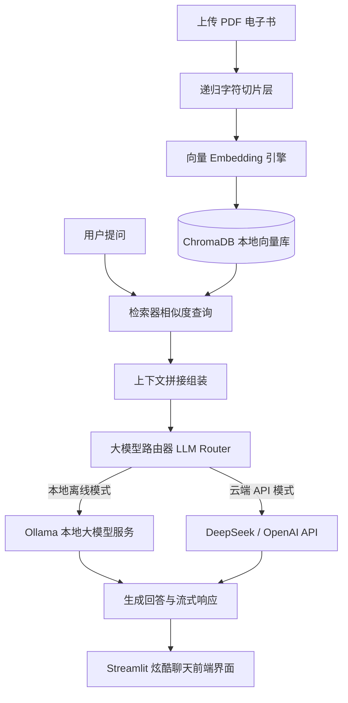

# 🗺️ 混合双模 RAG 实战示范项目 (Hybrid RAG Reference Application)

本目录包含 **[AI-Model-Atlas](https://github.com/Hao610/AI-Model-Atlas)** 课程体系配套的 **v2.1 版本** 工业级 **混合双模 RAG (检索增强生成) 示范项目**。

本项目不仅是高质量的教学辅助资源，更是一个可直接迁移用于生产环境的系统架构模板。它支持**本地离线模型 (通过 Ollama) 与云端 API (如 DeepSeek / OpenAI) 的一键切换**。

---

## 🛠️ 系统架构与数据流向



---

## 📂 项目目录结构说明

```text
rag-app/
├── app.py                # 主入口启动脚本
├── requirements.txt      # 依赖包声明清单 (Streamlit, ChromaDB, pypdf)
├── README.md             # 英文版架构与部署文档
├── README_zh.md          # 中文版架构与部署文档 (当前文件)
│
├── config/
│   └── settings.py       # 统一环境变量解析与全局配置加载
│
└── core/
    ├── llm_router.py     # 模型路由层：无缝对接本地 Ollama 和云端 API 并流式响应
    ├── embeddings.py     # 向量嵌入适配器：支持本地 sentence-transformers 和 OpenAI API
    ├── chunking.py       # 高级文本切片：支持固定长度切片与智能递归段落切片
    ├── vectorstore.py    # 向量数据库管理器：本地 ChromaDB 存储、索引与检索封装
    └── rag_pipeline.py   # RAG 核心流水线：集成 PDF 提取、向量化、检索组装与生成
```

---

## ⚙️ 快速本地部署指南

### 1. 安装 Python 依赖环境
确保您的系统安装了 Python 3.9 或更高版本，然后在当前目录下运行：
```bash
pip install -r requirements.txt
```

### 2. 配置环境变量 (可选)
如果不需要修改默认配置，可跳过此步。若需自定义，可在当前目录下创建 `.env` 文件：
```env
# 运行模式选择: 'ollama' (本地) 或 'api' (云端 API)
RAG_MODE=ollama
OLLAMA_MODEL=llama3

# 如果切换为云端 API 模式:
# RAG_MODE=api
# API_KEY=您的API密钥
# API_BASE_URL=https://api.deepseek.com/v1
# API_MODEL=deepseek-chat
```

### 3. 启动本地 Ollama 服务
如果您使用默认的 `ollama` 本地模式，请确保 Ollama 客户端已在后台启动，并已拉取对应模型：
```bash
ollama pull llama3
```

### 4. 一键启动应用
在当前目录下执行以下命令，启动 Streamlit 网页服务：
```bash
python app.py
```
程序启动后会自动在浏览器中打开前端界面（默认地址为 `http://localhost:8501`）。

---

## 💡 项目亮点

* **双模平滑切换 (Hybrid Router)**：解耦设计，支持零代码修改直接切换本地私有化模型或高性能云端大模型 API。
* **检索来源可视化透明度 (Retrieval Provenance)**：右侧面板实时展示匹配文本块的**余弦相似度距离 (Distance Metrics)**、文档来源、页码及切片序号，彻底杜绝幻觉来源盲区。
* **智能递归切片 (Recursive Splitting)**：不采用死板的等长切片，而是智能识别段落换行、句号等符号，确保语义上下文的连贯完整。
