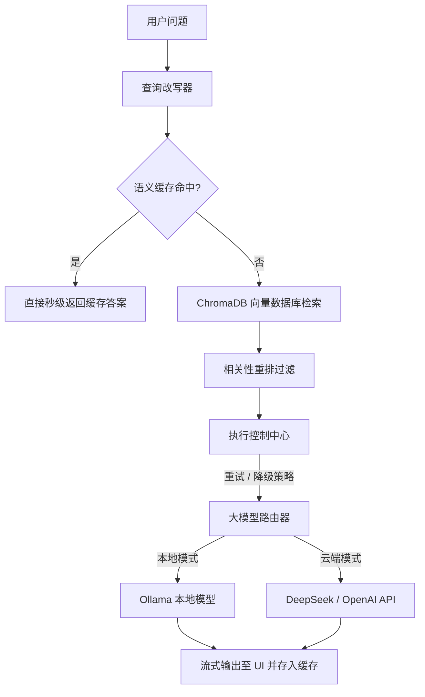

# 🧠 混合动力认知 RAG 系统 (含执行控制器与语义缓存)

> **工业级、混合双模 RAG 参考架构。提供极致的故障自愈容灾、认知级检索增强以及语义缓存响应提速。**

[[English] (README.md)](README.md) | [中文]

本项目实现了一个完整的 **认知型 RAG 系统**，旨在演示如何将一个简单的 AI 原型应用演进为健壮、具备生产韧性的交付级软件。系统提供双模推理后端，支持在本地离线模型 (Ollama) 与公有云 API (OpenAI/DeepSeek) 之间无缝进行热切换。

---

## 🗺️ 系统数据流向与架构设计



---

## ⚡ 系统亮点

* **🧠 认知查询改写 (Cognitive Query Rewriting)**：在向量数据库检索前，自动剥离口语化提问噪音与语法修饰，大幅提升检索的召回率与准确度。
* **🛡️ 执行控制平面 (Execution Control Plane)**：统一接管请求生命周期。实现指数级退避重试、连接超时控制以及优雅的**故障降级降配 (Ollama 掉线自动秒切云端 API)**。
* **⚡ 语义缓存加速 (Semantic Cache Layer)**：避免重复算力浪费。对相同或高度相似的语义问题进行匹配，加入长度比例限制防止缓存污染，直接零时延返回缓存答案。
* **🔍 全链路可观测性 (Observability Dashboard)**：Streamlit 控制台不仅提供检索阈值参数微调，还在右侧直观展示重排前后对比，并实时量化输出首 Token 延迟 (TTFT)、推理吞吐速率 (Tokens/sec)。

---

## 📂 项目结构目录

```text
rag-app/
├── app.py                # 网页前端一键拉起脚本
├── requirements.txt      # 依赖包说明书 (Streamlit, ChromaDB, pypdf)
├── START_HERE.md         # 1分钟快速上手使用说明
│
├── config/
│   └── settings.py       # 统一的环境变量控制与系统设置
│
└── core/
    ├── execution_controller.py  # 控制层：管理请求生命周期、重试与降级
    ├── prompt_templates.py      # 治理层：管理提示词规范与兜底提示词
    ├── llm_router.py            # 推理层：对接 Ollama/云端 API 的流式输出
    ├── embeddings.py            # 向量层：本地 sentence-transformers 或云端嵌入接口
    ├── chunking.py              # 切片层：递归式字符切片
    ├── vectorstore.py           # 存储层：本地 ChromaDB 数据集交互
    └── intelligence/
        ├── query_rewriter.py    # 智能层：剥离前缀噪点并重写输入
        └── reranker.py          # 智能层：进行余弦相似度重排与截断
```

---

## 🏃 1 分钟快速启动

运行本项目前，请确保系统已安装 Python 3.9+ 并确保本地 Ollama 服务正在运行。

```bash
# 1. 安装项目环境
pip install -r requirements.txt

# 2. 提前拉取本地大模型
ollama pull llama3

# 3. 启动应用
python app.py
```
更详尽的测试流程，请阅读 **[START_HERE.md](START_HERE.md)**。

---

## 📄 开源协议

本示例项目是 [AI-Model-Atlas](../../README_zh.md) 的一部分。源代码采用 [MIT License](../../LICENSE-CODE)，文档内容采用 [CC BY 4.0](../../LICENSE)。
