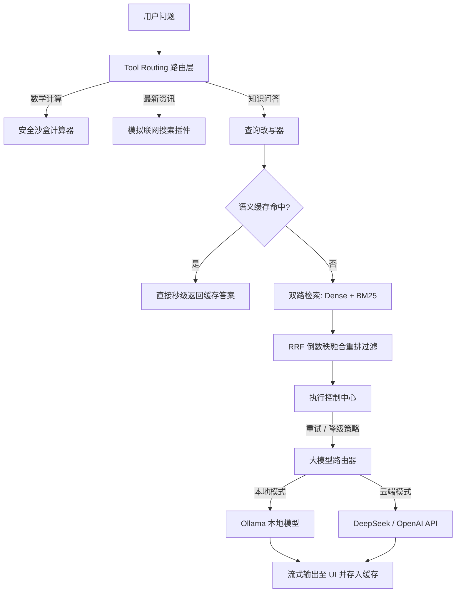

# 🧠 智能体架构 Agentic RAG 系统 (含工具路由与量化评测)

> **工业级、混合双模 Agentic RAG 参考架构。提供极具确定性的工具路由编排、轻量级原生量化评测体系，以及极致的故障自愈容灾。**

[[English] (README.md)](README.md) | [中文]

本项目实现了一个完整的 **Agentic RAG 系统**，旨在演示如何将一个简单的 AI 原型应用演进为健壮、具备生产韧性的交付级智能体软件。系统提供意图路由引擎（支持计算器、联网等插件分发）、轻量级无黑盒评测框架，以及支持在本地离线模型 (Ollama) 与公有云 API (OpenAI/DeepSeek) 之间无缝热切换的双模推理后端。

---

## 🗺️ 系统数据流向与架构设计



---

## ⚡ 系统亮点

* **🚦 检索编排与路由层 (Retrieval Orchestration Layer)**：基于确定性正则的意图路由器。在调用昂贵的大模型推理前，先对问题进行意图分发，可将请求路由至“计算器”、“联网搜索”或传统的“混合向量检索”分支。
* **📊 轻量级量化评测体系 (Lightweight Evaluation Framework)**：不依赖黑盒第三方库，纯原生手工实现的 LLM-as-a-judge 裁判引擎。实时对系统生成的每一条数据进行路由准确率 (Routing Accuracy)、忠实度 (Faithfulness)、上下文精确度 (Context Precision) 与扎实度 (Groundedness) 评分。
* **🧠 认知查询改写 (Cognitive Query Rewriting)**：在向量数据库检索前，自动剥离口语化提问噪音与语法修饰，大幅提升检索的召回率与准确度。
* **🛡️ 执行控制平面 (Execution Control Plane)**：统一接管请求生命周期。实现指数级退避重试、连接超时控制以及优雅的**故障降级降配 (Ollama 掉线自动秒切云端 API)**。
* **⚡ 语义缓存持久化 (Persistent Semantic Cache)**：避免重复算力浪费。对相同或高度相似的语义问题进行命中拦截，状态持久化到本地 JSON，重启系统不丢失。
* **🔍 混合检索与 RRF 引擎 (Hybrid Search & RRF)**：结合 ChromaDB 稠密向量与 BM25 稀疏检索（关键词匹配），通过倒数秩融合算法实现前所未有的检索精度。
* **📈 全链路可观测性 (Observability Dashboard)**：Streamlit 控制台不仅提供检索阈值参数微调，还在右侧直观展示重排前后对比，并实时量化输出首 Token 延迟 (TTFT)、推理吞吐速率 (Tokens/sec)。

---

## 📂 项目结构目录

```text
rag-app/
├── app.py                # 网页前端一键拉起脚本
├── requirements.txt      # 依赖包说明书 (Streamlit, ChromaDB, pypdf)
├── START_HERE.md         # 1分钟快速上手使用说明
│
├── config/
│   └── settings.py       # 统一的环境变量控制与系统设置
│
└── core/
    ├── rag_pipeline.py          # 核心编排：集成并串联所有组件逻辑
    ├── execution_controller.py  # 控制层：管理请求生命周期、重试与降级
    ├── prompt_templates.py      # 治理层：管理提示词规范与兜底提示词
    ├── llm_router.py            # 推理层：对接 Ollama/云端 API 的流式输出
    ├── embeddings.py            # 向量层：本地 sentence-transformers 或云端嵌入接口
    ├── chunking.py              # 切片层：递归式字符切片
    ├── vectorstore.py           # 存储层：ChromaDB + BM25 双路索引管理器
    ├── cache/
    │   ├── semantic_cache.py    # 持久化存储的语义级查询缓存中心
    │   └── cache_metrics.py     # 缓存命中率与耗时统计监控
    ├── tools/
    │   ├── base.py              # 统一的 Tool 插件标准接口
    │   ├── router.py            # 基于意图的确定性意图路由器
    │   ├── calculator.py        # 纯本地安全沙盒数学计算器
    │   └── web.py               # 联网搜索打桩代码
    ├── evaluation/
    │   ├── evaluator.py         # 跑分套件的生命周期执行引擎
    │   └── metrics.py           # 四大原生大模型裁判指标 (Faithfulness 等)
    └── intelligence/
        ├── query_rewriter.py    # 智能层：剥离前缀噪点并重写输入
        └── reranker.py          # 智能层：实现 RRF 融合重排算法
```

> [!WARNING]
> **BM25 生产环境扩展提示:** 目前的混合检索架构使用全内存级 `BM25Okapi` 索引。在系统启动和增加新文档时，它会自动从 ChromaDB 读取全量数据来构建倒排索引。这对于 POC 和中小型知识库非常完美，但在处理十万、百万级文档时会面临内存和 O(N) 重建耗时的瓶颈。如果想承载真正的大型企业数据，建议将底层的 BM25 替换为 Elasticsearch 或 OpenSearch。

---

## 🏃 1 分钟快速启动

运行本项目前，请确保系统已安装 Python 3.9+ 并确保本地 Ollama 服务正在运行。

```bash
# 1. 安装项目环境
pip install -r requirements.txt

# 2. 提前拉取本地大模型
ollama pull llama3

# 3. 启动应用
python app.py
```
更详尽的测试流程，请阅读 **[START_HERE.md](START_HERE.md)**。

---

## 📄 开源协议

本示例项目是 [AI-Model-Atlas](../../README_zh.md) 的一部分。源代码采用 [MIT License](../../LICENSE-CODE)，文档内容采用 [CC BY 4.0](../../LICENSE)。
